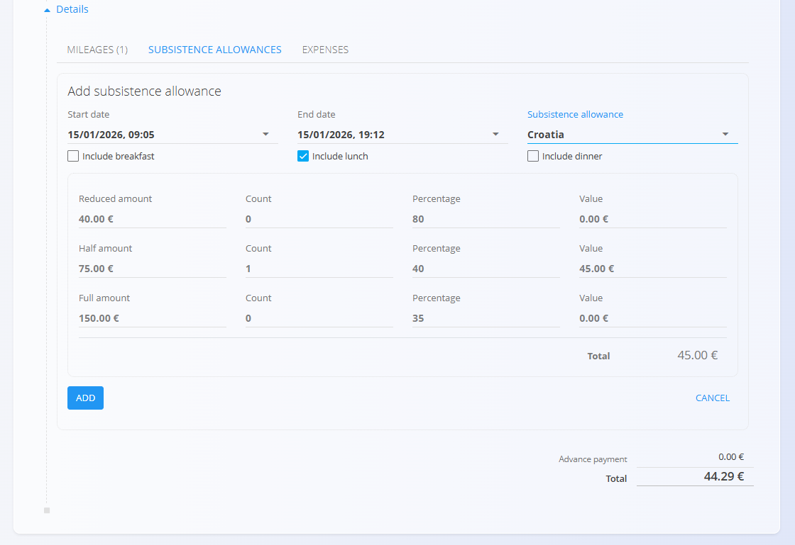

<!-- app_route: /resources/documents/travel-orders -->
<!-- app_label: Travel Orders -->
<!-- canonical_source_url: https://github.com/Tom-PIT/Connected.Docs/blob/main/en/Domains/Resources/Documents/TravelOrders.md -->
<!-- canonical_source_title: Travel Orders -->

# Travel Orders

Travel Orders are used to record and manage employee business trips. They consolidate mileage, subsistence allowances, and expenses, and calculate the total trip cost.

To access this page, go to **Resources / Documents / Travel Orders** in the [navigation](../../../Zajednicko/UI/Navigacija.md).

## Schema

| Field | Description |
|------|-------------|
| **Code** | Automatically generated travel order code (read-only). |
| **Employee** | Employee for whom the travel order is created. |
| **Document date** | Date of the travel order document. |
| **Departure** | Departure date and time. |
| **Arrival** | Arrival date and time. |
| **Reason** | Travel reason sourced from the from [**Travel order reasons**](../Management/TravelOrderReasons.md) code list. |
| **Means of transport** | Transport used for the trip (e.g., own vehicle). |
| **Vehicle** | Vehicle [resource](../../Resources/Management/Resources.md); only non-human resources tagged `vehicle` are available. |
| **Company** | Company selected from the business directory. |
| **Location** | Travel destination. |
| **Cost center** | Cost center assigned to the travel order. |
| **Advance payment** | Advance payment amount (optional). |
| **Description** | Additional notes (optional). |

### Mileage

| Field | Description |
|------|-------------|
| **Destination** | Destination sourced from the [**Travel destinations**](../Management/TravelDestinations.md) code list. |
| **Date** | Date of travel. |
| **Price (per unit)** | Cost per distance unit (e.g., €/km). |
| **Distance** | Travel distance. |
| **Return trip** | Indicates a return trip. |
| **Price total** | Automatically calculated mileage cost (read-only). |
| **Description** | Optional description. |

### Subsistence allowances

| Field | Description |
|------|-------------|
| **Start date** | Start date and time of the allowance period. |
| **End date** | End date and time of the allowance period. |
| [**Subsistence allowance**](../Management/SubsistenceAllowances.md) | Allowance sourced from the **Subsistence allowances** code list. |
| **Include breakfast** | Include breakfast in calculation. |
| **Include lunch** | Include lunch in calculation. |
| **Include dinner** | Include dinner in calculation. |

Allowance values (reduced, half, full) are calculated automatically based on duration and included meals.

### Expenses

| Field | Description |
|------|-------------|
| [**Expense**](../../Supply/Management/Expenses.md) | Expense type. |
| **Date** | Expense date. |
| **Price** | Expense amount. |
| **Description** | Optional description. |
| **Attachment** | Uploaded receipt or supporting document. |

## List view

The list shows all travel orders and provides an overview of total travel expenses.

### Filters

- **Document dates**
- **View** — Draft / Committed
- **Company** — filter by company
- **Employee** — filter by employee

## Actions

When creating or editing a travel order, the fields described in the [**Schema**](#schema) section above are available.

### Create a new travel order

1. Click the [action button](../../../Common/UI/ActionButton.md) to create a new travel order.
2. Enter travel order data.
3. Add mileage, subsistence allowances, and expenses as needed.
4. Click **Publish**.

#### Add details to a travel order

Each travel order can include **mileages**, **subsistence allowances**, and **expenses**. These entries are managed from the **Details** section of the travel order and contribute to the total travel cost.

##### Add mileage to a travel order

To add mileage:

1. Expand the **Details** section and select the **Mileage** tab.
2. Click **Add mileage**.
3. Select a route from the predefined [**Travel destionations**](../Management/TravelDestinations.md). The total amount is calculated automatically based on the distance, unit price, and return-trip flag.

##### Add subsistence allowance to a travel order

To add a subsistence allowance:

1. Expand the **Details** section and select the **Subsistence allowances** tab.
2. Click **Add subsistence allowance**.
3. Select a subsistence allowance from the [**Subsistence allowances**](../Management/SubsistenceAllowances.md) code list. The system automatically calculates reduced, half, and full allowance amounts based on the selected time period and included meals.

##### Add an expense to a travel order

To add an expense:

1. Expand the **Details** section and select the **Expenses** tab.
2. Click **Add new expense**.
3. Select an expense from the [**Expenses**](../../Supply/Management/Expenses.md) code list. Supporting documents can be attached to the entry.
4. Enter the expense amount, description, and attachment, then click **Add**. Total expenses are calculated automatically.

#### Special behaviours / validation

- Publishing a travel order makes it **read-only**.
- Mileage, allowance, and expense totals are **calculated automatically**.
- Vehicles list includes only **non-human resources** tagged `vehicle`.

### Edit a travel order

Open a travel order from the list to edit its data while in **Draft** status. Publish the travel order to make it **read-only**. Delete a draft if it is no longer needed.

### Delete a travel order

Travel orders can be deleted only while in **Draft** status.

Click on a travel order in the list to open its details, then select **Delete**. After confirming the deletion, the travel order is permanently removed from the system.

Deleted travel orders are permanently removed and no longer appear in the list.
