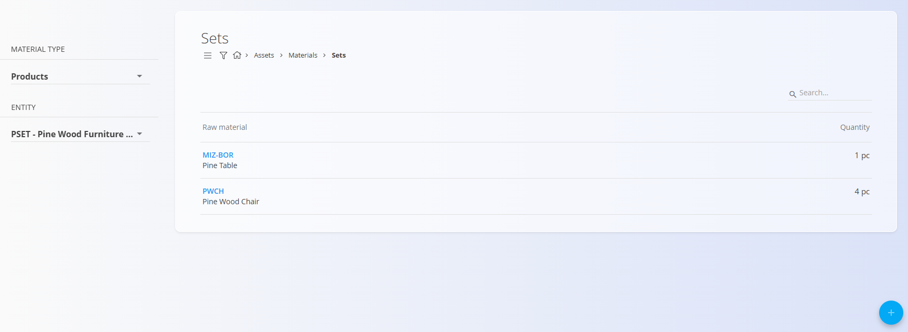
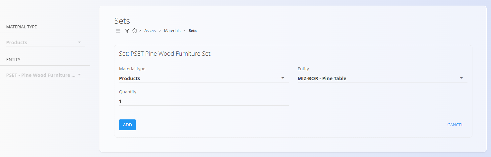

<!-- app_route: /management/materials/sets -->
<!-- app_label: Sets -->
<!-- canonical_source_url: https://github.com/Tom-PIT/Connected.Docs/blob/main/en/Domains/Assets/Materials/Sets.md -->
<!-- canonical_source_title: Sets -->

# Sets

Sets let you define composite items made of existing materials (products, semi products, raw or repro materials). A set groups multiple components with quantities under a single parent material, so you can sell or manage it as one.

To access this page, go to **Assets / Materials / Sets** in the [navigation](../../../Zajednicko/UI/Navigacija.md).

## Schema

### Document section

| Field | Description |
|---|---|
| **Material type** | Category of the parent set (e.g., Product, Semi product). |
| **Entity** | The parent material that represents the set (e.g., Furniture set). |
| **Quantity** | Quantity of each component in the set. |

## Management

### Prerequisites
- Create the parent material first in its category (e.g., **Products**, **Semi products**).
- Ensure each component you want to include is already defined in its respective code list.

## List of sets
The left sidebar lists parent materials grouped by [**Material type**](../README.md) (e.g., [**Products**](Products.md), [**Semi products**](SemiProducts.md)). Select a parent to view its components in the main list. The main list shows the components of the selected set with their quantities.

## Actions

### Create a set

1. Create the parent material in its category:
   - Go to **Assets / Materials / Products** and add a new product (e.g., **Pine Wood Furniture Set**).
2. Open **Assets / Materials / Sets** and select the parent on the left sidebar: **Products → Pine Wood Furniture Set**.
3. Click the [action button](../../../Common/UI/ActionButton.md) to add components to the set (each component must exist already):
   - Example components: **Pine Wood Table** (1), **Pine Wood Chair** (4)

   

4. Save. The **Pine Wood Furniture Set** now references all components with their quantities.

   

### Edit a set

Click on a component in the set list to modify its quantity or replace it with another material.

## Related operations
Sets are connected to **[Disassemblies](../../Logistics/Documents/Disassemblies.md)**. You can disassemble a set when, for example, you receive it and want to use or sell the individual parts separately. Disassembly creates logistics documents that move the set out and post its components into stock per defined quantities.

## Delete a set

Individual components can be removed from a set by selecting them and clicking **Delete**. If confirmed, the component is removed from the parent set.
