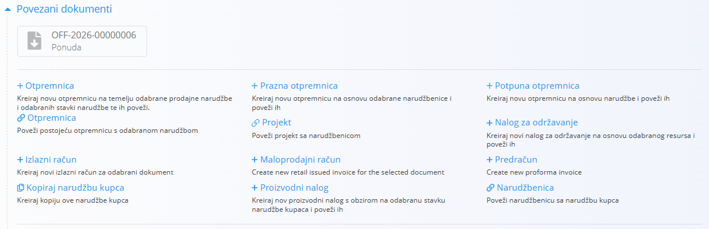

<!-- canonical_source_url: https://github.com/Tom-PIT/Connected.Docs/blob/main/hr/Zajednicko/Koncepti/PovezaniDokumenti.md -->
<!-- canonical_source_title: Povezani dokumenti -->

# Povezani dokumenti

Odjeljak **Povezani dokumenti** prikazuje dokumente povezane s trenutnim dokumentom te omogućuje stvaranje novih dokumenata unutar istog poslovnog procesa.

Povezani dokumenti omogućuju sljedivost između operativnih, logističkih, servisnih, proizvodnih i financijskih dokumenata u cijelom sustavu.

## Svrha povezanih dokumenata

Povezani dokumenti korisnicima omogućuju:

- Praćenje tijeka poslovnog procesa
- Kretanje između povezanih dokumenata
- Stvaranje sljedećih dokumenata izravno iz postojećih dokumenata
- Održavanje sljedivosti tijekom cijelog životnog ciklusa dokumenta

Primjeri:

- **Ponuda → Narudžba kupca → Otpremnica → Izlazni račun**
- **Narudžbenica dobavljača → Primka → Ulazni račun**
- **Plan održavanja → Radni nalog održavanja**
- **Proizvodni nalog → Primka → Izdatnica**

Dostupni povezani dokumenti ovise o vrsti i statusu trenutnog dokumenta.

## Stvoriti i povezati dokumente

Odjeljak **Povezani dokumenti** može se koristiti za stvaranje novih povezanih dokumenata ili za povezivanje postojećih dokumenata.

### Stvoriti novi dokument

Mnoge vrste dokumenata omogućuju stvaranje sljedećih dokumenata izravno iz trenutnog dokumenta.

Prilikom stvaranja novog dokumenta:

- Dokument se automatski povezuje s izvornim dokumentom.
- Relevantni podaci kopiraju se iz izvornog dokumenta.
- Sljedivost između dokumenata ostaje očuvana.

Primjeri:

- Narudžba kupca → Izlazni račun
- Narudžba kupca → Otpremnica
- Narudžbenica dobavljača → Primka

### Povezati postojeći dokument

Neke vrste dokumenata omogućuju i povezivanje dokumenata koji već postoje u sustavu.

Prilikom povezivanja postojećeg dokumenta:

- Ne stvara se novi dokument.
- Veza između dokumenata evidentira se u sustavu.
- Oba dokumenta postaju vidljiva u odjeljku **Povezani dokumenti**.

Ova je mogućnost korisna kada su povezani dokumenti nastali neovisno jedan o drugome, ali ih je ipak potrebno povezati radi sljedivosti.

## Sljedivost dokumenata

Odjeljak **Povezani dokumenti** omogućuje pregled cjelokupnog životnog ciklusa poslovnog procesa.

Korisnici mogu otvoriti izvorne dokumente kao i dokumente koji su nastali iz trenutnog dokumenta.

Na taj način stvara se potpuni revizijski trag te je moguće pratiti povijest transakcija, kretanja materijala, aktivnosti održavanja, proizvodnih procesa i financijskih dokumenata kroz cijeli sustav.

## Povezane informacije

Za primjere povezanih dokumenata dostupnih za određenu vrstu dokumenta pogledajte dokumentaciju tog dokumenta.