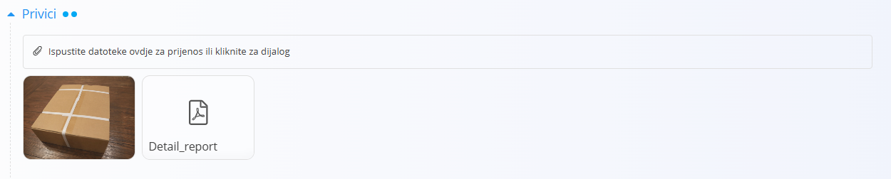
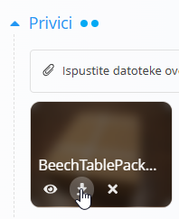

<!-- canonical_source_url: https://github.com/Tom-PIT/Connected.Docs/blob/main/hr/Zajednicko/Koncepti/Privici.md -->
<!-- canonical_source_title: Privici -->

# Privici

Odjeljak **Privici** dostupan je pri vrhu većine dokumenata i zapisa u sustavu.

Koristite ovaj odjeljak za prijenos i pohranu datoteka povezanih s dokumentom, kao što su:

- Otpremnice
- Prijevozni dokumenti
- Ugovori
- Fotografije
- Certifikati
- Skenirani dokumenti
- Ostale popratne datoteke

Priložene datoteke ostaju povezane s dokumentom te ih je moguće pregledati ili preuzeti u bilo kojem trenutku.

Broj točkica prikazan pokraj naslova **Privici** označava koliko je datoteka trenutno priloženo dokumentu.

### Prenijeti privitke

Datoteke možete prenijeti na dva načina:

- Povucite i ispustite datoteke u područje za prijenos.
- Kliknite područje za prijenos kako biste otvorili dijaloški okvir za odabir datoteka.

Nakon prijenosa, privici se prikazuju na popisu ispod područja za prijenos.

### Radnje nad privicima

Postavite pokazivač miša iznad prenesene datoteke kako bi se prikazale dostupne radnje.

Ovisno o vrsti datoteke, dostupne mogu biti sljedeće radnje:

- **Pregled** – otvara pregled datoteke. Ova je radnja dostupna za slikovne datoteke.
- **Preuzmi** – preuzima datoteku na vaš uređaj.
- **Izbriši** – nakon potvrde uklanja datoteku iz dokumenta.