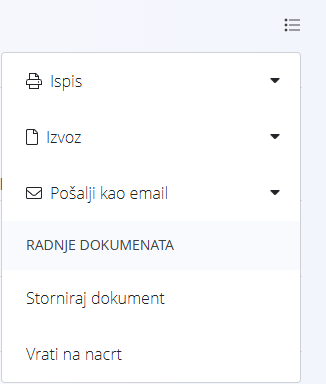

<!-- canonical_source_url: https://github.com/Tom-PIT/Connected.Docs/blob/main/hr/Zajednicko/Koncepti/RadnjeIzbornika.md -->
<!-- canonical_source_title: Radnje izbornika -->

# Radnje izbornika

Mnogi zasloni pružaju dodatne radnje putem **Izbornika** koji se nalazi u gornjem desnom kutu stranice.

Dostupne radnje ovise o trenutnom zaslonu te o tome je li izbornik otvoren iz **prikaza popisa** ili **prikaza dokumenta**.

## Izbornik u prikazu popisa

Kada se koristi u prikazu popisa, radnje izbornika primjenjuju se na zapise koji su trenutno prikazani na popisu.

Primjeri:

- Ispis filtriranog popisa računa
- Izvoz trenutnog popisa u CSV ili PDF
- Otvaranje skupne obrade za više zapisa

Rezultat ovisi o trenutno primijenjenim filtrima i vidljivim podacima.

## Izbornik u prikazu dokumenta

Kada se koristi u prikazu dokumenta, radnje izbornika primjenjuju se samo na trenutno otvoreni dokument.

Primjeri:

- Ispis dokumenta
- Izvoz dokumenta
- Slanje dokumenta e-poštom
- Vraćanje dokumenta u nacrt
- Storniranje dokumenta

## Uobičajene radnje izbornika

### Ispis

Ispišite trenutni dokument ili popis.

### Izvoz

Izvezite trenutni dokument ili popis.

Ovisno o zaslonu, dostupni formati izvoza mogu uključivati:

- PDF
- CSV
- XML

> [!NOTE]
> Izvoz popisa obično uključuje sve zapise koji odgovaraju trenutno primijenjenim filtrima, dok izvoz dokumenta uključuje pojedinosti trenutno otvorenog dokumenta.

### Uvoz stavki

Uvezite stavke dokumenta iz vanjske datoteke.

### Izbrisati sve stavke

Uklonite sve stavke iz trenutnog dokumenta.

Ova se radnja najčešće koristi za pražnjenje dokumenta prije dodavanja novih stavki ili prije brisanja dokumenta u statusu **Nacrt**, budući da se dokumenti koji sadrže stavke ne mogu izbrisati.

### Vratiti u nacrt

Vratite potvrđeni dokument u status **Nacrt**, čime je omogućeno njegovo daljnje uređivanje.

Dostupnost ove radnje ovisi o vrsti dokumenta i njegovom trenutnom statusu.

### Stornirati dokument

Stvorite [storno dokument](../../Domains/Logistics/Documents/Reversals.md) kojim se poništavaju učinci izvornog dokumenta.

Dostupnost ove radnje ovisi o vrsti dokumenta.

> [!NOTE]
> Storniranje ne briše niti mijenja izvorni dokument. Umjesto toga, sustav stvara povezani storno dokument koji primjenjuje suprotne skladišne ili financijske učinke uz očuvanje potpune revizijske evidencije.

### Poslati e-poštom

Pošaljite trenutni dokument e-poštom.

Kada je dostupno, možete odabrati datoteku koju želite priložiti poruci e-pošte. Ovisno o vrsti dokumenta i konfiguraciji, dostupni privici mogu uključivati:

- PDF verziju dokumenta
- CSV izvoz koji sadrži pojedinosti dokumenta
- Ostale datoteke koje generira sustav

Dostupni formati privitaka ovise o odabranom dokumentu ili prikazu. Primatelji i privici odabiru se u izborniku.

### Otvoriti skupnu obradu

Izvršite radnje nad više odabranih zapisa odjednom.

Dostupne radnje ovise o odabranoj vrsti dokumenta.

Otvara način rada u kojem je moguće odabrati više zapisa za skupnu obradu. Nakon odabira zapisa, radnje se izvršavaju putem [akcijskog gumba](../UI/ActionButton.md).

### Izvesti stanje zaliha po prosječnom iznosu

Izvezite trenutno stanje zaliha u CSV datoteku.

Izvoz uključuje količine i vrijednosti zaliha za svaki materijal zajedno s izračunatim prosječnim iznosom koji se koristi za vrednovanje zaliha.

Izvoz obično uključuje sljedeće podatke:

- Skladište
- Šifra i naziv materijala
- Vrsta materijala
- Količine (početno stanje, primljeno, izdano, završno stanje)
- Iznosi (početno stanje, primljeno, izdano, završno stanje)
- Prosječni iznos

Ovaj se izvoz može koristiti za analizu zaliha, izvještavanje i potrebe vrednovanja zaliha.

## Dodatne radnje

Neki zasloni pružaju dodatne radnje izbornika koje su specifične za taj zaslon. Te su radnje opisane u odgovarajućoj dokumentaciji.