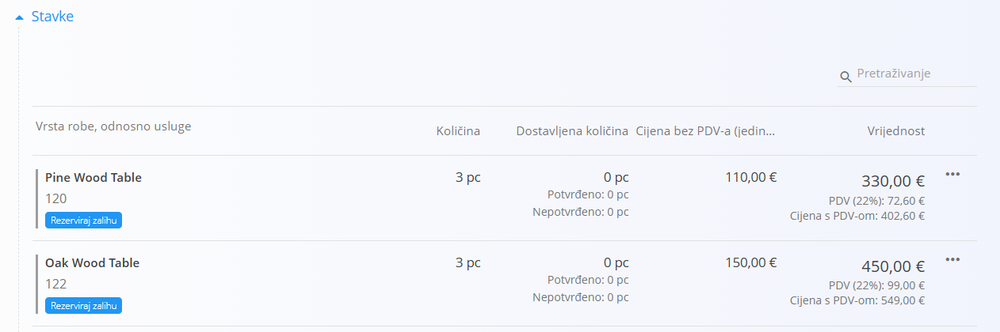
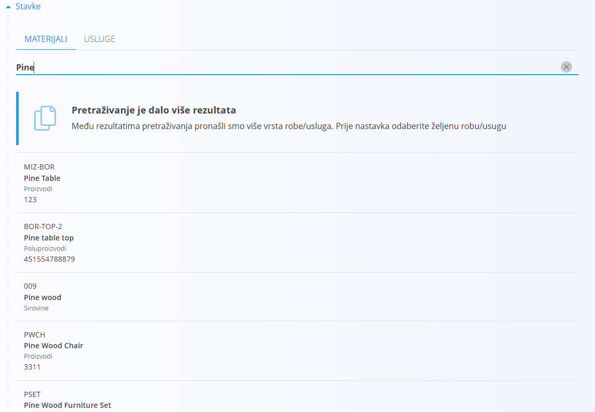
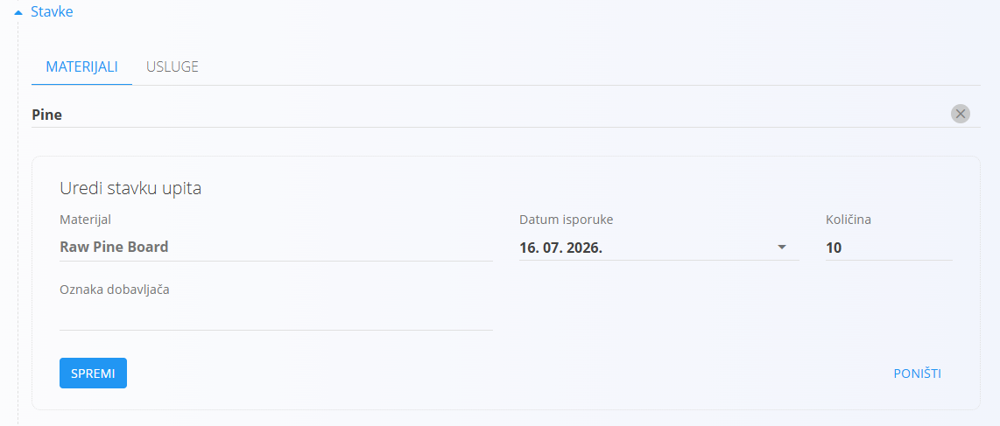
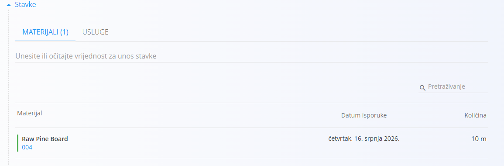

<!-- canonical_source_url: https://github.com/Tom-PIT/Connected.Docs/blob/main/hr/Zajednicko/Koncepti/Stavke.md -->
<!-- canonical_source_title: Stavke -->

# Stavke

Odjeljak **Stavke** sadrži pojedinačne stavke koje čine dokument.

Ovisno o vrsti dokumenta, stavke mogu predstavljati:

- Robu
- Usluge

Većina logističkih, proizvodnih, servisnih i prodajnih dokumenata koristi odjeljak **Stavke** za evidentiranje materijala i količina.

## Dodati stavku

Nova stavka može se dodati upisivanjem ili skeniranjem vrijednosti u polje za unos iznad popisa stavki.

Podržane vrijednosti za pretraživanje obično uključuju:

- Šifru materijala
- Naziv materijala
- Barkod (EAN)
- Serijski broj

Dostupne mogućnosti pretraživanja ovise o vrsti dokumenta i konfiguraciji sustava.

### Odabrati odgovarajući rezultat

Ako je pronađeno više odgovarajućih zapisa, sustav prikazuje popis dostupnih rezultata.

Odaberite odgovarajući zapis s popisa.

### Potvrditi stavku

Nakon odabira rezultata, sustav automatski popunjava dostupne podatke, kao što su:

- Materijal
- Serijski broj
- Lokacija skladišta
- Rok trajanja
- Količina

Prikazana polja ovise o odabranom materijalu i vrsti dokumenta. Po potrebi možete izmijeniti količinu.

Kliknite **Spremi** kako biste dodali stavku u dokument ili **Poništi** kako biste odustali od dodavanja.

### Dodane stavke

Nakon spremanja, stavka se prikazuje na popisu stavki.

## Podaci o stavci

Ovisno o vrsti dokumenta, stavka može sadržavati podatke kao što su:

- Materijal
- Količina
- Jedinica mjere
- Lokacija skladišta
- Serijski broj
- Broj serije
- Rok trajanja
- Cijena
- Iznos

Ne koriste svi dokumenti ista polja.

## Urediti stavku

Postojeće stavke obično se mogu urediti odabirom stavke na popisu.

Dostupna polja ovise o vrsti dokumenta i trenutnom statusu dokumenta.

Dostupna polja mogu uključivati:

- **Vrsta robe, odnosno usluge**
- **Datum isporuke**
- **Količina**
- **Cijena bez PDV-a (jedinična)**
- **Stopa poreza**
- **Popust (%)**
- **Koristite alternativnu valutu**

> [!NOTE]
> Dostupna polja ovise o vrsti dokumenta i konfiguraciji sustava.

## Izbrisati stavku

Stavke se u pravilu mogu izbrisati dok je dokument u statusu **Nacrt**.

Za brisanje stavke odaberite stavku na popisu i kliknite **Izbriši**.

Dostupnost ove radnje ovisi o vrsti dokumenta i konfiguraciji.

## Dodatno ponašanje

Ovisno o vrsti dokumenta, sustav može automatski:

- Provjeriti raspoloživost zaliha
- Provjeriti serijske brojeve
- Izračunati cijene
- Izračunati poreze
- Predložiti lokacije skladišta
- Spriječiti unos duplikata

Pravila specifična za pojedinu vrstu dokumenta opisana su u odgovarajućoj dokumentaciji.