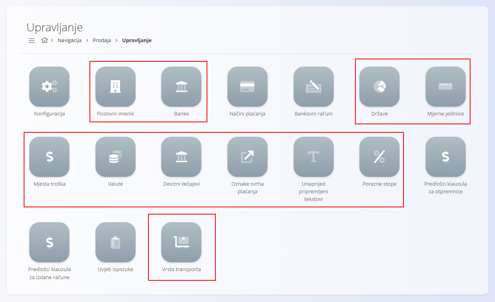

<!-- canonical_source_url: https://github.com/Tom-PIT/Connected.Docs/blob/main/hr/Zajednicko/README.md -->
<!-- canonical_source_title: Zajedničko -->

# Zajedničko

Modul **Zajedničko** nije zasebna domena, već skup **zajedničkih šifrarnika i osnovnih elemenata korisničkog sučelja** koji se koriste u cijeloj platformi. Ti elementi definiraju zajedničke podatke, kao što su države, valute, porezne stope, mjerne jedinice i poslovni partneri. Sve funkcionalne domene — [**Prodaja**](../Domene/Prodaja/README.md), [**Nabava**](../Domene/Nabava/README.md), [**Logistika**](../Domene/Logistika/README.md) i [**Proizvodnja**](../Domene/Proizvodnja/README.md) — oslanjaju se na modul **Zajedničko** za ispravan rad.

Zbog toga je modul **Zajedničko** potrebno konfigurirati **prije** korištenja bilo koje druge domene u platformi.

Primjer zajedničkih šifrarnika u domeni **Prodaja**:

> [!IMPORTANT]
> Zajedničke šifrarnike potrebno je konfigurirati kao **prvi korak** prilikom postavljanja platforme.
>
> Bez tih podataka domene [**Prodaja**](../Domene/Prodaja/README.md), [**Nabava**](../Domene/Nabava/README.md), [**Logistika**](../Domene/Logistika/README.md) i [**Konfiguracija sustava**](../Domene/Sustav/Postavke/Konfiguracija.md) ne mogu ispravno funkcionirati.

## Što uključuje modul Zajedničko?

Modul **Zajedničko** sadrži nekoliko skupina zajedničkih šifrarnika koji se koriste u cijelom sustavu:

- **Geografski i organizacijski podaci**
- **Financijske i porezne postavke**
- **Mjerne jedinice**
- **Poslovni partneri i poslovni podaci**
- **Predlošci tekstova i elementi korisničkog sučelja**

Ti šifrarnici predstavljaju osnovu na kojoj se temelje ostale domene sustava.

> [!TIP]
> Pregled svih šifrarnika dostupan je u dokumentu **[Indeks upravljanja](../IndeksUpravljanja.md)**.

## Geografski i organizacijski podaci

Ovi šifrarnici definiraju geografski i organizacijski kontekst tvrtke i njezinih dokumenata.

- **[Države](Upravljanje/Drzave.md)** – Definiraju države koje se koriste za adrese, dokumente, zakonske zahtjeve i lokalizaciju.
- **[Poslovni imenik](Upravljanje/PoslovniImenik.md)** – Središnji popis kupaca, dobavljača i drugih poslovnih subjekata.

> [!IMPORTANT]
> Države moraju biti konfigurirane prije postavljanja države organizacije u **Sustav → Konfiguracija → Organizacija** ili u **Postavkama zajedničkih šifrarnika**.

## Financijske i porezne postavke

Ove postavke utječu na sva financijska i novčana poslovanja u sustavu.

- **[Valute](Upravljanje/Valute.md)** – Definiraju valute dostupne u sustavu.
- **[Porezne stope](Upravljanje/PorezneStope.md)** – Definiraju PDV i ostale porezne stope koje se koriste u prodaji i nabavi.
- **[Načini plaćanja](../Domene/Prodaja/Upravljanje/NaciniPlacanja.md)** – Definiraju načine plaćanja koji se koriste u prodaji i financijama.

> [!IMPORTANT]
> Valute moraju biti definirane prije nego što se mogu koristiti u:
>
> - **Sustav → Konfiguracija → Postavke zajedničkih šifrarnika**
> - dokumentima **Prodaje**
> - dokumentima **Nabave**

## Mjerne jedinice

Mjerne jedinice koriste se u području imovine, materijala, prodaje, nabave, logistike i proizvodnje.

- **[Mjerne jedinice](Upravljanje/MjerneJedinice.md)** – Definiraju osnovne mjerne jedinice poput komada, kilograma, metara ili litara.

Ispravna konfiguracija osigurava dosljedan prikaz količina, cijena i izračuna zaliha.

## Poslovni partneri

Podaci o poslovnim partnerima zajednički su svim komercijalnim procesima.

- **[Poslovni imenik](Upravljanje/PoslovniImenik.md)** – Zajednički popis kupaca, dobavljača i drugih poslovnih subjekata.
- **[Banke](Upravljanje/Banke.md)** – Definicije banaka koje se koriste u platnim nalozima i bankovnim računima.
- **[Bankovni računi organizacije](../Domene/Prodaja/Upravljanje/BankovniRacuniOrganizacije.md)** – Bankovni računi tvrtke koji se koriste na izlaznim računima i drugim dokumentima.

Ovi podaci osiguravaju dosljednu identifikaciju poslovnih partnera u svim domenama.

## Tekstovi i predlošci

Ovi šifrarnici omogućuju dosljedan izgled i sadržaj poslovnih dokumenata.

- **[Unaprijed pripremljeni tekstovi](Upravljanje/UnaprijedPripremljeniTekstovi.md)** – Tekstovi koji se mogu ponovno koristiti u ponudama, izlaznim računima, otpremnicama i narudžbenicama.

## Zašto je potrebno prvo konfigurirati modul Zajedničko?

Gotovo svi poslovni procesi u sustavu ovise o zajedničkim šifrarnicima.

| Područje | Ovisnost |
|----------|----------|
| **Sustav → Konfiguracija** | Zahtijeva [**Države**](Upravljanje/Drzave.md) i [**Valute**](Upravljanje/Valute.md) prije definiranja podataka o organizaciji. |
| **Prodaja** | Zahtijeva [**Valute**](Upravljanje/Valute.md), [**Porezne stope**](Upravljanje/PorezneStope.md), [**Mjerne jedinice**](Upravljanje/MjerneJedinice.md) i [**Načine plaćanja**](../Domene/Prodaja/Upravljanje/NaciniPlacanja.md). |
| **Nabava** | Zahtijeva [**Poslovni imenik**](Upravljanje/PoslovniImenik.md), [**Države**](Upravljanje/Drzave.md) i [**Valute**](Upravljanje/Valute.md). |
| **Logistika** | Zahtijeva [**Mjerne jedinice**](Upravljanje/MjerneJedinice.md), [**Države**](Upravljanje/Drzave.md) i [**Poslovni imenik**](Upravljanje/PoslovniImenik.md). |
| **Proizvodnja** | Koristi [**Mjerne jedinice**](Upravljanje/MjerneJedinice.md) i [**Poslovni imenik**](Upravljanje/PoslovniImenik.md). |

Ako modul **Zajedničko** nije konfiguriran prije početka rada, korisnici mogu naići na sljedeće probleme:

- nedostajuće vrijednosti u padajućim popisima
- nemogućnost stvaranja prodajnih i nabavnih dokumenata
- neispravan obračun poreza
- pogrešan prikaz podataka na računima i otpremnicama
- pogreške prilikom konfiguracije sustava

> [!CAUTION]
> Nemojte započeti rad u domenama [**Prodaja**](../Domene/Prodaja/README.md), [**Nabava**](../Domene/Nabava/README.md), [**Logistika**](../Domene/Logistika/README.md) ili **Konfiguracija sustava** dok nisu konfigurirani svi potrebni zajednički šifrarnici.