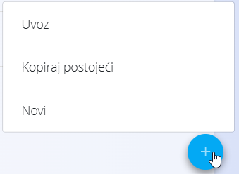

<!-- app_route: /sitemap -->
<!-- app_label: Sitemap -->
<!-- canonical_source_url: https://github.com/Tom-PIT/Connected.Docs/blob/main/hr/Zajednicko/UI/AkcijskiGumb.md -->
<!-- canonical_source_title: Akcijski gumb -->

# Akcijski gumb

**Akcijski gumb** prikazuje se kao plava okrugla ikona **+** u donjem desnom kutu zaslona s popisom. Njegova je osnovna namjena stvaranje novih zapisa unutar modula koji trenutno pregledavate.

Klikom na gumb otvara se kontekstni izbornik s radnjama dostupnima za trenutni zaslon.

Najčešća radnja je:

- **Novo** – stvara novi dokument, stavku šifrarnika ili konfiguracijsku stavku.

Ovisno o modulu, akcijski gumb može sadržavati i dodatne mogućnosti, kao što su:

- **Uvoz** – prijenos ili uvoz podataka iz vanjskih datoteka (npr. Excel predložaka).
- **Kopiraj postojeće** – stvara novu stavku na temelju postojeće.
- **Ostale radnje specifične za modul** – prikazuju se samo kada su dostupne.

### Napomene

- Dostupne radnje ovise o modulu i korisničkim ovlastima.
- Akcijski gumb prikazuje se samo na **zaslonima s popisom**, a ne na obrascima za uređivanje dokumenata.
- Svaka radnja otvara ili stvara **novi dokument u statusu Nacrt**, koji se zatim može dovršiti i potvrditi.

