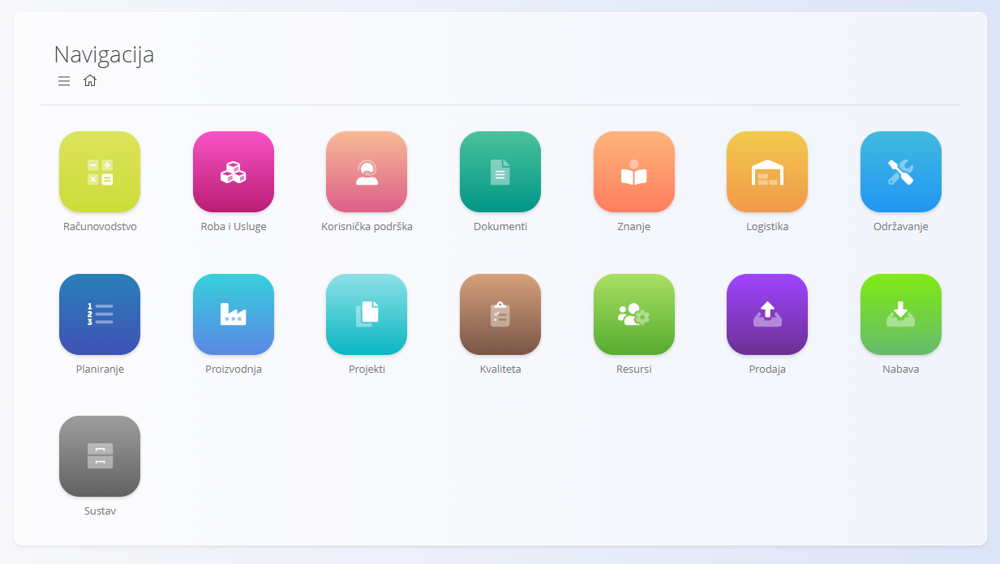
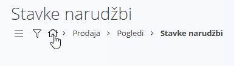
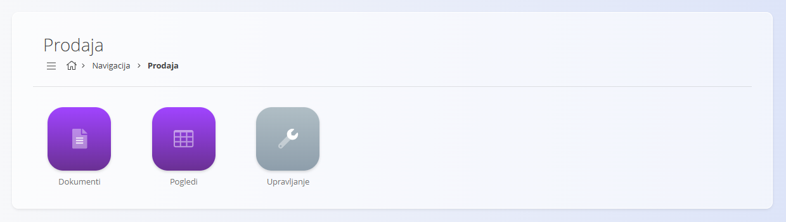
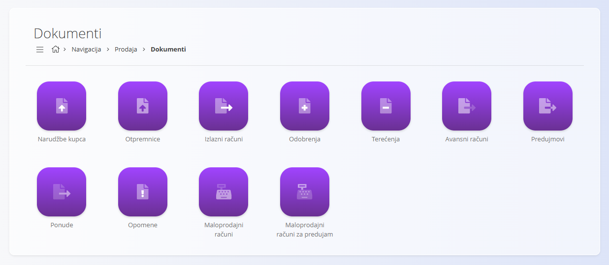
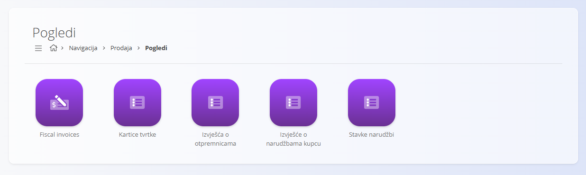
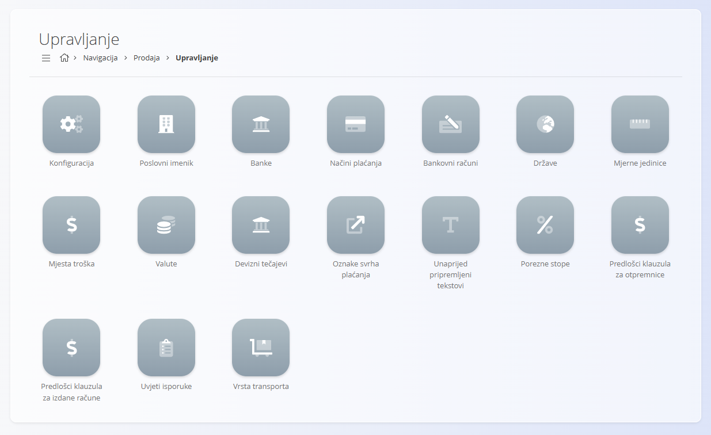

<!-- app_route: /sitemap -->
<!-- app_label: Navigacija -->
<!-- canonical_source_url: https://github.com/Tom-PIT/Connected.Docs/blob/main/hr/Zajednicko/UI/Navigacija.md -->
<!-- canonical_source_title: Navigacija -->

# Navigacija

Platforma je organizirana tako da možete jednostavno pronaći dokumente, poglede i područja konfiguracije koja su vam potrebna u svakodnevnom radu. Navigacija se odvija prvenstveno putem **Navigacije**, navigacijske putanje i gumba za brzi pristup.

## Navigacija

**Navigacija** predstavlja glavnu ulaznu točku platforme. Podijeljena je na **domene**, pri čemu svaka predstavlja određeno poslovno područje sustava.

Na **Navigaciju** se uvijek možete vratiti klikom na **ikonu kuće** u navigacijskoj putanji.

### Navigacija pomoću navigacijske putanje

Navigacijska putanja prikazuje vašu trenutnu lokaciju u sustavu i omogućuje povratak na bilo koju prethodnu razinu.

Na mnogim zaslonima u donjem desnom kutu prikazuje se i **gumb sa strelicom za povratak**, kojim se možete vratiti na prethodni zaslon.

### Domene

Svaka domena sadrži funkcionalnosti povezane s određenim poslovnim područjem. Primjeri uključuju:

- **[Prodaja](../../Domene/Prodaja/README.md)**
- **[Logistika](../../Domene/Logistika/README.md)**
- **[Nabava](../../Domene/Nabava/README.md)**
- **[Proizvodnja](../../Domene/Proizvodnja/README.md)**

> [!NOTE]
>
> Dostupne domene ovise o konfiguraciji sustava i poslovnom modelu pojedine tvrtke. Primjerice, tvrtka koja se bavi isključivo prodajom gotovih proizvoda možda neće koristiti domenu **Proizvodnja**.

Unutar svake domene nalaze se različite vrste odjeljaka. Najčešći su:

- **Dokumenti**
- **Pogledi**
- **Upravljanje**

Primjer – odjeljci u domeni **Prodaja**:

## Dokumenti

Dokumenti predstavljaju osnovu svakodnevnog poslovanja. Koriste se za stvaranje, obradu i praćenje poslovnih transakcija, kao što su:

- **[Narudžbe kupca](../../Domene/Prodaja/Dokumenti/NarudzbeKupca.md)**
- **[Otpremnice](../../Domene/Prodaja/Dokumenti/Otpremnice.md)**
- **[Primke](../../Domene/Logistika/Dokumenti/Primke.md)**
- **[Izdatnica](../../Domene/Logistika/Dokumenti/Izdatnica.md)**
- **[Međuskladišni promet](../../Domene/Logistika/Dokumenti/MeduskladisniPromet.md)**
- **[Inventure](../../Domene/Logistika/Dokumenti/Inventure.md)**
- **[Narudžbenice dobavljača](../../Domene/Nabava/Dokumenti/NarudzbeniceDobavljaca.md)**
- **[Izvedba](../../Domene/Proizvodnja/Dokumenti/Izvedba.md)**
- **[Proizvodni nalozi](../../Domene/Proizvodnja/Dokumenti/ProizvodniNalozi.md)**
- **[Zahtjevi](../../Domene/Proizvodnja/Dokumenti/Zahtjevi.md)**
- I mnogi drugi.

Primjer – otvaranje **Prodaja / Dokumenti**:

Dokumenti u pravilu omogućuju:

- Pregled nacrta i potvrđenih dokumenata
- Stvaranje novih dokumenata
- Filtriranje podataka
- Ispis i izvoz

## Pogledi

Pogledi služe za **analizu i praćenje** poslovnih podataka. Njima se ne stvaraju poslovne transakcije, već omogućuju bolji pregled poslovanja.

Pogledi obično uključuju:

- **[Zaliha](../../Domene/Logistika/Pogledi/Zaliha.md)**
- **[Izvješće o narudžbama kupcu](../../Domene/Prodaja/Pogledi/IzvjesceONarudzbamaKupcu.md)**
- **[Izvješća o otpremnicama](../../Domene/Prodaja/Pogledi/IzvjescaOOtpremnicama.md)**
- **[Kartice tvrtke](../../Domene/Prodaja/Pogledi/KarticeTvrtke.md)**
- **[Pogled na zalihe prema lokacijama](../../Domene/Logistika/Pogledi/PogledNaZalihePremaLokacijama.md)**
- **[Ključni pokazatelji uspješnosti proizvodnje](../../Domene/Proizvodnja/Analitika/KlucniPokazateljiUspjesnostiProizvodnje.md)**
- **[Sažetak gubitka (škarta)](../../Domene/Proizvodnja/Analitika/SazetakGubitkaSkarta.md)**
- **[Sažetak zastoja](../../Domene/Proizvodnja/Analitika/SazetakZastoja.md)**

Primjer – **Prodaja / Pogledi**:

Pogledi su namijenjeni za:

- Brzu analizu
- Kontrolu i provjeru
- Donošenje odluka
- Izvještavanje

## Upravljanje

Odjeljak **Upravljanje** sadrži matične podatke i šifrarnike koji se koriste u cijelom sustavu. Oni osiguravaju da dokumenti i poslovni procesi koriste dosljedne i valjane podatke.

> [!TIP]
> Za brzo pronalaženje dokumentacije o šifrarnicima pogledajte [**Indeks upravljanja**](../../IndeksUpravljanja.md).

Odjeljak **Upravljanje** obuhvaća, između ostalog:

- Konfiguraciju
- **[Poslovni imenik](../Upravljanje/PoslovniImenik.md)**
- **[Načini plaćanja](../../Domene/Prodaja/Upravljanje/NaciniPlacanja.md)**
- **[Države](../Upravljanje/Drzave.md)**, **[Valute](../Upravljanje/Valute.md)**, **[Porezne stope](../Upravljanje/PorezneStope.md)**
- **[Unaprijed pripremljeni tekstovi](../Upravljanje/UnaprijedPripremljeniTekstovi.md)**
- **[Mjerne jedinice](../Upravljanje/MjerneJedinice.md)**
- **[Bankovni računi organizacije](../../Domene/Prodaja/Upravljanje/BankovniRacuniOrganizacije.md)**
- **[Procesi](../../Domene/Proizvodnja/Upravljanje/Procesi.md)**
- **[Unosi](../../Domene/Proizvodnja/Upravljanje/Unosi.md)** i **[Izlazi](../../Domene/Proizvodnja/Upravljanje/Izlazi.md)**
- **[Sistematizacija radnih mjesta](../../Domene/Proizvodnja/Upravljanje/SistematizacijaRadnihMjesta.md)** i **[Ljudski resursi](../../Domene/Proizvodnja/Upravljanje/LjudskiResursi.md)**
- Ostali važni šifrarnici

Primjer – **Prodaja / Upravljanje**:

Stranice u odjeljku **Upravljanje** najčešće koriste administratori i korisnici zaduženi za konfiguraciju sustava.