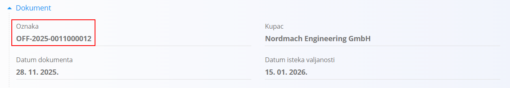
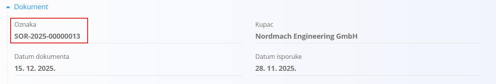

<!-- canonical_source_url: https://github.com/Tom-PIT/Connected.Docs/blob/main/hr/Zajednicko/UI/OznakeDokumenata.md-->
<!-- canonical_source_title: Oznake dokumenata -->

# Oznake dokumenata

Svaki dokument u sustavu dobiva automatski generiranu **oznake dokumenta**.

Oznaka dokumenta jedinstveno identificira dokument i slijedi istu strukturu u svim modulima sustava.
> [!NOTE]
> Format oznaka dokumenata može se konfigurirati u **Upravljanje / Konfiguracija** za pojedine vrste dokumenata u svakoj domeni.

Oznake dokumenata koriste se za:

- Praćenje i identifikaciju dokumenata
- Navigaciju unutar sustava
- Povezivanje dokumenata (Ponuda → Narudžba kupca → Otpremnica → Izlazni račun)
- Vanjsku komunikaciju (PDF, e-pošta, izvoz)

## Struktura oznake dokumenta

Sve oznake dokumenata imaju isti format:

```text
PREFIKS-GODINA-REDNI_BROJ
```

Gdje:

- `PREFIKS` – 2 ili 3 slova koja označavaju vrstu dokumenta
- `GODINA` – godina u kojoj je dokument stvoren
- `REDNI_BROJ` – uzastopni broj s vodećim nulama



Primjeri:

- `OFF-2025-00000012`
- `SOR-2025-00002311`

## Primjeri prefiksa prema vrsti dokumenta

### Prodajni dokumenti

- `OFF` – Ponude
- `SOR` – Narudžbe kupca
- `DNO` – Otpremnice
- `INV` – Izlazni računi

### Nabavni dokumenti

- `INQ` – Upiti
- `SOR` – Narudžbenice dobavljača
- `REC` – Primke (djelomične ili potpune)

### Financijski / skladišni dokumenti

(Ako je primjenjivo)

- `PAY` – Plaćanja
- `STK` – Skladišne transakcije
- `CMP` – Završene proizvodne ili montažne serije

## Generiranje oznaka

- Oznake se **automatski dodjeljuju** prilikom stvaranja dokumenta.
- Redni broj povećava se neovisno za svaku vrstu dokumenta.
- Jednom dodijeljena oznaka **ne može se mijenjati**.
- Dokumenti nastali iz drugih dokumenata (npr. Ponuda → Narudžba kupca) uvijek dobivaju **novu oznaku**.

## Gdje se prikazuje oznaka


Oznake se također prikazuju u:

- Popisima
- Povezanim dokumentima
- PDF dokumentima
- Izvozu e-poštom
- Integracijama

## Zašto je struktura oznake važna

Jedinstvena struktura omogućuje:

- Pregledno sortiranje u popisima
- Predvidljivo pretraživanje i filtriranje
- Jednostavno referenciranje u računovodstvu, logistici i poslovnim procesima
- Jednostavno čitljiv format (godina + redni broj)