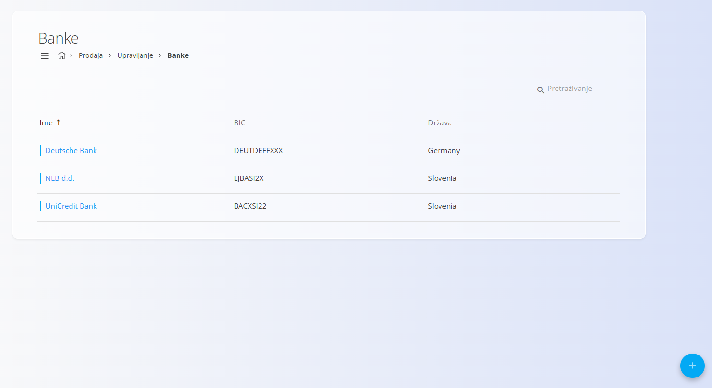
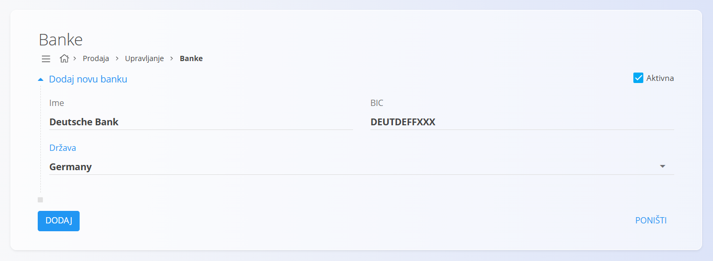

<!-- app_route: /management/common-types/banks -->
<!-- app_label: Banke -->
<!-- canonical_source_url: https://github.com/Tom-PIT/Connected.Docs/blob/main/hr/Zajednicko/Upravljanje/Banke.md -->
<!-- canonical_source_title: Banke -->

# Banke

Šifrarnik **Banke** sadrži financijske institucije koje se mogu koristiti u dokumentima kao što su izlazni računi, plaćanja i bankovni računi organizacije. Svaki zapis sadrži naziv banke, BIC oznaku i državu, što sustavu omogućuje povezivanje s [**Poslovnim imenikom**](BusinessDirectory.md) i ispravno korištenje bankovnih podataka u cijelom sustavu.

Za pristup ovom šifrarniku idite na **Prodaja / Upravljanje / Banke** u [navigaciji](../../Zajednicko/UI/Navigacija.md).

> [!NOTE]
> **Preduvjeti**
>
> Prije upravljanja zapisima banaka provjerite je li šifrarnik [**Države**](../../Common/Management/Countries.md) pravilno konfiguriran.

## Shema

| Polje | Opis |
|-------|------|
| **Ime** | Puni naziv banke (obavezno). |
| **BIC** | Identifikacijska oznaka banke koja se koristi u međunarodnim transakcijama (obavezno). |
| [**Država**](../../Common/Management/Countries.md) | Država u kojoj je banka registrirana (obavezno). |
| **Aktivna** | Označava može li se banka koristiti u dokumentima (zadano odabrano). |

## Upravljanje

Na ovom zaslonu možete pregledavati, dodavati i uređivati banke koje se koriste u cijelom sustavu.

### Popis banaka

Popis prikazuje sve evidentirane banke zajedno s njihovim **nazivom**, **BIC** oznakom i [**državom**](../../Common/Management/Countries.md).

Svaki zapis sadrži indikator statusa lijevo od naziva:

- **Plava** boja označava aktivnu banku.
- **Siva** boja označava neaktivnu banku.

Polje **Pretraživanje** omogućuje brzo pronalaženje banaka prema nazivu ili BIC oznaci.

## Radnje

### Dodati novu banku

Za dodavanje nove banke:

1. Kliknite [akcijski gumb](../../Common/UI/ActionButton.md).
2. Ispunite sva obavezna polja. Neobavezna polja ispunite prema potrebi. Više informacija o pojedinim poljima nalazi se u odjeljku [**Shema**](#shema).
3. Kliknite **Dodaj** za spremanje nove banke ili **Poništi** za povratak na popis bez spremanja.

### Urediti postojeću banku

Za uređivanje postojeće banke:

1. Odaberite banku s popisa.
2. Po potrebi izmijenite naziv, BIC oznaku, državu ili status aktivnosti.
3. Kliknite **Spremi** za potvrdu promjena ili **Poništi** za odustajanje.

### Izbrisati postojeću banku

Za brisanje banke:

1. Odaberite banku s popisa.
2. Kliknite **Izbriši**.
3. Potvrdite brisanje.

Ako potvrdite brisanje, zapis će biti trajno uklonjen.

> [!NOTE]
> Zapis banke može se izbrisati samo ako nije povezan s drugim zapisima u sustavu.