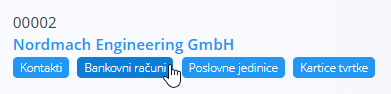
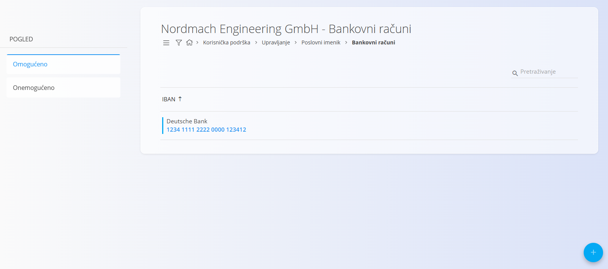
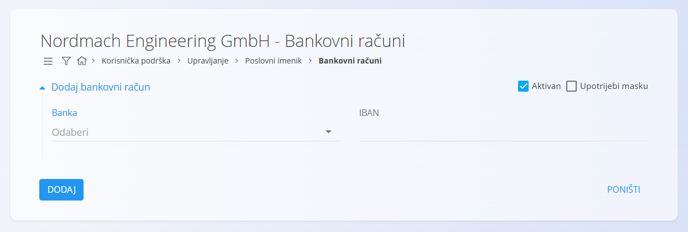

<!-- app_route: /management/contacts/companies -->
<!-- app_label: Bankovni računi -->
<!-- app_navigation_hint: Otvorite Poslovni imenik, zatim otvorite Bankovne račune za odgovarajući zapis. -->
<!-- canonical_source_url: https://github.com/Tom-PIT/Connected.Docs/blob/main/hr/Zajednicko/Upravljanje/BankovniRacuni.md -->
<!-- canonical_source_title: Bankovni računi -->

# Bankovni računi

**Bankovni računi** pripadaju određenom **kupcu** ili **dobavljaču** te se njima upravlja unutar [**Poslovnog imenika**](BusinessDirectory.md). Sadrže podatke o bankovnim računima koji se kasnije koriste u dokumentima, kao što su izlazni računi ili plaćanja.

Svaki bankovni račun povezan je s **Bankom**, koja se odabire iz šifrarnika [**Banke**](Banks.md).

Za otvaranje **Bankovnih računa** kliknite karticu ispod odgovarajućeg zapisa u **Poslovnom imeniku**. Otvorit će se popis svih bankovnih računa povezanih s odabranom tvrtkom ili fizičkom osobom.

## Shema

| Polje | Opis |
|-------|------|
| [**Banka**](Banks.md) | Banka u kojoj je otvoren račun. Odabire se iz šifrarnika **Banke** (obavezno). |
| **IBAN** | Međunarodni broj bankovnog računa (obavezno). |
| **Aktivan** | Označava može li se račun koristiti u dokumentima. |
| **Upotrijebi masku** | Prikazuje IBAN u formatiranom obliku (s razmacima i grupiranjem) bez promjene njegove vrijednosti. |

## Popis

Popis **Bankovnih računa** prikazuje sve bankovne račune povezane s odabranim zapisom u **Poslovnom imeniku**.

Pomoću filtara na lijevoj strani (**Omogućeno / Onemogućeno**) možete prikazati samo aktivne ili neaktivne bankovne račune.

## Radnje

### Dodati novi bankovni račun

Za dodavanje novog bankovnog računa:

1. Kliknite [akcijski gumb](../UI/ActionButton.md) kako biste otvorili obrazac za unos novog bankovnog računa.

   

2. Ispunite sva obavezna polja. Neobavezna polja ispunite prema potrebi. Više informacija o pojedinim poljima nalazi se u odjeljku [**Shema**](#shema).

3. Kliknite **Dodaj** za spremanje novog bankovnog računa ili **Poništi** za povratak na popis bez spremanja.

### Urediti postojeći bankovni račun

Za uređivanje postojećeg bankovnog računa:

1. Otvorite zapis u **Poslovnom imeniku**.
2. Kliknite karticu **Bankovni računi**.
3. Odaberite bankovni račun s popisa.
4. Po potrebi izmijenite IBAN, status aktivnosti ili postavku **Upotrijebi masku**.
5. Kliknite **Spremi** za potvrdu promjena ili **Poništi** za odustajanje.

### Izbrisati bankovni račun

Za brisanje bankovnog računa:

1. Otvorite zapis u **Poslovnom imeniku**.
2. Kliknite karticu **Bankovni računi**.
3. Odaberite bankovni račun klikom na njegov IBAN na popisu.
4. Kliknite **Izbriši**. Nakon potvrde bankovni račun bit će trajno izbrisan.

Bankovni račun može se izbrisati samo ako nije povezan s drugim dokumentima, primjerice izlaznim računima ili plaćanjima.