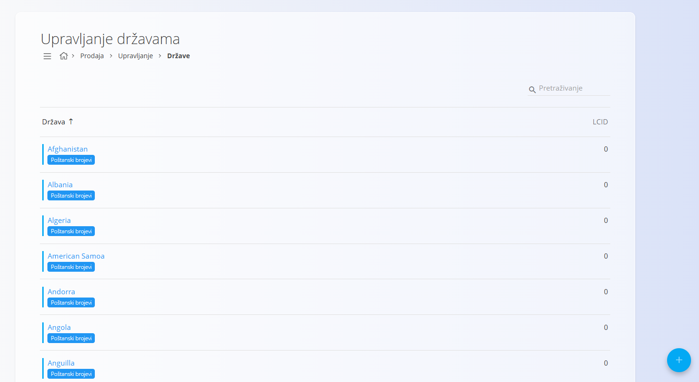
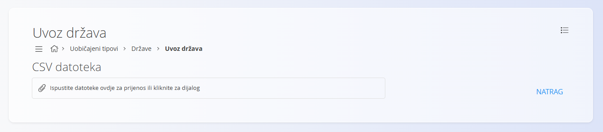
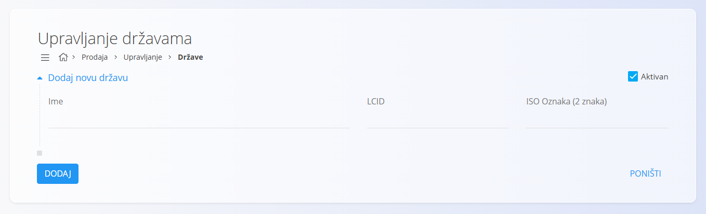

<!-- app_route: /management/common-types/countries -->
<!-- app_label: Države -->
<!-- canonical_source_url: https://github.com/Tom-PIT/Connected.Docs/blob/main/hr/Zajednicko/Upravljanje/Drzave.md -->
<!-- canonical_source_title: Države -->

# Države

Šifrarnik **Države** sadrži države koje se koriste u cijelom sustavu. Svaka država određuje lokalizacijske parametre, kao što su **LCID** i **ISO oznaka**, koji osiguravaju ispravne jezične i regionalne postavke te usklađenost s međunarodnim standardima.

Šifrarniku **Države** možete pristupiti iz različitih domena putem [navigacije](../UI/Navigation.md). U svim slučajevima radite s istim zajedničkim podacima.

Za otvaranje šifrarnika idite na **Upravljanje / Države** u jednoj od sljedećih domena:

- **Logistika**
- **Prodaja**
- **Nabava**

## Shema

| Polje | Opis |
|-------|------|
| **Ime** | Naziv države, primjerice **Hrvatska** ili **Austrija** (obavezno). |
| **LCID** | Identifikator lokalizacije koji određuje jezične i regionalne postavke države. |
| **ISO oznaka (2 znaka)** | Međunarodna oznaka države prema standardu ISO 3166-1 Alpha-2, primjerice **HR** za Hrvatsku ili **AT** za Austriju. |
| **Aktivan** | Označava je li država aktivna. Neaktivne države ne mogu se koristiti u novim zapisima, ali ostaju vidljive u postojećim podacima. |

## Upravljanje

### Popis država

Korisničko sučelje prikazuje popis svih država.

Svaki zapis sadrži indikator statusa lijevo od naziva:

- **Plava** boja označava aktivnu državu.
- **Siva** boja označava neaktivnu državu.



Svaki zapis također sadrži karticu koja predstavlja povezane podatke — [**Poštanski brojevi**](PostalCodes.md).

Klikom na karticu otvara se zaslon za upravljanje poštanskim brojevima odabrane države.


## Radnje

Kliknite [akcijski gumb](../UI/ActionButton.md) za prikaz sljedećih radnji:

- **Uvoz**
- **Dodaj**

### Uvoz država

Radnja **Uvoz** omogućuje skupno stvaranje ili ažuriranje zapisa država. Namijenjena je administratorima koji trebaju odjednom dodati ili ažurirati veći broj država.

Za uvoz država:

1. Kliknite [akcijski gumb](../UI/ActionButton.md) i odaberite **Uvoz**.
2. Povucite CSV datoteku u područje za prijenos ili kliknite područje za odabir datoteke.



Datoteka mora sadržavati obavezna polja u ispravnoj strukturi. Nakon završetka prijenosa sustav obrađuje datoteku te dodaje ili ažurira države prema sadržaju CSV datoteke.

Kliknite **Natrag** za povratak na popis država bez uvoza.

> [!TIP]
> Primjer CSV datoteke možete preuzeti putem izbornika u gornjem desnom kutu zaslona za uvoz.

#### Primjer CSV strukture

```csv
Name,LCID,ISOAlpha2Code,Active
Croatia,1050,HR,true
Austria,3079,AT,true
Italy,1040,IT,false
```

### Dodati novu državu

Za dodavanje nove države:

1. Kliknite [akcijski gumb](../UI/ActionButton.md) i odaberite **Dodaj**.
2. Ispunite sva obavezna polja. Neobavezna polja ispunite prema potrebi.
3. Kliknite **Dodaj** za spremanje zapisa ili **Poništi** za povratak na popis bez spremanja.

> [!NOTE]
> Više informacija o pojedinim poljima nalazi se u odjeljku [**Shema**](#shema).



### Urediti postojeću državu

Za uređivanje postojeće države:

1. Kliknite naziv države na popisu.
2. Po potrebi izmijenite podatke.
3. Kliknite **Spremi** za potvrdu promjena ili **Poništi** za odustajanje.

### Izbrisati državu

Za brisanje države:

1. Kliknite naziv države na popisu.
2. Kliknite **Izbriši**.
3. Potvrdite brisanje.

> [!NOTE]
> Država se može izbrisati samo ako nije povezana s drugim zapisima u sustavu, primjerice adresama ili dokumentima.