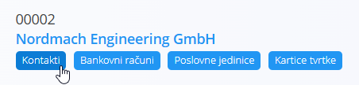
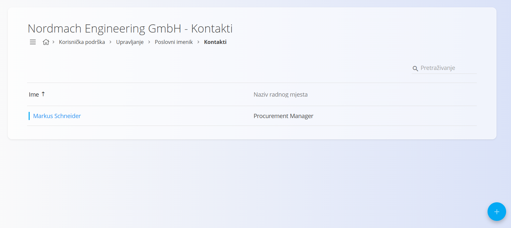
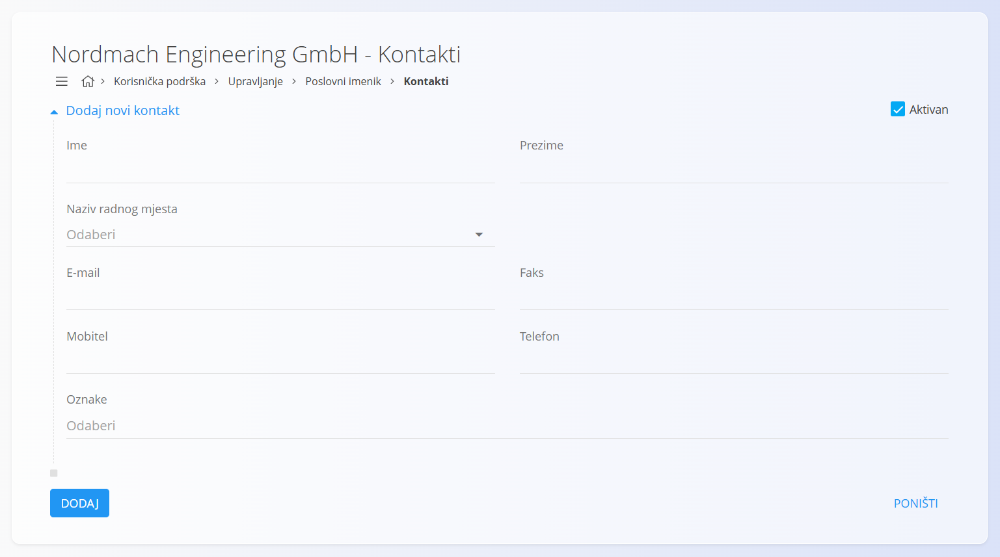

<!-- app_route: /management/contacts/companies -->
<!-- app_label: Kontakti -->
<!-- app_navigation_hint: Otvorite **Poslovni imenik**, zatim otvorite **Kontakti** za odgovarajući zapis. -->
<!-- canonical_source_url: https://github.com/Tom-PIT/Connected.Docs/blob/main/hr/Zajednicko/Upravljanje/Kontakti.md -->
<!-- canonical_source_title: Kontakti -->

# Kontakti

**Kontakti** pripadaju određenom **kupcu** ili **dobavljaču** te se njima upravlja unutar [**Poslovnog imenika**](BusinessDirectory.md). U njima se evidentiraju osobe povezane s tvrtkom, kao što su voditelji kupaca, osobe za nabavu, tehničke kontakt osobe ili osobe zadužene za obračun.

Svaki kontakt sadrži **Naziv radnog mjesta**, koji se odabire iz šifrarnika [**Nazivi radnih mjesta**](NaziviRadnihMjesta.md).

**Kontakti** su dostupni kao kartica ispod svakog zapisa u **Poslovnom imeniku**. Kliknite karticu kako biste otvorili popis kontakata povezanih s odabranom tvrtkom ili fizičkom osobom.

## Shema

| Polje | Opis |
|-------|------|
| **Ime** | Ime kontakt osobe (obavezno). |
| **Prezime** | Prezime kontakt osobe (obavezno). |
| **Naziv radnog mjesta** | Radno mjesto kontakt osobe, odabire se iz šifrarnika [**Nazivi radnih mjesta**](JobTitles.md). |
| **E-mail** | Primarna adresa e-pošte. |
| **Telefon** | Broj telefona. |
| **Mobitel** | Broj mobilnog telefona. |
| **Faks** | Broj faksa (nije obavezno). |
| **Oznake** | Oznake za grupiranje i filtriranje kontakata. |
| **Aktivan** | Označava može li se kontakt koristiti u dokumentima. |

## Popis

Popis **Kontakata** prikazuje sve kontakte povezane s odabranim zapisom u **Poslovnom imeniku**.

Pomoću filtara na lijevoj strani (**Aktivan / Neaktivan**) možete prikazati samo aktivne ili neaktivne kontakte.

## Radnje

### Dodati novi kontakt

Za dodavanje novog kontakta:

1. Kliknite [akcijski gumb](../UI/ActionButton.md) u donjem desnom kutu.
2. Ispunite sva obavezna polja. Neobavezna polja ispunite prema potrebi. Više informacija o pojedinim poljima nalazi se u odjeljku [**Shema**](#shema).
3. Kliknite **Dodaj** za spremanje novog kontakta ili **Poništi** za povratak na popis bez spremanja.

### Urediti postojeći kontakt

Za uređivanje postojećeg kontakta:

1. Otvorite zapis u **Poslovnom imeniku**.
2. Kliknite karticu **Kontakti**.
3. Odaberite kontakt s popisa.
4. Po potrebi izmijenite podatke, kao što su ime, prezime, e-mail, telefon, naziv radnog mjesta ili oznake.
5. Kliknite **Spremi** za potvrdu promjena ili **Poništi** za odustajanje.

### Izbrisati postojeći kontakt

Za brisanje kontakta:

1. Otvorite zapis u **Poslovnom imeniku**.
2. Kliknite karticu **Kontakti**.
3. Odaberite kontakt klikom na njegovo ime.
4. Kliknite **Izbriši**. Nakon potvrde kontakt će biti trajno izbrisan.

Kontakt se može izbrisati samo ako nije povezan s drugim dokumentima.