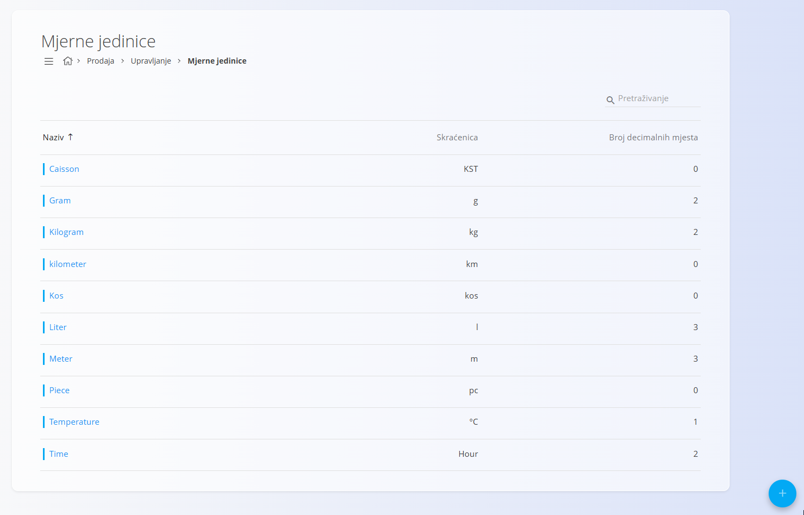
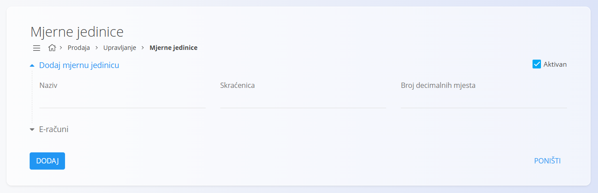
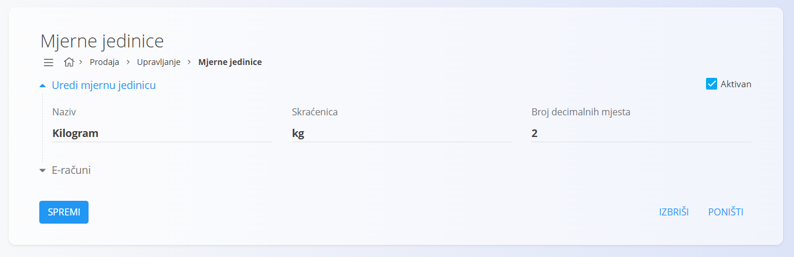

<!-- app_route: /management/common-types/measure-units -->
<!-- app_label: Mjerne jedinice -->
<!-- canonical_source_url: https://github.com/Tom-PIT/Connected.Docs/blob/main/hr/Zajednicko/Upravljanje/MjerneJedinice.md -->
<!-- canonical_source_title: Mjerne jedinice -->

# Mjerne jedinice

**Mjerne jedinice** određuju način na koji se količine iskazuju u sustavu (primjerice: komad, kilogram, metar ili litra). Osiguravaju dosljedan prikaz količina u dokumentima, zalihama i izračunima te određuju broj decimalnih mjesta za pojedinu mjernu jedinicu.

Primjeri:

- Gotovi proizvodi: Stolice u **komadima (kom)**, bez decimalnih mjesta.
- Sirovine: Boja u **litrama (l)** s 2 decimalna mjesta (npr. **1,25 l**).
- Komponente: Kabel u **metrima (m)** s 3 decimalna mjesta (npr. **12,375 m**).

> [!TIP]
> Za cjelovit prikaz pogledajte videouputu **[Mjerne jedinice](https://www.youtube.com/watch?v=8swl8Vex6y4)**.

Šifrarniku **Mjerne jedinice** možete pristupiti iz različitih domena putem [navigacije](../UI/Navigation.md). U svim slučajevima radite s istim zajedničkim podacima.

Za otvaranje šifrarnika idite na **Upravljanje / Mjerne jedinice** u jednoj od sljedećih domena:

- **Osnovna sredstva**
- **Logistika**
- **Održavanje**
- **Proizvodnja**
- **Prodaja**
- **Nabava**

## Shema

| Polje | Opis |
|-------|------|
| **Naziv** | Naziv mjerne jedinice koji se koristi u dokumentima i popisima, primjerice **Kilogram** ili **Metar** (obavezno). |
| **Skraćenica** | Kratki naziv mjerne jedinice koji se prikazuje u cijelom sustavu, primjerice **kg** ili **m** (obavezno). |
| **Broj decimalnih mjesta** | Zadani broj decimalnih mjesta za vrijednosti iskazane u toj mjernoj jedinici. Primjerice **3** za vrijednost **1,255** ili **1** za vrijednost **2,5**. |
| **Aktivan** | Označava može li se mjerna jedinica koristiti u novim dokumentima. Neaktivne mjerne jedinice nije moguće odabrati u novim zapisima, ali ostaju vidljive u postojećim podacima. |

## Upravljanje

### Popis mjernih jedinica

Korisničko sučelje prikazuje popis svih mjernih jedinica.

Svaki zapis sadrži indikator statusa lijevo od naziva:

- **Plava** boja označava aktivnu mjernu jedinicu.
- **Siva** boja označava neaktivnu mjernu jedinicu.

Popis prikazuje **naziv**, **skraćenicu** i **broj decimalnih mjesta** za svaku mjernu jedinicu.

## Radnje

### Dodati novu mjernu jedinicu

Za dodavanje nove mjerne jedinice:

1. Kliknite [akcijski gumb](../UI/ActionButton.md).
2. Ispunite sva obavezna polja. Neobavezna polja ispunite prema potrebi.
3. Kliknite **Dodaj** za spremanje nove mjerne jedinice ili **Poništi** za povratak na popis bez spremanja.

> [!NOTE]
> Više informacija o pojedinim poljima nalazi se u odjeljku [**Shema**](#shema).

### Urediti mjernu jedinicu

Za uređivanje postojeće mjerne jedinice:

1. Kliknite naziv mjerne jedinice na popisu.
2. Po potrebi izmijenite naziv, skraćenicu, broj decimalnih mjesta ili status aktivnosti.
3. Kliknite **Spremi** za potvrdu promjena ili **Poništi** za odustajanje.

### Izbrisati mjernu jedinicu

Za brisanje mjerne jedinice:

1. Otvorite mjernu jedinicu s popisa.
2. Kliknite **Izbriši**.
3. Potvrdite brisanje.

Ako potvrdite brisanje, zapis će biti trajno uklonjen.

> [!NOTE]
> Mjernu jedinicu moguće je izbrisati samo ako se ne koristi ni u jednom povezanom zapisu, primjerice u materijalima ili transakcijama zaliha.