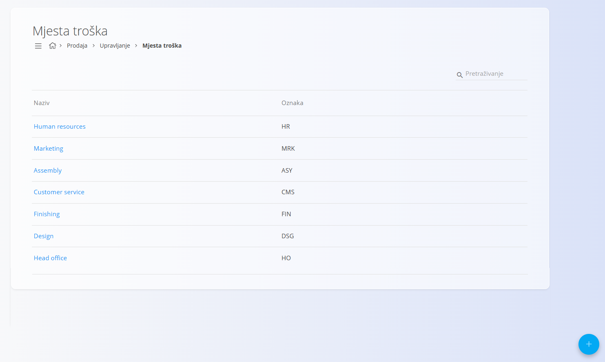
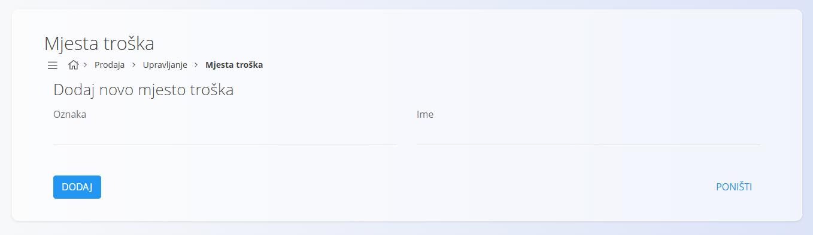

<!-- app_route: /management/common-types/cost-centers -->
<!-- app_label: Mjesta troška -->
<!-- canonical_source_url: https://github.com/Tom-PIT/Connected.Docs/blob/main/hr/Zajednicko/Upravljanje/MjestaTroska.md -->
<!-- canonical_source_title: Mjesta troška -->

# Mjesta troška

Šifrarnik **Mjesta troška** sadrži organizacijske jedinice ili funkcije koje stvaraju troškove, ali ne ostvaruju prihod, primjerice ljudske resurse ili korisničku podršku. Iako ta mjesta troška ne ostvaruju dobit, imaju važnu ulogu u poslovanju tvrtke. Dodjeljivanjem troškova pojedinom mjestu troška sustav omogućuje preglednu raspodjelu troškova unutar organizacije.

Ovaj šifrarnik dostupan je u domenama **Prodaja** i **Nabava**. Za pristup idite na **Upravljanje / Mjesta troška** u [navigaciji](../../Common/UI/Navigation.md).

## Shema

| Polje | Opis |
|-------|------|
| **Oznaka** | Kratka interna oznaka mjesta troška (obavezno), primjerice **HR** za ljudske resurse. |
| **Ime** | Puni naziv mjesta troška (obavezno). |

## Upravljanje

### Popis mjesta troška

Popis prikazuje sva evidentirana **mjesta troška** zajedno s njihovim **nazivom** i **oznakom**.

Polje **Pretraživanje** omogućuje filtriranje mjesta troška prema nazivu ili oznaci.

## Radnje

### Dodati novo mjesto troška

Za dodavanje novog mjesta troška:

1. Kliknite [akcijski gumb](../UI/ActionButton.md).
2. Ispunite sva obavezna polja. Neobavezna polja ispunite prema potrebi. Više informacija o pojedinim poljima nalazi se u odjeljku [**Shema**](#shema).
3. Kliknite **Dodaj** za spremanje novog mjesta troška ili **Poništi** za povratak na popis bez spremanja.

### Urediti mjesto troška

Za uređivanje postojećeg mjesta troška:

1. Otvorite popis **Mjesta troška**.
2. Odaberite mjesto troška s popisa.
3. Po potrebi izmijenite **oznaku** ili **ime**.
4. Kliknite **Spremi** za potvrdu promjena ili **Poništi** za odustajanje.

### Izbrisati mjesto troška

Za brisanje mjesta troška:

1. Otvorite popis **Mjesta troška**.
2. Odaberite mjesto troška s popisa.
3. Kliknite **Izbriši**.

> [!NOTE]
> Mjesto troška može se izbrisati samo ako nije povezano s dokumentima ili drugim zapisima u sustavu.