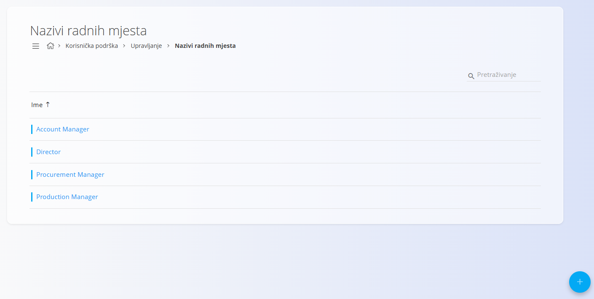
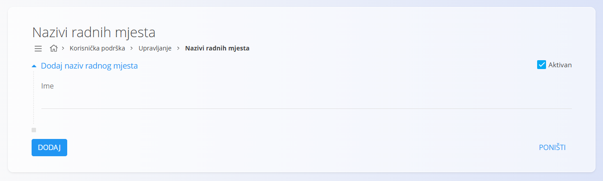

<!-- app_route: /management/contacts/job-titles -->
<!-- app_label: Nazivi radnih mjesta -->
<!-- canonical_source_url: https://github.com/Tom-PIT/Connected.Docs/blob/main/hr/Zajednicko/Upravljanje/NaziviRadnihMjesta.md -->
<!-- canonical_source_title: Nazivi radnih mjesta -->

# Nazivi radnih mjesta

Šifrarnik **Nazivi radnih mjesta** dio je modula **Korisnička podrška** i definira radna mjesta koja se mogu dodijeliti [kontaktima](Contacts.md) u [**Poslovnom imeniku**](BusinessDirectory.md). Omogućuje kategorizaciju kontakata prema njihovoj ulozi, primjerice *Account Manager*, *Procurement Manager* ili *Director*.

Za pristup ovom šifrarniku idite na **Korisnička podrška / Upravljanje / Nazivi radnih mjesta** u [navigaciji](../UI/Navigation.md). :contentReference[oaicite:0]{index=0}

## Shema

| Polje | Opis |
|-------|------|
| **Ime** | Naziv radnog mjesta ili funkcije (npr. *Account Manager*, *Director*) (obavezno). |
| **Aktivan** | Označava je li naziv radnog mjesta dostupan za odabir prilikom stvaranja ili uređivanja kontakata. |

## Upravljanje

### Popis naziva radnih mjesta

Popis prikazuje sve nazive radnih mjesta definirane u sustavu.

Za prikaz aktivnih ili neaktivnih naziva radnih mjesta koristite filtre **Aktivan** i **Neaktivan** na lijevoj strani.

## Radnje

### Dodati naziv radnog mjesta

Za dodavanje novog naziva radnog mjesta:

1. Kliknite [akcijski gumb](../UI/ActionButton.md).
2. Ispunite sva obavezna polja.
3. Kliknite **Dodaj** za spremanje novog naziva radnog mjesta ili **Poništi** za odustajanje.

> [!NOTE]
> Više informacija o pojedinim poljima nalazi se u odjeljku [**Shema**](#shema).

### Urediti naziv radnog mjesta

Za uređivanje postojećeg naziva radnog mjesta:

1. Na popisu odaberite naziv radnog mjesta.
2. Po potrebi izmijenite **Ime** ili status **Aktivan**.
3. Kliknite **Spremi** za potvrdu promjena ili **Poništi** za odustajanje.

### Izbrisati naziv radnog mjesta

Za brisanje naziva radnog mjesta:

1. Na popisu odaberite naziv radnog mjesta.
2. Kliknite **Izbriši** i potvrdite brisanje.

Naziv radnog mjesta moguće je izbrisati samo ako nije povezan s postojećim kontaktima.