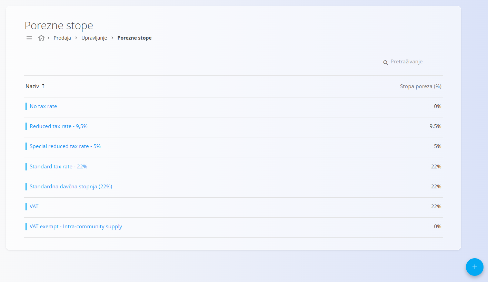
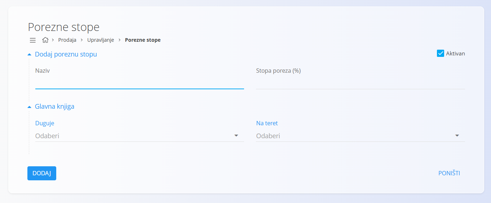

<!-- app_route: /management/common-types/tax-rates -->
<!-- app_label: Porezne stope -->
<!-- canonical_source_url: https://github.com/Tom-PIT/Connected.Docs/blob/main/hr/Zajednicko/Upravljanje/PorezneStope.md -->
<!-- canonical_source_title: Porezne stope -->

# Porezne stope

Šifrarnik **Porezne stope** definira sve porezne stope koje se koriste u sustavu. Porezne stope određuju postotak poreza koji se primjenjuje na proizvode, materijale i usluge u poslovnim dokumentima. Svaka porezna stopa sadrži naziv i postotak poreza, čime se osigurava dosljedan obračun poreza u cijelom sustavu. :contentReference[oaicite:0]{index=0}

Šifrarniku možete pristupiti iz više modula putem [navigacije](../UI/Navigation.md). U svim slučajevima radi se o istim zajedničkim podacima.

Za pristup šifrarniku otvorite odjeljak **Upravljanje** u jednom od sljedećih modula:

- **Imovina**
- **Prodaja**
- **Nabava**

## Shema

| Polje | Opis |
|-------|------|
| **Naziv** | Opisni naziv porezne stope, npr. *Standardna porezna stopa 22%* ili *Snižena porezna stopa 9,5%*. |
| **Stopa poreza (%)** | Postotak poreza koji se primjenjuje, npr. **22** ili **9,5**. |
| **Aktivan** | Označava je li porezna stopa dostupna za korištenje. Neaktivne porezne stope nije moguće odabrati u novim dokumentima, ali ostaju vidljive u postojećim zapisima. |
| **Glavna knjiga – Duguje / Na teret** | Konta glavne knjige odabrana iz šifrarnika [**Kontni plan**](../../Domains/Accounting/Management/Ledger/ChartOfAccounts.md) koja se koriste za knjiženje iznosa poreza. |

## Upravljanje

### Popis poreznih stopa

Popis prikazuje sve porezne stope definirane u sustavu.

Svaki zapis ima oznaku statusa s lijeve strane:

- **Plava** označava aktivnu poreznu stopu.
- **Siva** označava neaktivnu poreznu stopu.

Popis prikazuje naziv i pripadajuću stopu poreza. Za pretraživanje zapisa koristite polje **Pretraživanje** u gornjem desnom kutu.

## Radnje

### Dodati poreznu stopu

Za dodavanje nove porezne stope:

1. Kliknite [akcijski gumb](../UI/ActionButton.md).
2. Ispunite sva obavezna polja.
3. Kliknite **Dodaj** za spremanje nove porezne stope ili **Poništi** za odustajanje.

> [!NOTE]
> Više informacija o pojedinim poljima nalazi se u odjeljku [**Shema**](#shema).

#### Glavna knjiga

Odjeljak **Glavna knjiga** određuje koja se konta koriste za knjiženje poreza kada se ova porezna stopa primjenjuje u poslovnim dokumentima.

Polja **Duguje** i **Na teret** omogućuju odabir konta iz šifrarnika [**Kontni plan**](../../Domains/Accounting/Management/Ledger/ChartOfAccounts.md).

> [!NOTE]
> Ispravna konfiguracija konta glavne knjige potrebna je za točno knjiženje poreza, izradu izvještaja i usklađenost s računovodstvenim propisima.

### Urediti poreznu stopu

Za uređivanje postojeće porezne stope:

1. Na popisu odaberite poreznu stopu.
2. Po potrebi izmijenite podatke.
3. Kliknite **Spremi** za potvrdu promjena ili **Poništi** za odustajanje.

### Izbrisati poreznu stopu

Za brisanje porezne stope:

1. Na popisu odaberite poreznu stopu.
2. Kliknite **Izbriši** i potvrdite brisanje.

> [!NOTE]
> Poreznu stopu moguće je izbrisati samo ako nije korištena u drugim zapisima.