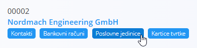
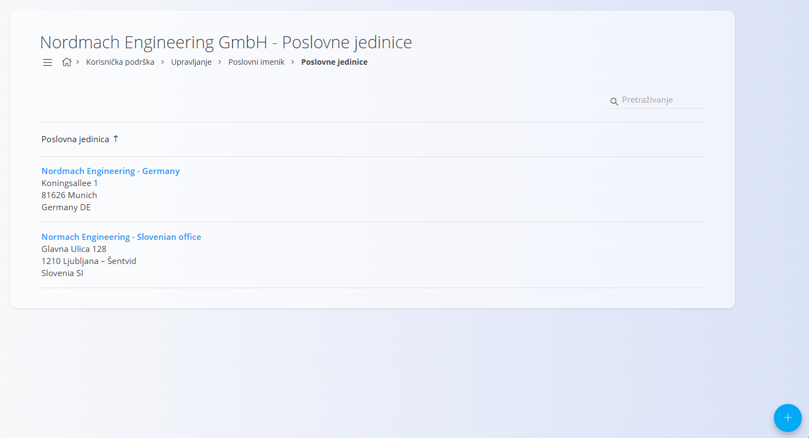
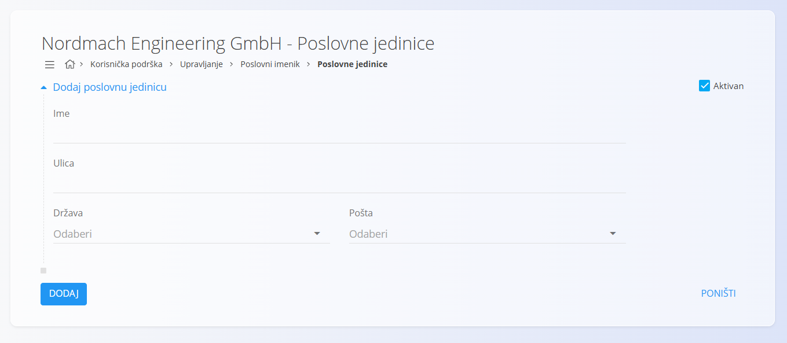

<!-- app_route: /management/contacts/companies -->
<!-- app_label: Poslovne jedinice -->
<!-- app_navigation_hint: Otvorite **Poslovni imenik**, zatim otvorite **Poslovne jedinice** za odgovarajući zapis. -->
<!-- canonical_source_url: https://github.com/Tom-PIT/Connected.Docs/blob/main/hr/Zajednicko/Upravljanje/PoslovneJedinice.md -->
<!-- canonical_source_title: Poslovne jedinice -->

# Poslovne jedinice

**Poslovne jedinice** pripadaju određenom **kupcu** ili **dobavljaču** te se njima upravlja unutar [**Poslovnog imenika**](BusinessDirectory.md). Predstavljaju fizičke lokacije, podružnice ili organizacijske jedinice tvrtke, pri čemu svaka ima vlastite podatke o adresi.

**Poslovne jedinice** dostupne su kao kartica ispod svakog zapisa u **Poslovnom imeniku**. Kliknite karticu kako biste otvorili popis poslovnih jedinica povezanih s odabranom tvrtkom ili fizičkom osobom.

## Shema

| Polje | Opis |
|-------|------|
| **Ime** | Naziv poslovne jedinice (npr. *Sjedište*, *Podružnica Zagreb*). |
| **Ulica** | Ulica i kućni broj poslovne jedinice. |
| [**Država**](../../Common/Management/Countries.md) | Odabire se iz šifrarnika **Države**. |
| [**Pošta**](PostalCodes.md) | Odabire se iz šifrarnika **Pošte** za odabranu državu. |
| **Aktivan** | Označava može li se poslovna jedinica koristiti u dokumentima. |

## Popis

Popis **Poslovnih jedinica** prikazuje sve poslovne jedinice povezane s odabranim zapisom u **Poslovnom imeniku**.

Pomoću filtara na lijevoj strani (**Omogućeno / Onemogućeno**) možete prikazati samo aktivne ili neaktivne poslovne jedinice.

## Radnje

### Dodati novu poslovnu jedinicu

Za dodavanje nove poslovne jedinice:

1. Kliknite [akcijski gumb](../UI/ActionButton.md).
2. Ispunite sva obavezna polja. Neobavezna polja ispunite prema potrebi.
3. Kliknite **Dodaj** za spremanje nove poslovne jedinice ili **Poništi** za povratak na popis bez spremanja.

> [!NOTE]
> Više informacija o pojedinim poljima nalazi se u odjeljku [**Shema**](#shema).

### Urediti postojeću poslovnu jedinicu

Za uređivanje postojeće poslovne jedinice:

1. Otvorite zapis u **Poslovnom imeniku**.
2. Kliknite karticu **Poslovne jedinice**.
3. Odaberite poslovnu jedinicu klikom na njezin naziv.
4. Po potrebi izmijenite naziv, adresu, državu, poštu ili status aktivnosti.
5. Kliknite **Spremi** za potvrdu promjena ili **Poništi** za odustajanje.

### Izbrisati postojeću poslovnu jedinicu

Za brisanje poslovne jedinice:

1. Otvorite zapis u **Poslovnom imeniku**.
2. Kliknite karticu **Poslovne jedinice**.
3. Odaberite poslovnu jedinicu klikom na njezin naziv.
4. Kliknite **Izbriši**.

Poslovna jedinica može se izbrisati samo ako nije povezana s drugim zapisima, primjerice adresama isporuke ili dokumentima.