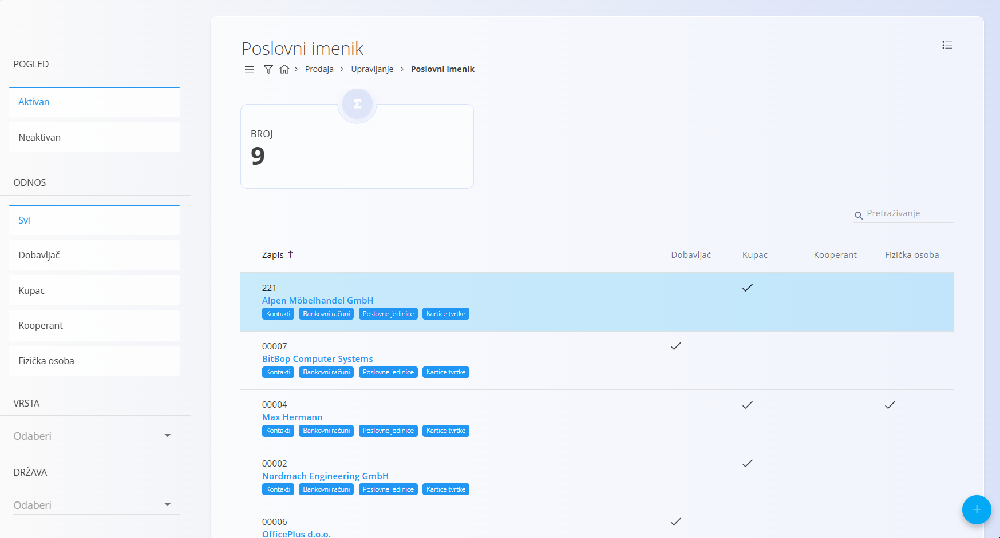
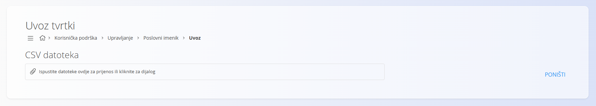
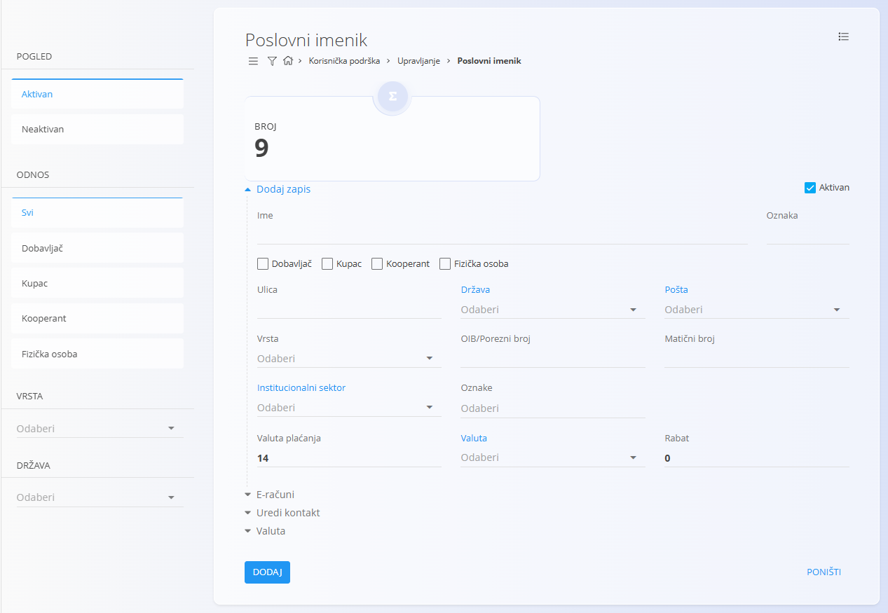
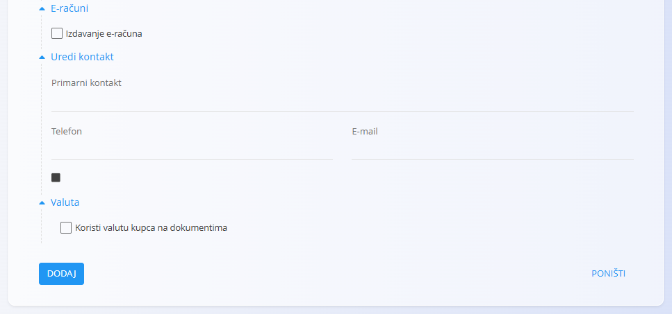
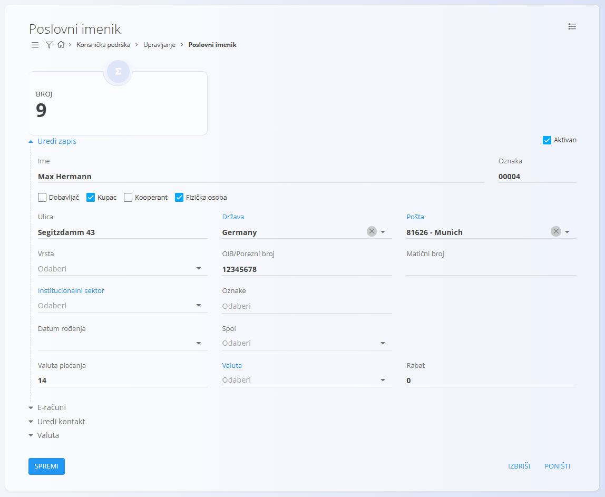

<!-- app_route: /management/contacts/companies -->
<!-- app_label: Poslovni imenik -->
<!-- canonical_source_url: https://github.com/Tom-PIT/Connected.Docs/blob/main/hr/Zajednicko/Upravljanje/PoslovniImenik.md -->
<!-- canonical_source_title: Poslovni imenik -->

# Poslovni imenik

**Poslovni imenik** sadrži sve tvrtke i fizičke osobe s kojima vaša organizacija posluje. To mogu biti **kupci**, **dobavljači**, **kooperanti** ili **fizičke osobe**. Svaki zapis sadrži važne informacije kao što su adrese, porezni podaci, kontakt osobe i postavke plaćanja. Time se osigurava dosljedno korištenje podataka o poslovnim partnerima u prodajnim, nabavnim, logističkim i financijskim dokumentima.

Šifrarniku **Poslovni imenik** možete pristupiti iz različitih domena putem [navigacije](../UI/Navigation.md). U svim slučajevima radite s istim zajedničkim podacima.

Za otvaranje šifrarnika idite na **Upravljanje / Poslovni imenik** u jednoj od sljedećih domena:

- **Korisnička podrška**
- **Logistika**
- **Prodaja**
- **Nabava**

## Shema

| Polje | Opis |
|-------|------|
| **Ime** | Puni naziv poslovnog partnera ili fizičke osobe, primjerice **ACME d.o.o.** ili **John Smith** (obavezno). |
| **Oznaka** | Interna oznaka koja osigurava jedinstvenu identifikaciju zapisa. Na primjer, možete koristiti **COK** za *Coca-Colu* ili **ACM** za *ACME d.o.o.* |
| **Aktivan** | Označava je li zapis aktivan. Neaktivni zapisi ne mogu se koristiti u novim dokumentima. |
| **Dobavljač** | Označava da poslovni partner ima ulogu dobavljača. |
| **Kupac** | Označava da poslovni partner ima ulogu kupca. |
| **Kooperant** | Označava da poslovni partner ima ulogu kooperanta. |
| **Fizička osoba** | Označava da zapis predstavlja fizičku osobu. |
| **Ulica** | Ulica i kućni broj poslovnog partnera. |
| [**Država**](Countries.md) | Država u kojoj se nalazi sjedište poslovnog partnera. |
| [**Pošta**](PostalCodes.md) | Poštanski broj i mjesto poslovnog partnera. |
| **Vrsta** | Određuje porezni status poslovnog partnera (pogledajte opis u nastavku). |
| **OIB/Porezni broj** | Porezni identifikacijski broj, primjerice **HR12345678901**. |
| **Matični broj** | Matični broj poslovnog partnera. |
| [**Institucionalni sektor**](../../Domains/Customers/Management/InstitutionalSectors.md) | Institucionalni sektor kojem poslovni partner pripada. |
| **Oznake** | Oznake koje omogućuju kategorizaciju poslovnih partnera. |
| **Valuta plaćanja** | Zadana valuta plaćanja koja se koristi u dokumentima. |
| [**Valuta**](Currencies.md) | Valuta povezana s poslovnim partnerom. |
| **Rabat** | Zadani postotak rabata koji se primjenjuje za poslovnog partnera. |
| [**Primarni kontakt**](Contacts.md) | Ime i prezime primarne kontakt osobe. |
| **Telefon** | Telefonski broj primarne kontakt osobe. |
| **E-mail** | Adresa e-pošte primarne kontakt osobe. |
| **Koristi valutu kupca na dokumentima** | Određuje koristi li se valuta poslovnog partnera na dokumentima. |

## Upravljanje

### Popis zapisa poslovnog imenika

Korisničko sučelje prikazuje popis svih zapisa poslovnog imenika.



Kartica na vrhu prikazuje ukupan broj zapisa u poslovnom imeniku.

Svaki zapis prikazuje oznake koje predstavljaju povezane podatke. Putem njih možete pristupiti sljedećim povezanim šifrarnicima:

- [**Kontakti**](Contacts.md)
- [**Bankovni računi**](BankAccounts.md)
- [**Poslovne jedinice**](BusinessUnits.md)
- [**Kartice tvrtke**](../../Domains/Sales/Views/CompanyCards.md)

Filtri na lijevoj strani omogućuju filtriranje prema **Pogledu**, **Odnosu**, **Vrsti** i **Državi**.

Polje **Vrsta** određuje porezni status poslovnog partnera. Dostupne vrijednosti su:

- **Obveznik PDV-a** – Poslovni partner registriran je za PDV te se porezna pravila primjenjuju prema konfiguraciji sustava.
- **Nije obveznik PDV-a** – Poslovni partner nije obveznik PDV-a te se koriste odgovarajuće porezne stope ili oslobođenja.
- **Krajnji kupac** – Fizička osoba ili krajnji kupac za kojeg se primjenjuju pravila poslovanja s krajnjim kupcima.

## Radnje

Kliknite [akcijski gumb](../../Common/UI/ActionButton.md) za prikaz dostupnih radnji:

- **VIES uvoz**
- **Uvoz**
- **Novi**

### VIES uvoz
Za jednostavnije dodavanje tvrtki registriranih za PDV moguće je automatski preuzeti podatke iz baze **VIES** na temelju OIB-a/PDV broja.

Za uvoz putem VIES-a:

1. Kliknite [akcijski gumb](../UI/ActionButton.md) i odaberite **VIES uvoz**.
2. Unesite OIB/PDV broj poslovnog partnera.
3. Kliknite **Uvoz**.

### Uvoz CSV datoteke

Za uvoz jednog ili više zapisa:

1. Kliknite [akcijski gumb](../UI/ActionButton.md) i odaberite **Uvoz**.
2. Odaberite CSV datoteku s podacima.
3. Kliknite **Uvoz**.



#### Primjer CSV strukture

```csv
Code,Name,Active,Supplier,Customer,Subcontractor,NaturalPerson,Street,Country,PostalCode,Type,VATID,RegistrationNumber,Tags,PaymentCurrency,DiscountPercent,PrimaryContact,Phone,Email
ACME01,ACME d.o.o.,true,true,true,false,false,Dunajska cesta 10,SI,1000,Liable for tax,SI12345678,1234567-0,wholesale,EUR,5,Janez Novak,+386 1 234 56 78,info@acme.si
CUST01,John Smith,false,false,true,false,true,Glavna ulica 5,SI,2000,Final customer,,,"retail,online",EUR,0,John Smith,+386 31 555 555,john.smith@example.com
```

### Dodati novi zapis poslovnog imenika

**Poslovni imenik** služi za upravljanje kupcima, dobavljačima, kooperantima i fizičkim osobama.

Za dodavanje novog zapisa:

1. Kliknite [akcijski gumb](../UI/ActionButton.md) i odaberite **Novi**.
2. Ispunite sva obavezna polja.
   - Označite **Kupac** ako stvarate kupca.
   - Označite **Dobavljač** ako stvarate dobavljača.
   - Označite **Kooperant** ako stvarate kooperanta.
   - Označite **Fizička osoba** ako zapis predstavlja fizičku osobu.
3. Kliknite **Dodaj** za spremanje ili **Poništi** za odustajanje.

> [!NOTE]
> Jednom zapisu može biti dodijeljena jedna ili više uloga. Primjerice, isti poslovni partner može biti kupac, dobavljač i kooperant.



#### E-računi

Ovaj odjeljak omogućuje uključivanje izdavanja e-računa za poslovnog partnera.

#### Uredi kontakt

Ovaj odjeljak omogućuje unos podataka o primarnom kontaktu, uključujući ime, telefonski broj i adresu e-pošte.

#### Valuta

Ovaj odjeljak omogućuje određivanje koristi li se valuta poslovnog partnera na dokumentima.



### Urediti zapis poslovnog imenika

Za uređivanje postojećeg zapisa:

1. Kliknite **Ime** zapisa na popisu.
2. Izmijenite potrebne podatke.
3. Kliknite **Spremi** za potvrdu promjena ili **Poništi** za odustajanje.



### Izbrisati zapis poslovnog imenika

Za brisanje postojećeg zapisa:

1. Kliknite **Ime** zapisa na popisu.
2. Kliknite **Izbriši**.

Ako potvrdite brisanje, zapis će biti trajno uklonjen.

> [!NOTE]
> Zapis se može izbrisati samo ako nije povezan s drugim zapisima, primjerice dokumentima ili narudžbama.

## Izbornik

Ova stranica sadrži radnje izbornika dostupne na popisu i na obrascu za uređivanje.

### Izbornik popisa

Dostupne radnje:

- **Izvoz u CSV**

### Izbornik dokumenta

Dostupne radnje:

- **Izvoz u CSV**

Više informacija potražite u dokumentu [**Radnje izbornika**](../../Common/Concepts/MenuActions.md).