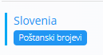
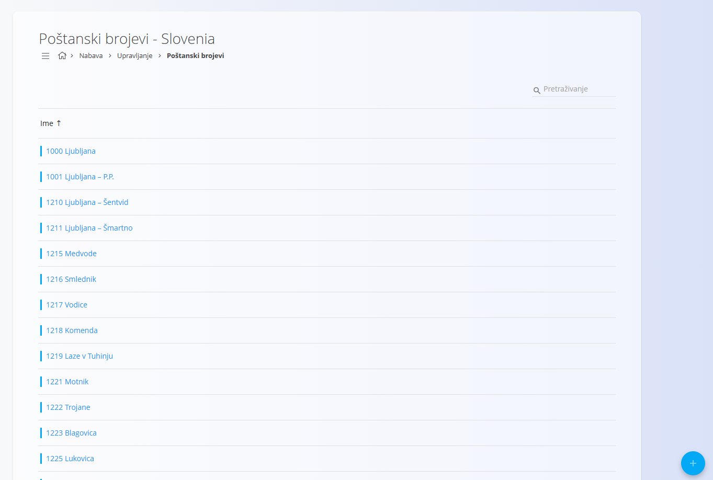
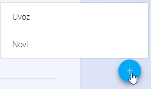
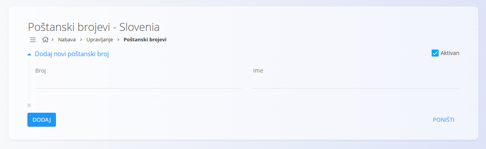

<!-- app_route: /management/common-types/countries -->
<!-- app_label: Države -->
<!-- app_navigation_hint: Otvorite **Poslovni imenik**, zatim kliknite na gumb **Poštanski brojevi** za željeni zapis. -->
<!-- canonical_source_url: https://github.com/Tom-PIT/Connected.Docs/blob/main/hr/Zajednicko/Upravljanje/PostanskiBrojevi.md -->
<!-- canonical_source_title: Poštanski brojevi -->

# Poštanski brojevi

**Poštanski brojevi** pripadaju određenoj **državi** i njima se upravlja unutar šifrarnika [**Države**](Countries.md). Definiraju dostupna poštanska područja koja se koriste prilikom unosa adresa u **Poslovni imenik** ili logističke dokumente. :contentReference[oaicite:0]{index=0}

Poštanski brojevi prikazani su kao oznaka uz svaki zapis u šifrarniku **Države**. Kliknite oznaku **Poštanski brojevi** kako biste otvorili popis poštanskih brojeva za odabranu državu.

## Shema

| Polje | Opis |
|-------|------|
| **Broj** | Vrijednost poštanskog broja (npr. **1000**). |
| **Ime** | Naziv grada, mjesta ili poštanskog područja. |
| **Aktivan** | Označava je li poštanski broj dostupan za odabir prilikom unosa adresa. |

## Upravljanje

### Popis poštanskih brojeva

Popis prikazuje sve poštanske brojeve definirane za odabranu državu.

Za prikaz aktivnih ili neaktivnih poštanskih brojeva koristite filtre **Aktivan** i **Neaktivan** na lijevoj strani.

## Radnje

Kliknite [akcijski gumb](../UI/ActionButton.md) kako biste otvorili sljedeće radnje:

- **Uvoz**
- **Novi**

### Dodati novi poštanski broj

Za dodavanje novog poštanskog broja:

1. Kliknite [akcijski gumb](../UI/ActionButton.md) i odaberite **Novi**.
2. Ispunite sva obavezna polja. Neobavezna polja ispunite prema potrebi.
3. Kliknite **Dodaj** za spremanje ili **Poništi** za odustajanje.

> [!NOTE]
> Više informacija o pojedinim poljima nalazi se u odjeljku [**Shema**](#shema).

### Uvesti poštanske brojeve

Akcijski gumb sadrži i mogućnost **Uvoz**, koja omogućuje skupni uvoz poštanskih brojeva iz CSV datoteke. To je korisno prilikom postavljanja nove države s velikim brojem poštanskih brojeva.

Za uvoz poštanskih brojeva:

1. Kliknite [akcijski gumb](../UI/ActionButton.md) i odaberite **Uvoz**.
2. Odaberite CSV datoteku koja sadrži poštanske brojeve za uvoz.

### Urediti poštanski broj

Za uređivanje postojećeg poštanskog broja:

1. Otvorite šifrarnik [**Države**](Countries.md).
2. Kliknite oznaku **Poštanski brojevi** za željenu državu.
3. Na popisu kliknite poštanski broj koji želite urediti.
4. Po potrebi izmijenite **Broj**, **Ime** ili status **Aktivan**.
5. Kliknite **Spremi** za potvrdu promjena ili **Poništi** za odustajanje.

### Izbrisati poštanski broj

Za brisanje poštanskog broja:

1. Otvorite šifrarnik [**Države**](Countries.md).
2. Kliknite oznaku **Poštanski brojevi** za željenu državu.
3. Na popisu odaberite poštanski broj.
4. Kliknite **Izbriši** i potvrdite brisanje.

Poštanski broj moguće je izbrisati samo ako nije povezan s drugim zapisima (primjerice adresama kupaca ili dobavljača).

> [!NOTE]
> Brisanjem poštanskog broja ne briše se zapis pripadajuće države.