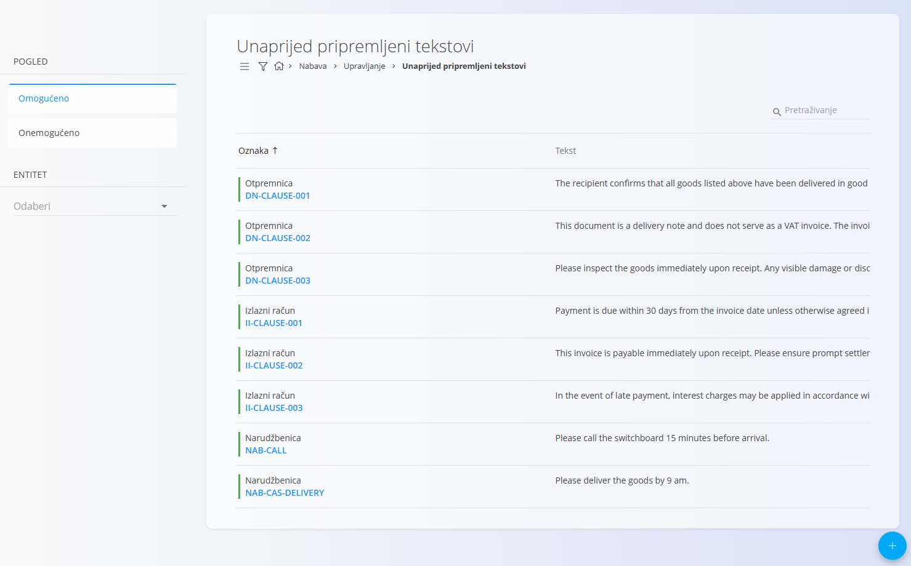
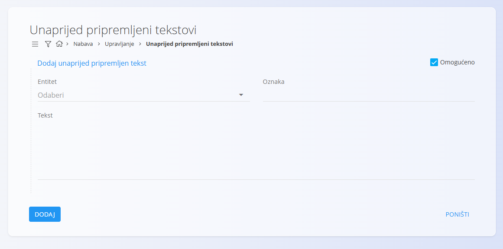
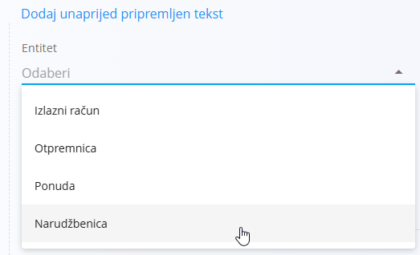

<!-- app_route: /management/common-types/predefined-texts -->
<!-- app_label: Unaprijed pripremljeni tekstovi -->
<!-- canonical_source_url: https://github.com/Tom-PIT/Connected.Docs/blob/main/hr/Zajednicko/Upravljanje/UnaprijedPripremljeniTekstovi.md -->
<!-- canonical_source_title: Unaprijed pripremljeni tekstovi -->

# Unaprijed pripremljeni tekstovi

Šifrarnik **Unaprijed pripremljeni tekstovi** sadrži unaprijed definirane tekstove koji se mogu umetnuti u različite poslovne dokumente, kao što su **Otpremnice**, **Izlazni računi**, **Ponude** i **Narudžbenice**. Ovi tekstovi omogućuju brzo i dosljedno dodavanje često korištenih napomena, uputa ili posebnih uvjeta.

Za pristup ovom šifrarniku idite na **Nabava / Upravljanje / Unaprijed pripremljeni tekstovi** u [navigaciji](../UI/Navigation.md). Dostupan je i u domeni **Prodaja**. :contentReference[oaicite:0]{index=0}

## Shema

| Polje | Opis |
|-------|------|
| **Entitet** | Vrsta dokumenta na koju se unaprijed pripremljeni tekst odnosi (obavezno): • [**Otpremnica**](../../Domains/Sales/Documents/DeliveryNotes.md) • [**Izlazni račun**](../../Domains/Sales/Documents/IssuedInvoices.md) • [**Ponuda**](../../Domains/Sales/Documents/Offers.md) • [**Narudžbenica**](../../Domains/Supply/Documents/SupplyOrders.md) |
| **Oznaka** | Kratka oznaka unaprijed pripremljenog teksta (obavezno). |
| **Tekst** | Sadržaj teksta koji će biti umetnut u odabranu vrstu dokumenta (obavezno). |
| **Omogućeno** | Označava je li unaprijed pripremljeni tekst aktivan i dostupan za korištenje. |

## Upravljanje

### Popis unaprijed pripremljenih tekstova

Popis prikazuje sve unaprijed pripremljene tekstove zajedno s njihovim **entitetom**, **oznakom** i **tekstom**.

Na lijevoj strani možete filtrirati zapise prema statusu **Omogućeno / Onemogućeno** ili prema **Entitetu**.

Svaki zapis ima indikator statusa s lijeve strane:

- **Zelena** označava da je tekst omogućen.
- **Siva** označava da je tekst onemogućen.

Za brzo pronalaženje zapisa prema oznaci ili sadržaju teksta koristite polje **Pretraživanje**.

## Radnje

### Dodati unaprijed pripremljeni tekst

Za dodavanje novog unaprijed pripremljenog teksta:

1. Kliknite [akcijski gumb](../UI/ActionButton.md).
2. Ispunite sva obavezna polja. Dodatna polja ispunite prema potrebi.
3. Kliknite **Dodaj** za spremanje ili **Poništi** za odustajanje.

> [!NOTE]
> Više informacija o pojedinim poljima nalazi se u odjeljku [**Shema**](#shema).

Dostupni entiteti:

### Urediti unaprijed pripremljeni tekst

Za uređivanje postojećeg unaprijed pripremljenog teksta:

1. Na popisu odaberite zapis koji želite urediti.
2. Po potrebi izmijenite **Entitet**, **Oznaku** ili **Tekst**.
3. Kliknite **Spremi** za potvrdu promjena ili **Poništi** za odustajanje.

### Izbrisati unaprijed pripremljeni tekst

Za brisanje unaprijed pripremljenog teksta:

1. Na popisu odaberite zapis koji želite izbrisati.
2. Kliknite **Izbriši** i potvrdite brisanje.

> [!NOTE]
> Unaprijed pripremljeni tekst može se izbrisati samo ako nije povezan s drugim dokumentima.