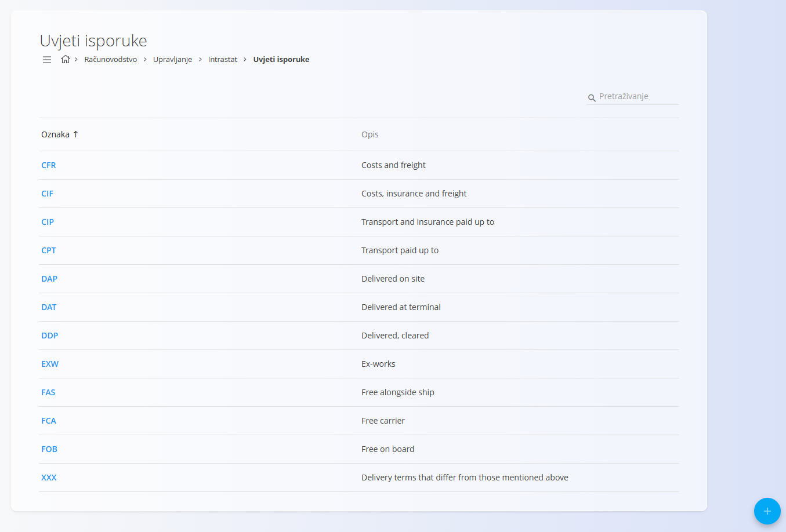
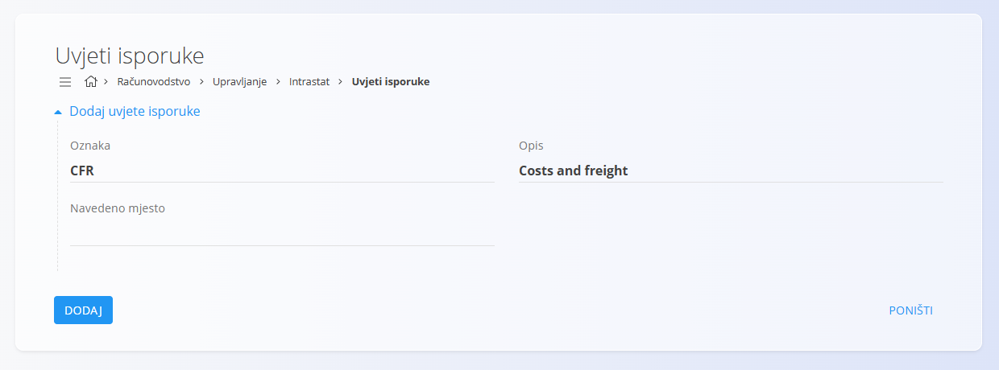

<!-- app_route: /management/common/delivery-terms -->
<!-- app_label: Uvjeti isporuke -->
<!-- canonical_source_url: https://github.com/Tom-PIT/Connected.Docs/blob/main/hr/Zajednicko/Upravljanje/UvjetiIsporuke.md -->
<!-- canonical_source_title: Uvjeti isporuke -->

# Uvjeti isporuke

**Uvjeti isporuke** određuju uvjete pod kojima se roba isporučuje između prodavatelja i kupca, uključujući raspodjelu troškova, rizika i odgovornosti tijekom prijevoza. :contentReference[oaicite:0]{index=0}

Uvjeti isporuke najčešće se koriste u **prodajnim** dokumentima za jasno određivanje uvjeta isporuke.

Većina uvjeta isporuke temelji se na međunarodno priznatim pravilima **Incoterms®**, koje objavljuje Međunarodna trgovačka komora (ICC), uz mogućnost definiranja vlastitih uvjeta prema potrebi.

Za pristup ovom zaslonu idite na **Računovodstvo / Upravljanje / Intrastat / Uvjeti isporuke** u [navigaciji](../../Common/UI/Navigation.md). Dostupan je i u domeni **Prodaja** pod **Upravljanje**.

## Shema

| Polje | Opis |
|-------|------|
| **Oznaka** | Kratka oznaka uvjeta isporuke (primjerice **EXW**, **DAP**, **CIF**). |
| **Opis** | Opis uvjeta isporuke. |
| **Navedeno mjesto** | Neobavezno polje koje se koristi za uvjete isporuke kod kojih je potrebno navesti određeno mjesto (primjerice luka, terminal ili adresa isporuke). |

## Upravljanje

### Popis uvjeta isporuke

Popis prikazuje sve dostupne uvjete isporuke zajedno s njihovim **oznakama** i **opisima**.

Uvjeti isporuke zajednički su svim domenama te se mogu koristiti u dokumentima kao što su [**Narudžbe kupca**](../../Domains/Sales/Documents/SalesOrders.md) ili [**Otpremnice**](../../Domains/Sales/Documents/DeliveryNotes.md).

Popis možete pretraživati pomoću polja **Pretraživanje** u gornjem desnom kutu.

## Radnje

### Dodati nove uvjete isporuke

Za dodavanje novih uvjeta isporuke:

1. Kliknite [akcijski gumb](../../Common/UI/ActionButton.md).
2. Ispunite sva obavezna polja. Neobavezna polja ispunite prema potrebi.
3. Kliknite **Dodaj** za spremanje novih uvjeta isporuke ili **Poništi** za povratak na popis bez spremanja.

> [!NOTE]
> Više informacija o pojedinim poljima nalazi se u odjeljku [**Shema**](#shema).

> [!IMPORTANT]
> Preporučuje se koristiti standardne **Incoterms®** oznake i opise kako bi se osigurala jasnoća i dosljednost u međunarodnoj trgovini.

Nakon spremanja uvjeti isporuke bit će dostupni za odabir u dokumentima u kojima je potrebno definirati uvjete isporuke.

### Urediti uvjete isporuke

Za uređivanje postojećih uvjeta isporuke:

1. Kliknite uvjete isporuke na popisu.
2. Po potrebi izmijenite **oznaku**, **opis** ili **navedeno mjesto**.
3. Kliknite **Spremi** za potvrdu promjena ili **Poništi** za odustajanje.

### Izbrisati uvjete isporuke

Za brisanje uvjeta isporuke:

1. Otvorite uvjete isporuke s popisa.
2. Kliknite **Izbriši**.
3. Potvrdite brisanje.

> [!NOTE]
> Uvjete isporuke moguće je izbrisati samo ako nisu povezani s drugim zapisima, primjerice narudžbama kupca ili narudžbenicama dobavljača.