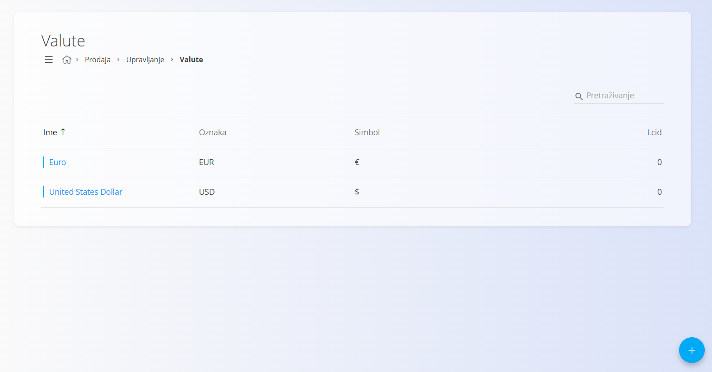
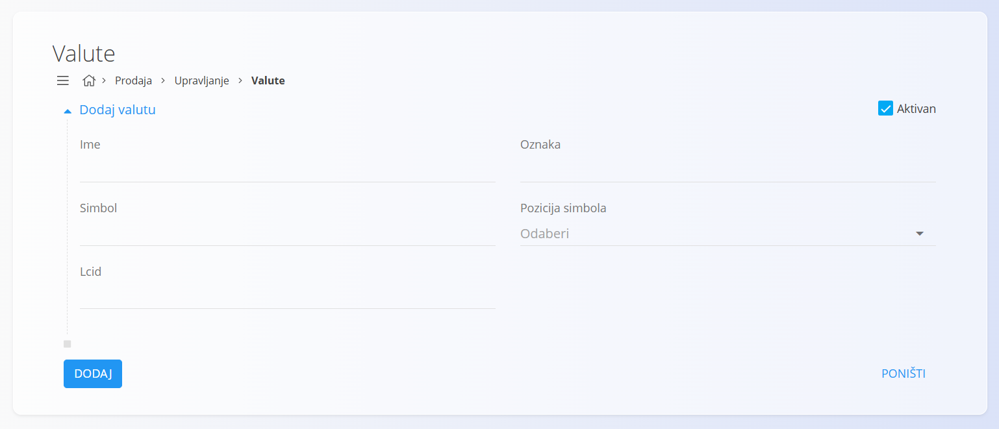
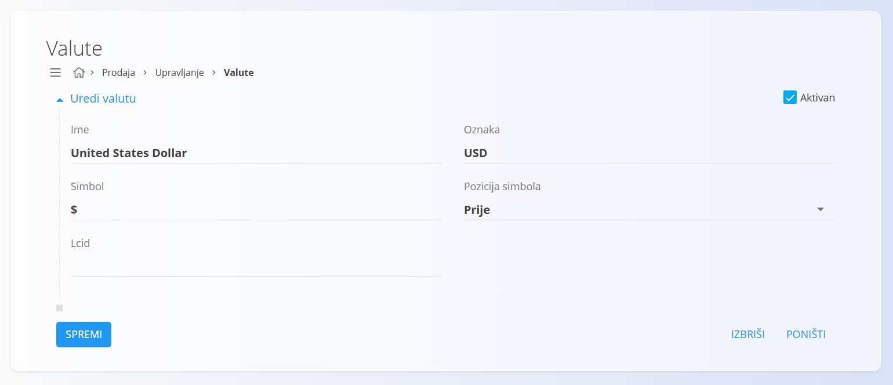

<!-- app_route: /management/common-types/currencies -->
<!-- app_label: Valute -->
<!-- canonical_source_url: https://github.com/Tom-PIT/Connected.Docs/blob/main/hr/Zajednicko/Upravljanje/Valute.md -->
<!-- canonical_source_title: Valute -->

# Valute

Šifrarnik **Valute** definira sve novčane jedinice koje se mogu koristiti u sustavu. Svaka valuta sadrži međunarodnu oznaku, simbol i pravila oblikovanja, čime se osigurava dosljedan i ispravan prikaz cijena, iznosa i financijskih dokumenata. Ovaj šifrarnik predstavlja osnovu za prikaz novčanih vrijednosti u procesima prodaje, nabave i izvještavanja.

Ova stranica dostupna je u domenama **Prodaja** i **Nabava**. Za pristup idite na **Upravljanje / Valute** u [navigaciji](../../Common/UI/Navigation.md).

> [!NOTE]
> **Preduvjeti**
>
> Valuta mora biti konfigurirana prije nego što se može koristiti u cjenicima, dokumentima ili financijskim izračunima.

## Shema

| Polje | Opis |
|-------|------|
| **Ime** | Puni naziv valute, primjerice **Euro** ili **United States Dollar** (obavezno). |
| **Oznaka** | Međunarodna troslovna oznaka valute, primjerice **EUR** ili **USD** (obavezno). |
| **Simbol** | Simbol valute koji se koristi pri prikazu cijena i ukupnih iznosa, primjerice **€** ili **$** (obavezno). |
| **Pozicija simbola** | Određuje prikazuje li se simbol **prije** ili **poslije** iznosa (obavezno). |
| **LCID** | Identifikator lokalizacije koji određuje standardni način prikaza brojeva i valuta. |
| **Aktivan** | Označava može li se valuta koristiti u sustavu. |

## Upravljanje

### Popis valuta

Popis prikazuje sve konfigurirane valute zajedno s njihovom **oznakom**, **simbolom** i **LCID** vrijednošću.

Svaki zapis sadrži indikator statusa lijevo od naziva:

- **Plava** boja označava aktivnu valutu.
- **Siva** boja označava neaktivnu valutu.

Polje **Pretraživanje** omogućuje brzo filtriranje valuta prema nazivu ili oznaci.

## Radnje

### Dodati novu valutu

Za dodavanje nove valute:

1. Kliknite [akcijski gumb](../UI/ActionButton.md).
2. Ispunite sva obavezna polja. Neobavezna polja ispunite prema potrebi.
3. Kliknite **Dodaj** za spremanje nove valute ili **Poništi** za povratak na popis bez spremanja.

> [!NOTE]
> Više informacija o pojedinim poljima nalazi se u odjeljku [**Shema**](#shema).

### Urediti postojeću valutu

Za uređivanje postojeće valute:

1. Kliknite valutu na popisu kako biste otvorili zaslon za uređivanje.
2. Po potrebi izmijenite podatke.
3. Kliknite **Spremi** za potvrdu promjena ili **Poništi** za odustajanje.

### Izbrisati postojeću valutu

Za brisanje valute:

1. Kliknite **ime** valute na popisu.
2. Kliknite **Izbriši**.
3. Potvrdite brisanje.

> [!NOTE]
> Valutu je moguće izbrisati samo ako nije povezana s cjenicima, dokumentima ili drugim financijskim zapisima.