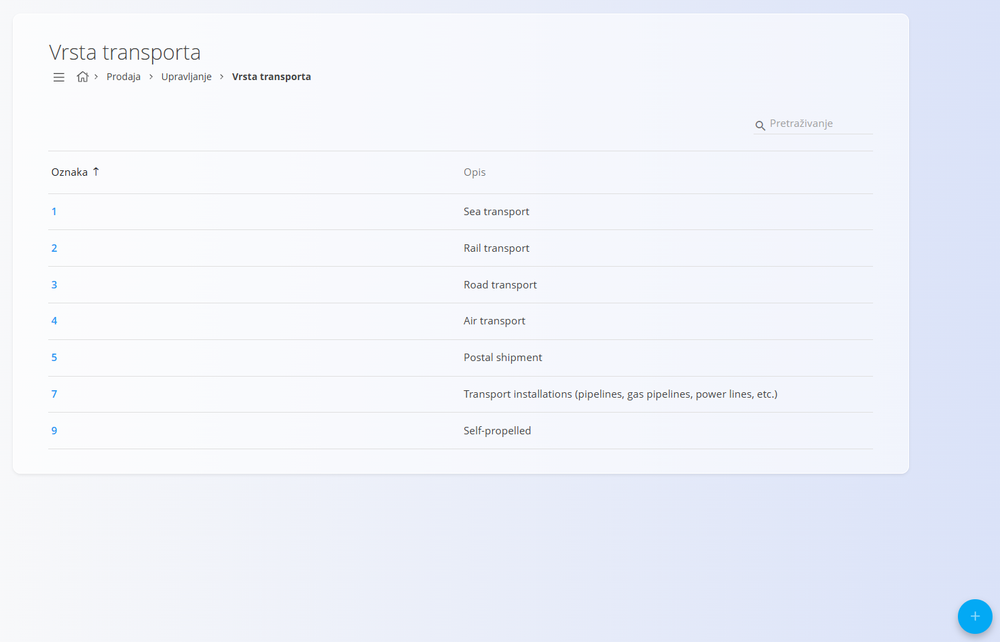

<!-- app_route: /management/common/mode-of-transport -->
<!-- app_label: Vrsta transporta -->
<!-- canonical_source_url: https://github.com/Tom-PIT/Connected.Docs/blob/main/hr/Zajednicko/Upravljanje/VrstaTransporta.md -->
<!-- canonical_source_title: Vrsta transporta -->

# Vrsta transporta

Šifrarnik **Vrsta transporta** definira načine prijevoza koji se koriste u cijelom sustavu. Vrste transporta koriste se u logistici, prodaji, nabavi i drugim dokumentima za određivanje načina isporuke ili prijenosa robe.

Šifrarniku **Vrsta transporta** možete pristupiti iz različitih domena putem [navigacije](../UI/Navigation.md). U svim slučajevima radite s istim zajedničkim podacima.

Za otvaranje šifrarnika idite na **Upravljanje / Vrsta transporta** u jednoj od sljedećih domena:

- **Logistika**
- **Prodaja**

## Shema

| Polje | Opis |
|-------|------|
| **Oznaka** | Brojčana oznaka vrste transporta. |
| **Opis** | Opis vrste transporta. |

## Upravljanje

### Popis vrsta transporta

Korisničko sučelje prikazuje popis svih definiranih vrsta transporta.

Svaki zapis prikazuje:

- **Oznaku**
- **Opis**

Ako ne postoji nijedan zapis, popis je prazan.

Klikom na zapis otvara se zaslon za uređivanje.

## Radnje

### Dodati novu vrstu transporta

Za dodavanje nove vrste transporta:

1. Kliknite [akcijski gumb](../UI/ActionButton.md).
2. Ispunite sva obavezna polja. Neobavezna polja ispunite prema potrebi.
3. Kliknite **Dodaj** za spremanje nove vrste transporta ili **Poništi** za povratak na popis bez spremanja.

> [!NOTE]
> Više informacija o pojedinim poljima nalazi se u odjeljku [**Shema**](#shema).

### Urediti vrstu transporta

Za uređivanje postojeće vrste transporta:

1. Kliknite **oznaku** na popisu.
2. Po potrebi izmijenite vrijednosti.
3. Kliknite **Spremi** za potvrdu promjena ili **Poništi** za odustajanje.

### Izbrisati vrstu transporta

Za brisanje vrste transporta:

1. Kliknite **oznaku** na popisu.
2. Kliknite **Izbriši**.
3. Potvrdite brisanje.

> [!NOTE]
> Vrstu transporta moguće je izbrisati samo ako nije korištena ni u jednom postojećem dokumentu.