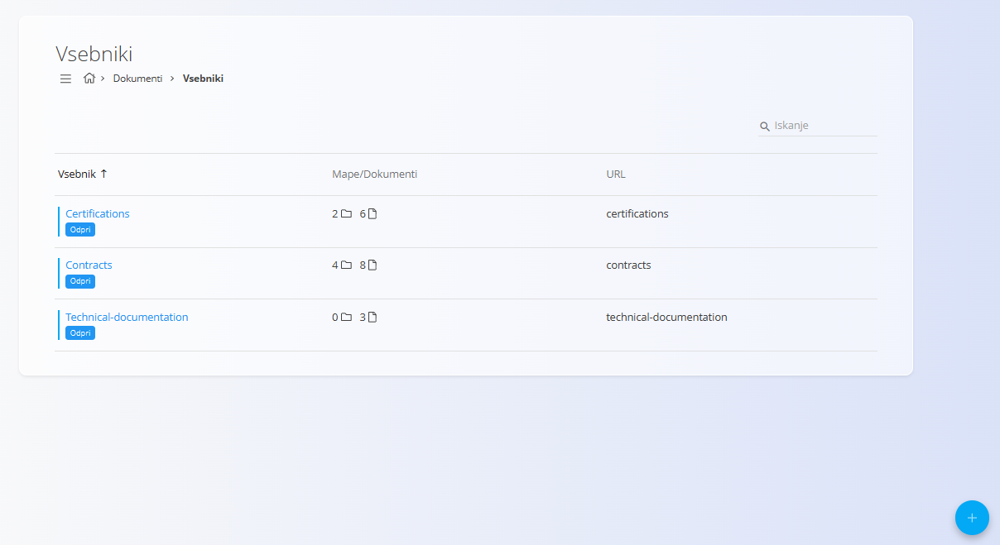
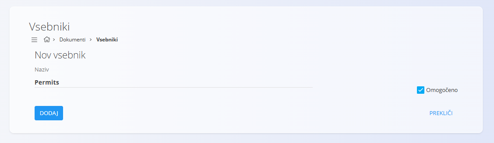
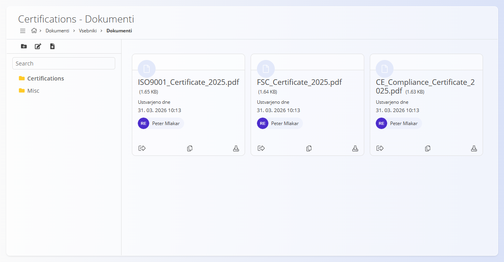
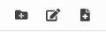
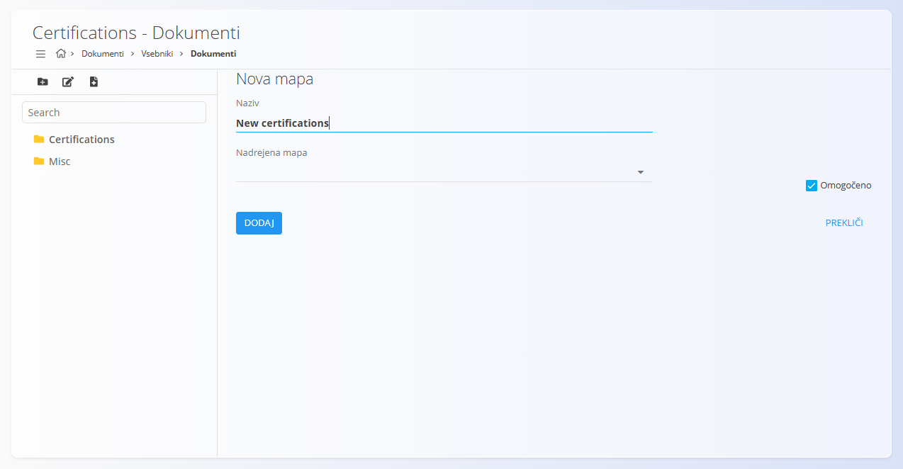
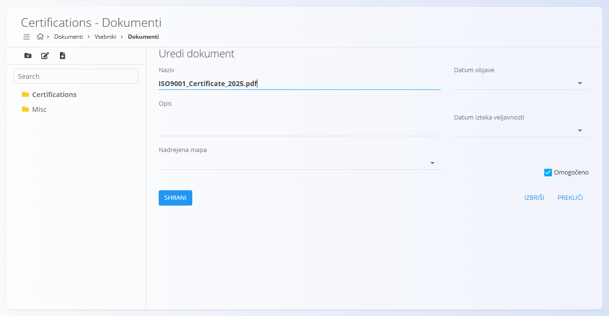

<!-- app_route: /documents/containers -->
<!-- app_label: Vsebniki -->
<!-- canonical_source_url: https://github.com/Tom-PIT/Connected.Docs/blob/main/sl/Domene/Dokumenti/Dokumenti/Vsebniki.md -->
<!-- canonical_source_title: Vsebniki -->

# Vsebniki

Zaslon **Vsebniki** določa glavne **repozitorije dokumentov** v domeni **Dokumenti**.

Vsebniki se uporabljajo za organizacijo zunanjih naloženih dokumentov, kot so:
- certifikati  
- dovoljenja  
- pogodbe  
- tehnična dokumentacija  

Vsak vsebnik deluje kot korenska struktura, kjer lahko dokumente razporedite v mape in jih upravljate.

Za dostop do tega zaslona pojdite na **Dokumenti / Vsebniki** v [**navigaciji**](../../../Skupno/UI/Navigacija.md).

## Shema

| Polje | Opis |
|------|-------------|
| **Naziv** | Naziv vsebovalnika (obvezno). |
| **Omogočeno** | Označuje, ali je vsebovalnik aktiven in na voljo. |

## Seznam vsebovalnikov

Pogled seznama prikazuje vse konfigurirane vsebnike.

Vsaka vrstica prikazuje:
- **Naziv vsebnika**
- **Število map in dokumentov**
- **URL** – identifikator za dostop
- **Odpri** – odpre vsebino vsebnika

Vsebnike lahko iščete s poljem **Iskanje**.

Vsak zapis vključuje indikator stanja levo od naziva:
- **Modra** pomeni, da je vsebnik aktiven  
- **Siva** pomeni, da je vsebnik neaktiven  

> [!NOTE]
> Vsebniki določajo **najvišjo raven strukture** za organizacijo dokumentov.

## Dejanja

### Ustvariti nov vsebnik

Kliknite [**akcijski gumb**](../../../Skupno/UI/AkcijskiGumb.md) za dodajanje novega vsebnika in izpolnite polje **Naziv**.

Polje **Omogočeno** določa, ali je vsebnik aktiven.

Kliknite **Dodaj** za ustvarjanje vsebnika.

Ko je ustvarjen, se vsebnik prikaže v seznamu in ga lahko odprete za upravljanje vsebine.

## Upravljati vsebine vsebnika

Kliknite **Odpri** na vsebniku za ogled njegove vsebine.

Leva stranska vrstica prikazuje mape, glavno območje pa dokumente.

### Orodna vrstica

Na voljo so naslednja dejanja:

- **Nova mapa** – Ustvari mapo za organizacijo dokumentov  
- **Uredi mapo** – Uredi izbrano mapo  
- **Naloži dokument** – Naloži novo datoteko v izbrano mapo  

### Struktura map

- Mape so prikazane v **drevesnem pogledu**
- Dokumente lahko shranjujete v mape ali na korenski ravni
- Mape niso obvezne, vendar so priporočljive za boljšo organizacijo

### Ustvariti mape

1. Kliknite **Nova mapa**
2. Vnesite:
   - **Naziv**
   - **Nadrejena mapa** (neobvezno)
   - **Omogočeno**
3. Kliknite **Dodaj**

### Nalaganje dokumentov

Za nalaganje dokumenta najprej izberite mapo v stranski vrstici, kliknite **Naloži dokument** in izberite datoteko iz vaše naprave. Datoteka bo naložena v izbrano mapo in prikazana na zaslonu.

Naloženi dokument bo dodan na seznam. Za vsak dokument so na voljo naslednja dejanja:
- **Odjavi** – zaklene dokument za urejanje. Drugi uporabniki ga ne morejo spreminjati, dokler ni ponovno sproščen.
- **Kopiraj** – ustvari kopijo dokumenta v isti mapi.
- **Prenesi** – prenese dokument na vašo napravo.

### Urejati dokumente

Po nalaganju dokumenta kliknite na naziv datoteke za urejanje metapodatkov.

Polja v obrazcu za urejanje dokumenta:

| Polje | Opis |
|------|-------------|
| **Naziv** | Naziv datoteke (obvezno). |
| **Opis** | Neobvezen opis. |
| **Nadrejena mapa** | Mapa, v kateri je dokument shranjen. |
| **Datum objave** | Datum, ko dokument postane veljaven/viden. |
| **Datum izteka veljavnosti** | Datum, ko dokument ni več veljaven. |
| **Omogočeno** | Označuje, ali je dokument aktiven. |

Kliknite **Shrani** za potrditev sprememb.

Kliknite **Izbriši** za odstranitev dokumenta. Prikaže se potrditveno okno, da preprečite nenamerno brisanje. Izbrisanih dokumentov ni mogoče obnoviti.
