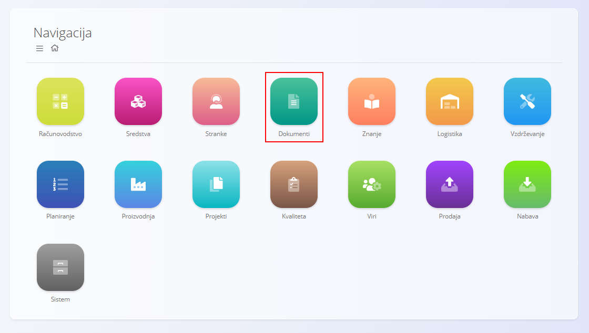
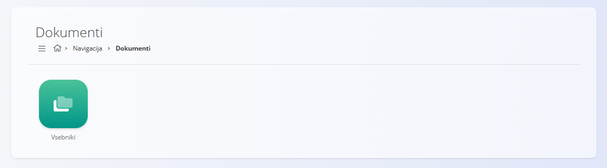

# Domena dokumentov

**Domena dokumentov** omogoča centraliziran repozitorij za upravljanje **zunanjih dokumentov**, ki jih sistem ne generira sam, vendar jih je treba shraniti, organizirati in imeti dostopne znotraj platforme.

Tipični primeri vključujejo:
- certifikate  
- dovoljenja  
- pogodbe  
- tehnično dokumentacijo  
- dokumente za skladnost in regulativo  

Za razliko od operativnih dokumentov (npr. proizvodni nalogi, računi) je domena dokumentov namenjena **naloženim datotekam**, ki podpirajo poslovne procese in zagotavljajo sledljivost ter skladnost.

Za dostop do te domene pojdite na **Dokumenti** v glavnem zemljevidu strani.

> [!NOTE]  
> Razpoložljive domene in funkcionalnosti so odvisne od konfiguracije podjetja in vključenih modulov.

## Kaj vključuje domena dokumentov?

Domena je strukturirana okoli **vsebnika** (vsebniki), ki delujejo kot najvišji repozitoriji za združevanje dokumentov.

- **[Vsebniki](../Dokumenti/Vsebniki.md)** – določajo logične skupine dokumentov (npr. Certifikati, Pogodbe, Tehnična dokumentacija).  
  Vsak vsebnik vsebuje mape in dokumente, organizirane v drevesni strukturi.