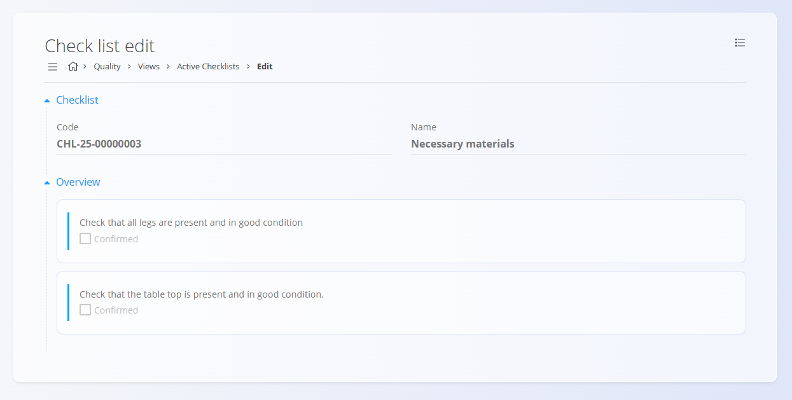

# Aktivne kontrolne liste

Pogled **Aktivne kontrolne liste** prikazuje vsa izvajanja kontrolnih seznamov, ki so trenutno v teku. Operaterji ga uporabljajo za spremljanje in dokončanje tekočih nalog kakovosti ali vzdrževanja. Ko je kontrolni seznam zaključen, se v tem pogledu ne prikazuje več in se premakne v pogled Zaključene kontrolne liste.

Za dostop do tega pogleda se pomaknite na **Kvaliteta / Pogledi / Aktivne kontrolne liste** v [**navigaciji**](../../../Skupno/UI/Navigacija.md).

### Pregled

Ta pogled ponuja seznam vseh trenutno aktivnih (nedokončanih) kontrolnih seznamov v realnem času. Namenjen je osebju v proizvodnji, vzdrževalnemu osebju in nadzornikom za hiter pregled, kateri kontrolni seznami zahtevajo pozornost.

## Shema

| Polje | Opis |
|------|------|
| **Kontrolni list** | Šifra in ime kontrolnega seznama, ki se izvaja; prikazuje trenutno fazo prek statusne oznake (npr. Na začetku). |
| **Dokument** | Vrsta in koda izvornega dokumenta: [Proizvodni nalog](../../Proizvodnja/Dokumenti/ProizvodniNalogi.md) ali [Vzdrževalni nalog](../../Vzdrzevanje/Dokumenti/VzdrzevalniNalogi.md). |
| **Operacija** | Šifra in ime operacije, povezane z izvajanjem kontrolnega seznama. |
| **Izdelek** | Ime in koda izdelka, povezana z operacijo (v proizvodnih kontekstih). |
| [**Organizacijska enota**](../../Proizvodnja/Upravljanje/OrganizacijskeEnote.md) | Enota, odgovorna za izvajanje (npr. Montaža, Elektro vzdrževanje). |
| **Oprema** | Prikazano za kontrolne sezname, povezane z vzdrževanjem; oprema, ki se vzdržuje ali preverja. |

## Seznam aktivnih kontrolnih seznamov

Na vrhu strani dva kazalnika povzemata trenutno stanje:
- **Aktivne kontrolne liste** — skupno število aktivnih izvajanj kontrolnih seznamov.
- **Moje kontrolne liste** — število aktivnih izvajanj kontrolnih seznamov, dodeljenih trenutno prijavljenemu uporabniku.

## Filtri

Uporabite filtre za zoženje seznama:
- **Datumi kontrolnih list** — filtriranje po datumu začetka, roku ali časovnem obdobju aktivnosti.
- **Tip dokumenta** — omejitev rezultatov na določen izvorni dokument:
  - [Vzdrževalni nalog](../../Vzdrzevanje/Dokumenti/VzdrzevalniNalogi.md)
  - [Proizvodni nalog](../../Proizvodnja/Dokumenti/ProizvodniNalogi.md)

## Interakcije vrstic

- Kliknite **šifro kontrolnega seznama**, da odprete izvajanje kontrolnega seznama na strani [Urejanje kontrolnega seznama](#urejanje-kontrolnega-seznama).
- Kliknite **šifro dokumenta**, da odprete povezani dokument:
  - [Proizvodni nalog](../../Proizvodnja/Dokumenti/ProizvodniNalogi.md), kadar je vrsta dokumenta Proizvodni nalog
  - [Vzdrževalni nalog](../../Vzdrzevanje/Dokumenti/VzdrzevalniNalogi.md), kadar je vrsta dokumenta Vzdrževalni nalog
- Kliknite **šifro operacije**, da odprete stran [Izvedba](../../Proizvodnja/Dokumenti/Izvedba.md), osredotočeno na trenutno izvajanje.

## Meni

**Meni** v zgornjem desnem kotu ponuja:

- **Tiskanje**
- **Izvoz CSV**
- **Izvoz PDF**

## Urejanje kontrolnega seznama

Stran za urejanje kontrolnega seznama prikazuje trenutno **šifro** in **ime** kontrolnega seznama, nato pa pregled kontrolnih točk.

Tipična postavitev vključuje seznam kontrolnih točk z zahtevanimi vnosi (potrditve, meritve, tolerance).

## Postavke

- Tukaj so prikazani samo kontrolni seznami, ki so trenutno v teku; zaključeni elementi so na voljo v pogledu Zaključeni kontrolni seznami.
- Osveževanje podatkov poteka samodejno v rednih intervalih ali ob ročni osvežitvi.