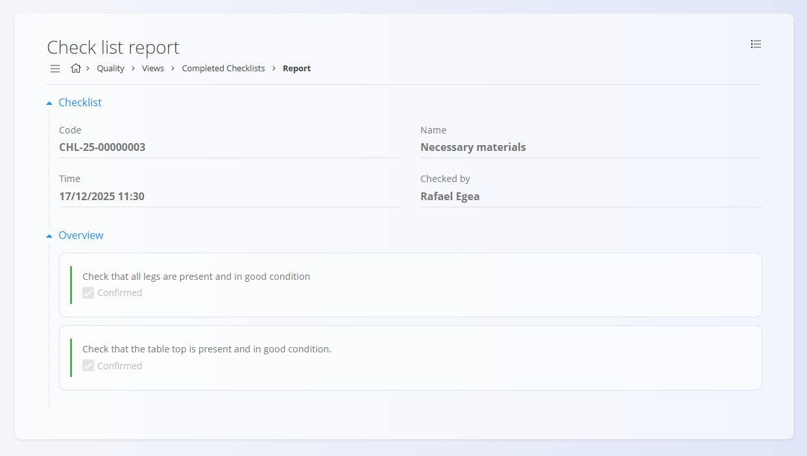

<!-- app_route: /quality/views/completed-checklists -->
<!-- app_label: Zaključene kontrolne liste -->
<!-- canonical_source_url: https://github.com/Tom-PIT/Connected.Docs/blob/main/sl/Domene/Kvaliteta/Pregledi/ZakljuceneKontrolneListe.md -->
<!-- canonical_source_title: Zaključene kontrolne liste -->

# Zaključene kontrolne liste

Pogled **Zaključene kontrolne liste** ponuja analitični pregled vseh **izvajanj kontrolnih list, ki so bila zaključena** v izbranem časovnem obdobju. Omogoča nadzornikom in vodjem kakovosti pregled rezultatov, preverjanje kakovosti izvajanja ter vpogled v poročila zaključenih kontrolnih list.

Za dostop do tega pogleda se pomaknite na **Kvaliteta / Pogledi / Zaključene kontrolne liste** v [**navigaciji**](../../../Skupno/UI/Navigacija.md).

### Pregled

Na vrhu zaslona več kazalnikov povzema trenutno stanje zaključenih kontrolnih list:

- **Vse kontrolne liste**  
  Prikazuje skupno število zaključenih izvajanj kontrolnih list in **stopnjo uspešnosti kontrolnih list** (odstotek v celoti potrjenih kontrolnih list).

- **Veljavne**  
  Število zaključenih kontrolnih list, pri katerih so bile **vse kontrolne točke potrjene**.

- **Neveljavne**  
  Število zaključenih kontrolnih list, pri katerih **vsaj ena kontrolna točka ni bila potrjena**.

Klik na posamezni kazalnik ustrezno filtrira seznam.

## Seznam zaključenih kontrolnih list

Seznam prikazuje zaključena izvajanja kontrolnih list z njihovimi glavnimi kontekstnimi informacijami. Vsaka vrstica predstavlja **eno zaključno izvajanje kontrolne liste**. Za hitro filtriranje rezultatov uporabite iskalno vrstico v zgornjem desnem kotu.

Prikazane informacije običajno vključujejo:

- **Kontrolna lista** — šifra in ime kontrolne liste (npr. `CHL-25-00000003` · Potrebni materiali)
- **Dokument** — izvorni dokument in šifra (npr. Proizvodni nalog `PRO-25-000026`)
- **Operacija** — šifra in ime operacije (npr. `OPR-25-000017, Montaža`)
- **Izdelek** — ime in šifra izdelka
- **Organizacijska enota** — odgovorna enota
- **Preveril** — uporabnik, ki je zaključil kontrolno listo
- **Datum in čas zaključka**

Vrstice **niso razširljive**. Za ogled podrobnosti kontrolne liste odprite poročilo kontrolne liste.

### Interakcije vrstic

- Kliknite **šifro kontrolne liste**, da odprete **poročilo kontrolne liste**.
- Kliknite **šifro proizvodnega naloga**, da odprete povezani dokument [proizvodni nalog](../../Proizvodnja/Dokumenti/ProizvodniNalogi.md).

## Meni

**Meni** v zgornjem desnem kotu ponuja:

- **Tiskanje**
- **Izvoz CSV**

## Filtri

Uporabite filtre v levi stranski vrstici za zoženje seznama:

- **Datumi kontrolnih list** — filtriranje po časovnem obdobju zaključka kontrolne liste
- **Tip dokumenta** — omejitev rezultatov na:
  - [Proizvodni nalog](../../Proizvodnja/Dokumenti/ProizvodniNalogi.md)
  - [Vzdrževalni nalog](../../Vzdrzevanje/Dokumenti/VzdrzevalniNalogi.md)
- **Dokument** — filtriranje po določenem dokumentu
- **Človeški viri** — filtriranje po uporabniku, ki je zaključil kontrolno listo
- **Kontrolna lista** — filtriranje po definiciji kontrolne liste

Vsi filtri so neobvezni in jih je mogoče kombinirati.

## Poročilo kontrolne liste

Klik na šifro kontrolne liste odpre zaslon **Poročilo kontrolne liste**, ki prikazuje celoten rezultat zaključenega izvajanja kontrolne liste.

Poročilo vključuje:

- **Informacije o kontrolni listi**
  - šifra in ime
  - Datum in čas zaključka
  - Preveril (uporabnik, ki je zaključil kontrolno listo)

- **Pregled kontrolne liste**
  - Seznam kontrolnih točk
  - Končno stanje vsake kontrolne točke (potrjeno / nepotrjeno)
  - Vse zabeležene **komentarje**, **meritve** ali **priloge**, če so bile del definicije kontrolne liste

Poročilo kontrolne liste je **samo za branje** in ga po zaključku ni mogoče urejati.

> [!NOTE]
> - V tem pogledu so prikazana samo zaključena izvajanja kontrolnih list.  
> - Kontrolna lista se šteje za **veljavno** samo, če so potrjene vse kontrolne točke.  
> - **Neveljavne** kontrolne liste pomenijo, da ena ali več kontrolnih točk ni bila potrjena.  
> - Komentarji, meritve in priloge so prikazani le, če so bili definirani v predlogi kontrolne liste.

## Povezani pogledi

- **[Aktivne kontrolne liste](AktivneKontrolneListe.md)** — spremljanje kontrolnih list, ki so trenutno v teku
- **[Proizvodni nalogi](../../Proizvodnja/Dokumenti/ProizvodniNalogi.md)** — pregled proizvodnih dokumentov, povezanih s kontrolnimi listami
- **[Vzdrževalni nalogi](../../Vzdrzevanje/Dokumenti/VzdrzevalniNalogi.md)** — pregled vzdrževalnih dokumentov, povezanih s kontrolnimi listami
