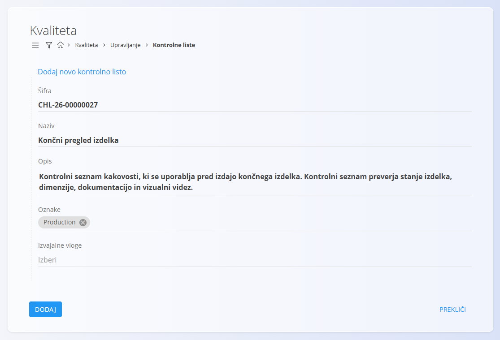
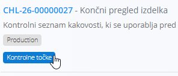
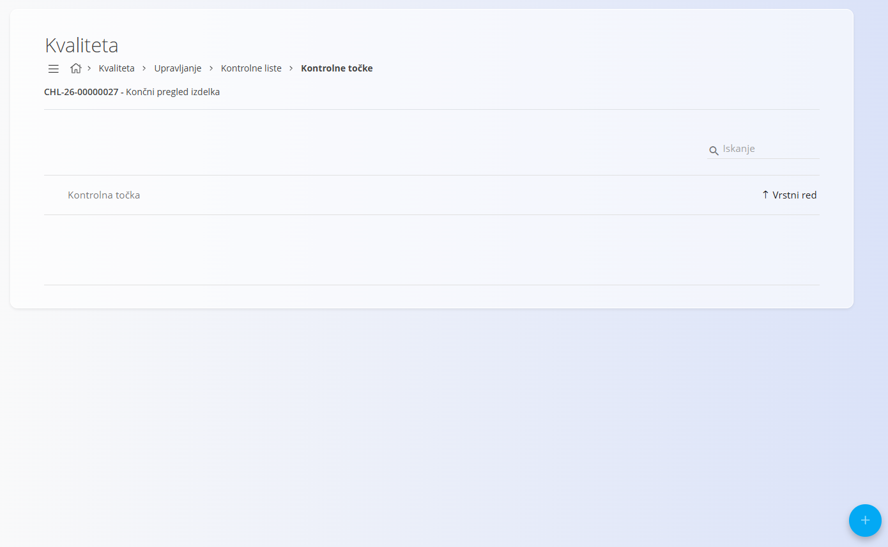
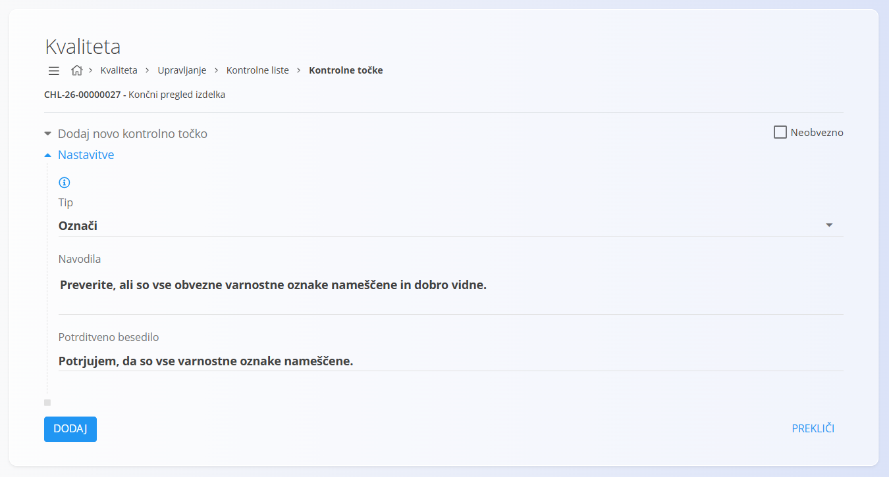
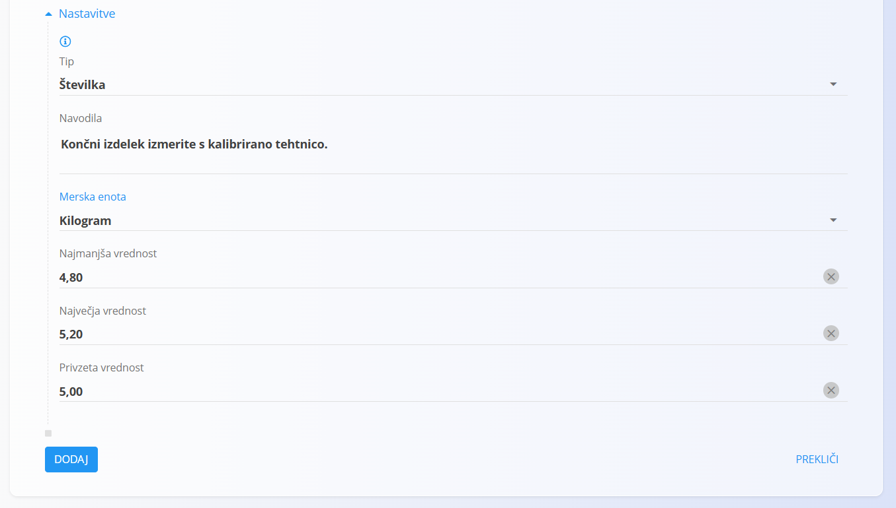
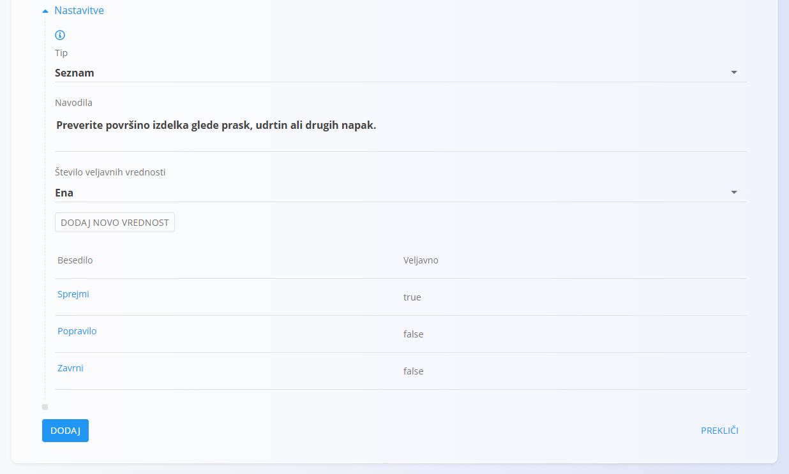
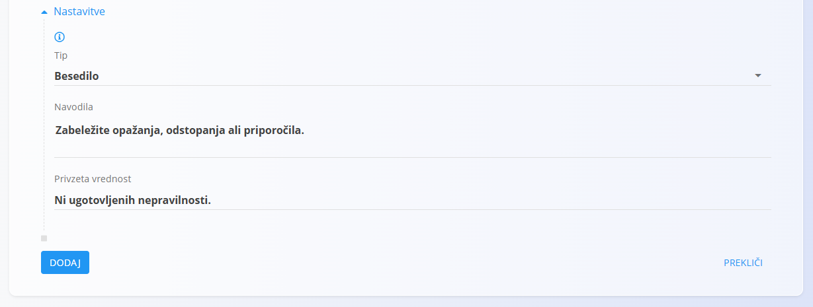
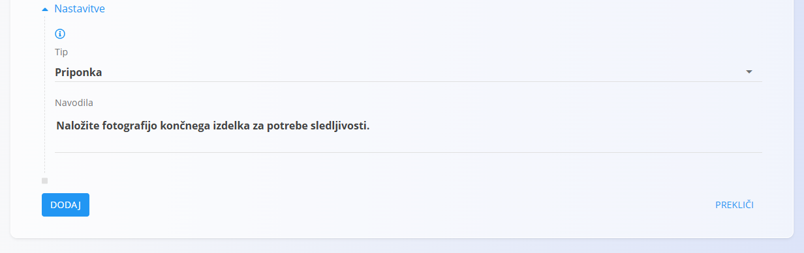
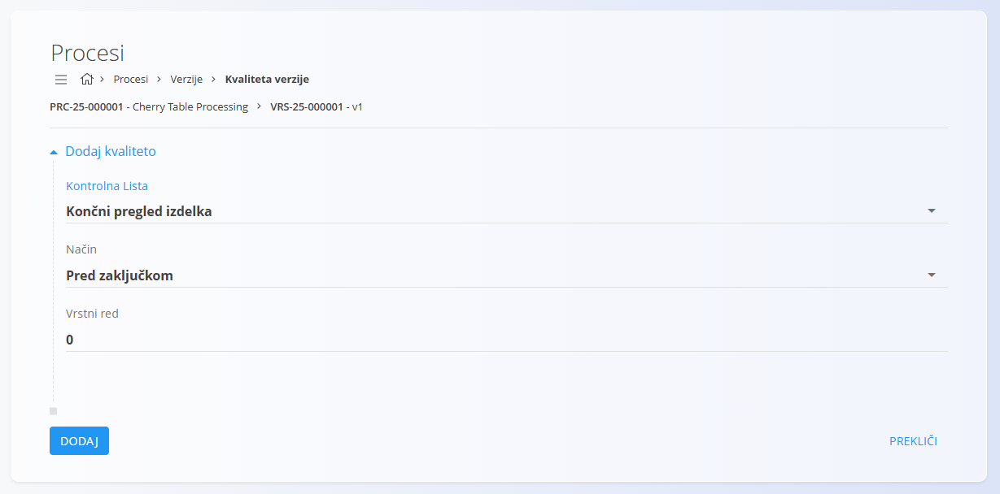
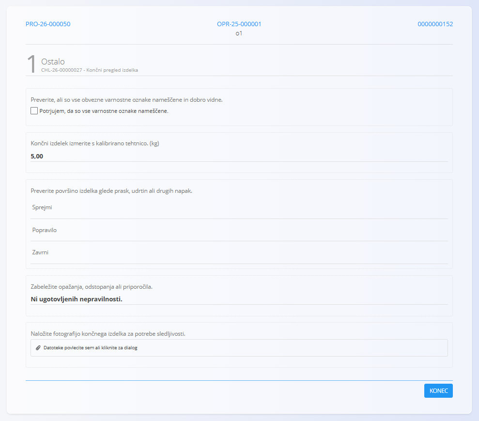

# Kako ustvariti kontrolno listo kakovosti

Kontrolne liste pomagajo zagotavljati dosledno izvajanje proizvodnih in vzdrževalnih postopkov ter podpirajo aktivnosti zagotavljanja kakovosti.

Ta vodič prikazuje, kako ustvariti kontrolno listo in konfigurirati različne vrste kontrolnih točk, ki jih izvajalci izpolnjujejo med izvedbo.

> [!TIP]
> Pripravite jasna navodila in uporabite ustrezne tipe kontrolnih točk, da bodo izvajalci lažje razumeli in izvedli zahtevane kontrole. Jasna navodila izboljšujejo doslednost izvajanja in zmanjšujejo možnost napak.

## Korak 1: Ustvariti novo kontrolno listo

Odprite **Proizvodnja / Upravljanje / Kontrolne liste** ali **Vzdrževanje / Upravljanje / Kontrolne liste**.

1. Kliknite [akcijski gumb](../../../Skupno/UI/AkcijskiGumb.md).
2. Vnesite **Naziv** kontrolne liste.
3. Po želji vnesite **Opis**.
4. Izberite eno ali več **Oznak** za razvrščanje kontrolne liste.
5. Po želji določite **Izvajalne vloge**, ki lahko izvajajo kontrolno listo.
6. Kliknite **Dodaj**.

Kontrolna lista je zdaj ustvarjena in pripravljena za dodajanje kontrolnih točk.

## Korak 2: Odpreti stran kontrolnih točk

Vsaka kontrolna lista vsebuje eno ali več kontrolnih točk.

Za upravljanje kontrolnih točk:

1. Odprite stran **Kontrolne liste**.
2. Poiščite želeno kontrolno listo.
3. Kliknite **Kontrolne točke**.

Odpre se stran **Kontrolne točke**.

## Korak 3: Ustvariti prvo kontrolno točko

Seznam kontrolnih točk prikazuje vse kontrolne točke, ki pripadajo izbrani kontrolni listi.

Pri novi kontrolni listi je seznam na začetku prazen.

Za dodajanje kontrolne točke:

1. Kliknite [akcijski gumb](../../../Skupno/UI/AkcijskiGumb.md).
2. Izpolnite osnovne podatke:

   * **Naziv**
   * **Opis** (neobvezno)
   * **Vrstni red**
   * **Kategorija** (neobvezno)
   * **Neobvezno**
   * **Tip**
   * **Navodila** (neobvezno)
3. Kliknite **Dodaj**.

> [!NOTE]
> Za določitev vrstnega reda kontrolnih točk uporabite polje **Vrstni red** na posamezni kontrolni točki.

Po ustvarjanju kontrolne točke so lahko na voljo dodatne nastavitve, odvisno od izbranega **Tipa**.

## Korak 4: Dodati potrditveno kontrolo

Potrditvene kontrole so uporabne, kadar mora izvajalec potrditi, da je bila določena naloga opravljena.

Primeri:

* Preverjanje varnostnih zaščit
* Preverjanje embalaže
* Potrditev čiščenja stroja

Pri ustvarjanju kontrolne točke:

* Vnesite **Naziv**
* Nastavite **Tip** na **Označi**
* Vnesite **Navodila** in **Potrditveno besedilo**

### Primer

* **Naziv**: *Preverjanje varnostnih oznak*
* **Navodila**: *Preverite, ali so vse obvezne varnostne oznake nameščene in dobro vidne.*
* **Potrditveno besedilo**: *Potrjujem, da so vse varnostne oznake nameščene.*

## Korak 5: Dodati merilno kontrolo

Merilne kontrole omogočajo vnos številčnih vrednosti.

Primeri:

* Teža izdelka
* Temperatura
* Dolžina
* Debelina

Pri ustvarjanju kontrolne točke:

* Vnesite **Naziv**
* Nastavite **Tip** na **Številka**
* Izberite **Mersko enoto**
* Po želji določite **Najmanjšo** in **Največjo vrednost**

### Primer

* **Naziv**: *Teža izdelka*
* **Merska enota**: *kg*
* **Najmanjša vrednost**: *4,8*
* **Privzeta vrednost**: *5,0*
* **Največja vrednost**: *5,2*

## Korak 6: Dodati vnaprej določen izbor

Kontrole tipa seznam omogočajo izbiro med vnaprej določenimi vrednostmi.

Pri ustvarjanju kontrolne točke:

* Vnesite **Naziv**
* Nastavite **Tip** na **Seznam**
* Izberite, ali je možna izbira ene ali več vrednosti
* Dodajte razpoložljive vrednosti

Primer:

* **Naziv**: *Kakovost površine*
* **Število veljavnih vrednosti**: *Ena*
* **Vrednosti**:

  * *Sprejmi* – Veljavno
  * *Popravilo* – Neveljavno
  * *Zavrni* – Neveljavno

Tako bo kontrolna točka potrjena samo ob izbiri veljavne vrednosti.

## Korak 7: Dodati polje za komentar

Kontrole tipa besedilo omogočajo vnos prostega besedila.

Primeri uporabe:

* Opis napak
* Dodatna pojasnila meritev
* Povratne informacije ali opažanja

Pri ustvarjanju kontrolne točke:

* Vnesite **Naziv**
* Nastavite **Tip** na **Besedilo**

### Primer

* **Naziv**: *Komentar kontrolorja*
* **Navodila**: *Zabeležite opažanja, odstopanja ali priporočila.*
* **Privzeta vrednost**: *Ni ugotovljenih nepravilnosti.*

## Korak 8: Dodati kontrolo za nalaganje datotek

Kontrole za nalaganje datotek zahtevajo, da izvajalec naloži dokument ali sliko.

Primeri uporabe:

* Fotografije izdelkov
* Poročila o pregledu
* Certifikati
* Podpisani dokumenti

Pri ustvarjanju kontrolne točke:

* Vnesite **Naziv**
* Nastavite **Tip** na **Priponka**

### Primer

* **Naziv**: *Fotografija končnega izdelka*
* **Navodila**: *Naložite fotografijo končnega izdelka za potrebe sledljivosti.*

## Korak 9: Dodati kontrolno listo procesu

Ko je kontrolna lista pripravljena, jo lahko povežete s proizvodnim ali vzdrževalnim procesom.

> [!NOTE]
> Kontrolne liste je mogoče povezati tudi z [organizacijskimi enotami](../../../Skupno/Upravljanje/OrganizacijskeEnote.md), kar omogoča samodejno vključitev kontrolne liste v vse procese, ki se izvajajo v tej organizacijski enoti.

Med izvedbo izvajalci izpolnijo zahtevane kontrolne točke in vnesejo zahtevane podatke.

Rezultati se shranijo v sistem in jih je mogoče pozneje pregledovati za potrebe zagotavljanja kakovosti, sledljivosti in revizij.

## Naslednji koraki

Za podrobnejše informacije glejte:

* [**Kontrolne liste**](KontrolneListe.md)
* [**Kontrolne točke**](KontrolneTocke.md)
