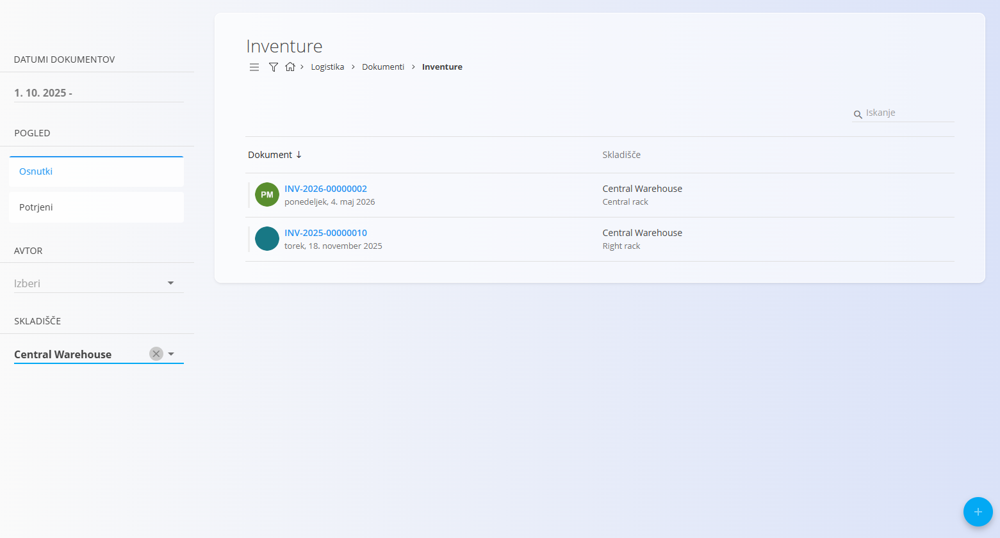
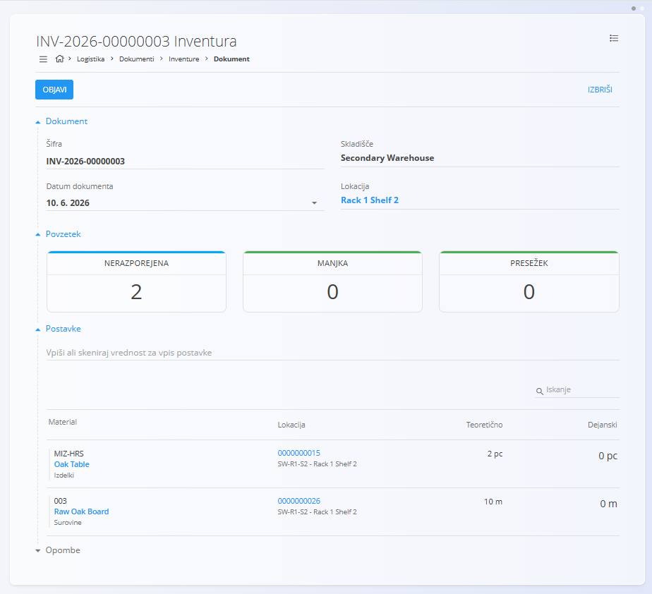
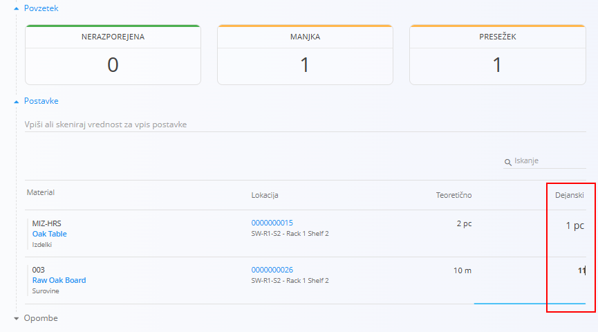

<!-- app_route: /warehouse/documents/inventories --> 
<!-- app_label: Inventure --> 
<!-- canonical_source_url: https://github.com/Tom-PIT/Connected.Docs/blob/main/sl/Domene/Logistika/Dokumenti/Inventure.md --> 
<!-- canonical_source_title: Inventure -->

# Inventure

Dokument **Inventura** se uporablja za preverjanje in popravljanje zalog na določeni skladiščni lokaciji. Sistem primerja **teoretično zalogo**, zabeleženo v sistemu, z **dejansko zalogo**, ki je fizično prisotna na lokaciji. Če se ugotovijo razlike, lahko posodobite količine in dokument objavite, s čimer se zaloga ustrezno uskladi z dejanskim stanjem.

Inventura se izvaja **po lokacijah** in prikaže vse materiale, shranjene na izbrani lokaciji, skupaj z indikatorji manjkajočih ali presežnih količin. Za razumevanje nastanka zaloge lahko neposredno odprete **[Pogled zaloge po lokacijah](../Pregledi/PogledZalogePoLokacijah.md)** ali **[Pogled zaloge po serijski številki](../Pregledi/Zaloga.md#pogled-zaloge-po-serijski-stevilki)**.

Minimalni in maksimalni pragovi, prikazani v povzetkih, se nastavijo v šifrantu  
**[Meje zaloge](../Upravljanje/MejeZaloge.md)**.

> [!TIP]
> Za celovit prikaz si oglejte video vodič **[Inventura](https://www.youtube.com/watch?v=Rc4qqTdxKn8)**.

Za dostop do **Inventur** pojdite na **Logistika / Dokumenti / Inventure** v [navigaciji](../../../Skupno/UI/Navigacija.md).

## Shema

  
<strong>Dokument</strong>

| Polje | Opis |
|------|------|
| [**Šifra**](../../../Skupno/UI/SifreDokumentov.md) | Sistemsko generiran enolični identifikator inventurnega dokumenta. |
| **Datum dokumenta** | Datum, ko se inventura izvaja ali evidentira. |
| [**Skladišče**](../Upravljanje/Skladisca.md) | Skladišče, v katerem se izvaja inventura. |
| [**Lokacija**](../Upravljanje/Lokacije.md) | Konkretna lokacija znotraj skladišča, ki se preverja. |

  
<strong>Postavke</strong>

| Polje | Opis |
|------|------|
| [**Material**](../../Sredstva/Materiali.md) | Material, shranjen na izbrani lokaciji ([izdelek](../../Sredstva/Materiali/Izdelki.md), [polizdelek](../../Sredstva/Materiali/Polizdelki.md), [surovina](../../Sredstva/Materiali/Surovine.md) ali [repro material](../../Sredstva/Materiali/ReproMateriali.md)). |
| **Lokacija** | Lokacija, na kateri se inventura izvaja. |
| **Teoretično** | Količina, ki je trenutno zabeležena v sistemu. |
| **Dejanski** | Fizično preverjena količina (urejanje dovoljeno). |

## Seznam inventurnih dokumentov

Stran **Inventure** prikazuje vse inventurne dokumente.  
Seznam lahko filtrirate z levim stranskim menijem, ki vključuje:

- **Datume dokumentov**
- **Pogled**
  - *Osnutki* — dokumenti, ki še niso objavljeni  
  - *Potrjeni* — potrjene inventurne prilagoditve
- **Avtor**
- **Skladišče**

Barvni indikator ob dokumentu prikazuje njegovo stanje:

- **Zelena** — objavljeno  
- **Siva** — osnutek

S klikom na dokument odprete njegov podroben pregled.

## Dejanja

### Ustvariti inventurnega dokumenta

Kliknite [akcijski gumb](../../../Skupno/UI/AkcijskiGumb.md) za ustvarjanje novega inventurnega dokumenta.

1. Kliknite **Novo**, da ustvarite novo inventuro.

   

2. Po izbiri **skladišča** in **lokacije** sistem samodejno naloži vse materiale, zabeležene na tej lokaciji.

3. V razdelku **Povzetek** so prikazani:
   - **Nerazporejena** — število materialov, ki še niso preverjeni  
   - **Manjka** — število materialov, pri katerih je dejanska količina manjša od teoretične  
   - **Presežek** — število materialov, pri katerih je dejanska količina večja od teoretične  

4. V razdelku **Postavke** ima stolpec **Dejanski** privzeto vrednost **0**.  
   Vnesite dejanske fizične količine. Ko je vrednost drugačna od teoretične, se to samodejno odrazi v razdelkih **Manjka** in **Presežek** v **Povzetku**.

   

5. Ko so vsi materiali preverjeni in so vnesene dejanske vrednosti, razdelek **Nerazporejena** postane zelen in prikaže **0**.

6. Kliknite **Objavi**, da potrdite inventuro. S tem se zaloga v sistemu posodobi in uskladi z dejanskim stanjem.

Novo ustvarjen inventurni dokument se prikaže med **Osnutki**. Po objavi se premakne med **Objavljene** in zaloga se ustrezno popravi.

> [!NOTE]
> Vrednosti v razdelkih **Manjka** in **Presežek** prikazujejo število **različnih materialov** z odstopanji, ne pa števila manjkajočih ali presežnih kosov.

## Urediti inventurnega dokumenta

V seznamu kliknite na **Šifro** dokumenta, da ga odprete. V statusu **Osnutek** lahko po potrebi urejate glavne podatke in podrobnosti. Uporabite lahko tudi možnosti menija za tiskanje ali izvoz dokumenta v PDF obliki.

#### Postavke

V razdelku **Postavke** lahko zabeležite dodatne komentarje ali ugotovitve, povezane z inventurnim postopkom.

## Izbrisati inventurni dokument

- V zaslonu za upravljanje inventurnimi dokumenti kliknite na **Izbriši**, da odstranite **osnutek** inventurnega dokumenta. Po potrditvi se dokument odstrani iz sistema, ne da bi to vplivalo na zalogo.
- Objavljenih inventurnih dokumentov **ni mogoče izbrisati ali razveljaviti**.

## Meni

Meni omogoča dodatna dejanja, ki so na voljo na tej strani.

Na voljo sta naslednji dejanji:

- **Tiskanje**
- **Izvoz v PDF**

Za podrobnosti o dejanjih menija glejte [**Dejanja menija**](../../../Skupno/Koncepti/MeniDejanja.md).