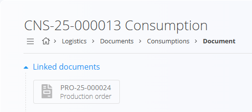
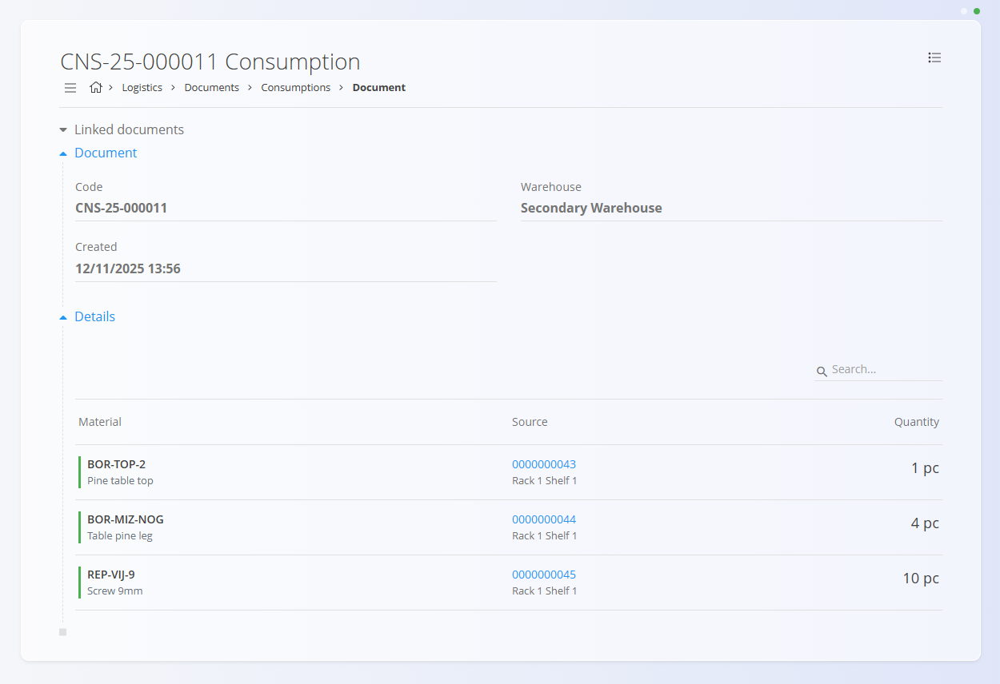

<!-- app_route: /production/documents/consumptions --> 
<!-- app_label: Porabe -->
<!-- canonical_source_url: https://github.com/Tom-PIT/Connected.Docs/blob/main/sl/Domene/Logistika/Dokumenti/Porabe.md --> 
<!-- canonical_source_title: Porabe -->

# Porabe

Dokument **Poraba** beleži materiale, ki so bili porabljeni med izvajanjem **proizvodnega naloga**. Dokumenti porabe se ustvarijo **samodejno** v modulu  
[**Izvajanje**](../../Proizvodnja/Dokumenti/Izvedba.md), ko proizvodni delavec zabeleži porabo materiala. Porabe zmanjšujejo zalogo porabljenih materialov in zagotavljajo sledljivost uporabljenih postavk.

Za vnos porabljenih materialov na proizvodni strani glejte  
**[Porabljeno](../../Proizvodnja/Dokumenti/Poraba.md)** — modula sta tesno povezana: beleženje porabe v proizvodnji ustvari ustrezen dokument porabe v logistiki.

Za dostop do **Porab** pojdite na **Logistika / Dokumenti / Porabe** v [navigaciji](../../../Skupno/UI/Navigacija.md).

## Shema

  
<strong>Dokument</strong>

| Polje | Opis |
|-------|------|
| [**Šifra**](../../../Skupno/UI/SifreDokumentov.md) | Enolični identifikator dokumenta porabe (samodejno generiran). |
| **Ustvarjeno** | Datum in čas, ko je bil dokument ustvarjen. |
| [**Skladišče**](../Upravljanje/Skladisca.md) | Skladišče, iz katerega so bili materiali porabljeni. |

  
<strong>Postavke</strong>

| Polje | Opis |
|-------|------|
| [**Material**](../../Sredstva/Materiali.md) | Porabljen material ([izdelek](../../Sredstva/Materiali/Izdelki.md), [polizdelek](../../Sredstva/Materiali/Polizdelki.md), [surovina](../../Sredstva/Materiali/Surovine.md) ali [repro material](../../Sredstva/Materiali/ReproMateriali.md)). |
| **Vir** | Identifikator vira porabljene enote (npr. serijska številka ali koda pakiranja, odvisno od načina sledenja materiala). |
| **Količina** | Zabeležena porabljena količina za posamezno postavko. |

## Seznam dokumentov porabe

Stran **Porabe** prikazuje vse dokumente porabe, ustvarjene med izvajanjem proizvodnje. Seznam lahko filtrirate po:

- **Datumih dokumentov**
- **Pogledu**
  - *Osnutek* — poraba je še v teku (beleženje še ni zaključeno)
  - *Potrjeno* — zaključen dokument porabe
- **Avtor**
- **Skladišče**

## Dejanja

Dokumentov porabe **ni mogoče ustvariti ročno** na tej strani (ni [akcijskega gumba](../../../Skupno/UI/AkcijskiGumb.md)). Ustvarijo se iz modula [**Izvajanje**](../../Proizvodnja/Dokumenti/Izvedba.md) med beleženjem porabe za proizvodni nalog.

Delovni tok:
- Ko proizvodni delavec začne beležiti porabo, se samodejno ustvari **osnutek** dokumenta porabe.
- Ko je postopek **Izvajanja** zaključen, se dokument premakne v stanje **Objavljeno** in je na voljo za pregled.

## Pregled dokumenta porabe

Dokument porabe vsebuje:

### Povezani dokumenti

Če je bila poraba zabeležena za proizvodni nalog, razdelek **Povezani dokumenti** prikaže povezavo do povezanega  
[**Proizvodnega naloga**](../../Proizvodnja/Dokumenti/ProizvodniNalogi.md) (če obstaja).

### Dokument in postavke

Razdelek **Postavke** prikazuje vse porabljene materiale skupaj z njihovim virom in zabeleženimi količinami.

## Izbrisati dokument porabe

Dokumentov porabe **ni mogoče izbrisati** iz sistema, saj je potrebno ohraniti sledljivost uporabe materialov v proizvodnji. Dokumente je mogoče samo **stornirati**, kot je opisano zgoraj.

## Meni

Meni omogoča dodatna dejanja, ki so na voljo na tej strani.

Na voljo je naslednje dejanje:

- **Ustvari novo storno**

Za podrobnosti o dejanjih menija glejte [**Dejanja menija**](../../../Skupno/Koncepti/MeniDejanja.md).
