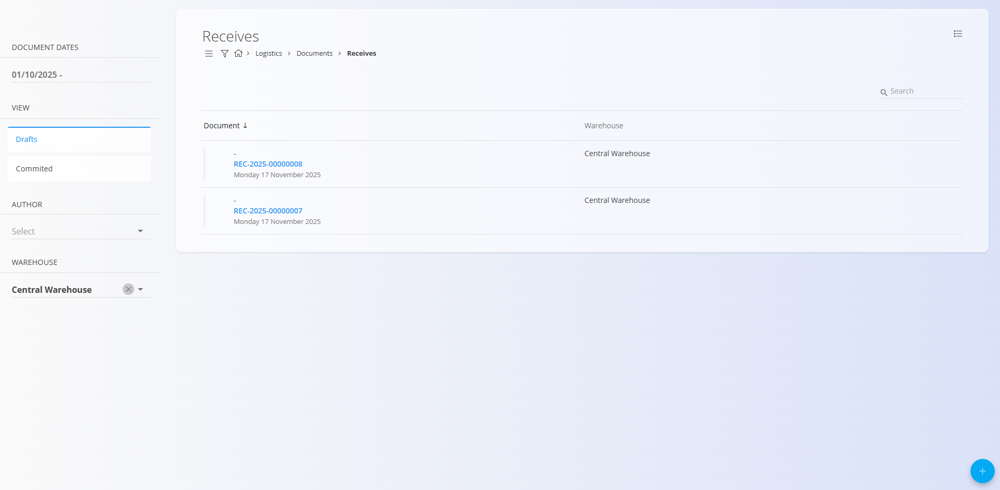
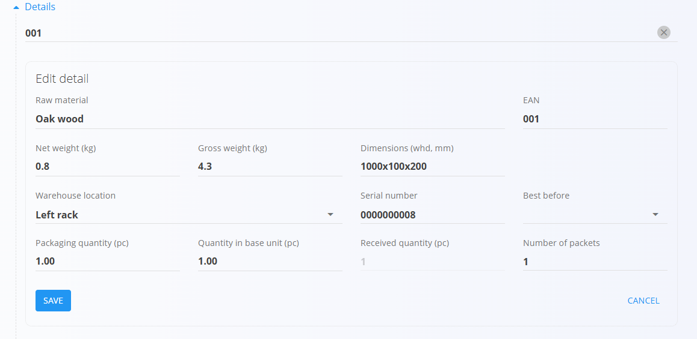
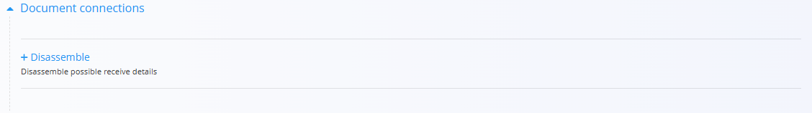

# Prevzemi

Dokument **Prevzem** se uporablja za evidentiranje prihoda materialov v skladišče. Ko blago fizično prispe od dobavitelja ali iz druge lokacije, ustvarite prevzemni dokument, s katerim ga zabeležite v sistemu. Primeri prevzemov vključujejo:
- [**Izdelke**](../../Sredstva/Materiali/Izdelki.md)  
- [**Polizdelke**](../../Sredstva/Materiali/Polizdelki.md)  
- [**Repro materiale**](../../Sredstva/Materiali/ReproMateriali.md)  
- [**Surovine**](../../Sredstva/Materiali/Surovine.md)

Postopek prevzema zajema ključne informacije, kot so material, [pakiranje](../../Sredstva/Materiali/Pakiranje.md), količina, serijske številke, rok uporabe in [skladiščna lokacija](../Upravljanje/Lokacije.md). To zagotavlja natančno stanje zaloge in popolno sledljivost materialov od trenutka vstopa v skladišče.

> [!TIP]
> Za celovit prikaz si oglejte video vodič **[Prevzemi](https://www.youtube.com/watch?v=oTOYD-nlCqE)**.

Za dostop do **Prevzemov** pojdite na **Logistika / Dokumenti / Prevzemi** v [**navigaciji**](../../../Skupno/UI/Navigacija.md).

## Shema

  
<strong>Dokument</strong>

| Polje | Opis |
|------|------|
| [**Šifra**](../../../Skupno/UI/SifreDokumentov.md) | Sistemsko generiran enolični identifikator prevzemnega dokumenta. |
| **Datum dokumenta** | Datum, ko je bilo blago fizično prevzeto. |
| [**Skladišče**](../Upravljanje/Skladisca.md) | Skladišče, v katerega se materiali prevzemajo (obvezno). |
| **Dobavitelj** | Dobavitelj blaga, izbran iz [Poslovnega imenika](../../../Skupno/Upravljanje/PoslovniImenik.md) (obvezno). |
| **Nabavni nalog** | (Neobvezno) Povezan dobavni nalog. |
| **Postavke** | Dodatne opombe, povezane z dokumentom. |

  
<strong>Razdelek postavk</strong>

| Polje | Opis |
|------|------|
| [**Material**](../../Sredstva/Domena/Materiali.md) | Prevzeti material (izdelek, polizdelek, surovina ali repro material). |
| **EAN** | Črtna koda pakiranja ali enote. |
| **Neto teža / Bruto teža (kg)** | Podatek o teži, shranjen v sistemu ali pridobljen s skeniranjem. |
| **Dimenzije (švd, mm)** | Širina, višina in globina pakiranja. |
| [**Skladiščna lokacija**](../Upravljanje/Lokacije.md) | Lokacija, kamor bo enota shranjena. |
| **Serijska številka** | Skenirana ali generirana serijska številka. |
| **Datum do** | Datum poteka (za materiale z rokom uporabe). |
| **Količina pakiranja (kos)** | Količina, ki jo predstavlja ena pakirna enota. |
| **Količina v osnovni enoti (kos)** | Količina, izražena v osnovni merski enoti materiala. |
| **Prevzeta količina (kos)** | Dejanska prevzeta količina. |
| **Količina v paketu** | Število prevzetih paketov. |

## Seznam prevzemnih dokumentov

Stran **Prevzemi** prikazuje vse prevzemne dokumente. Dokument lahko poiščete z iskalnikom ali uporabite filtre v levem stranskem meniju:

- **Datumi dokumentov**
- **Pogled:**  
  - *Osnutki* — dokumenti, ki še niso objavljeni  
  - *Potrjeni* — dokončni in zaklenjeni dokumenti
- **Avtor**
- **Skladišče**

Barvni indikator ob dokumentu prikazuje njegovo stanje:

- **Zelena** — objavljeno  
- **Siva** — osnutek

S klikom na dokument odprete njegov podroben pregled.

## Dejanja

Kliknite [**akcijski gumb**](../../../Skupno/UI/AkcijskiGumb.md), da ustvarite nov prevzemni dokument.

### Ustvarjanje prevzemnega dokumenta

Postopek ustvarjanja novega prevzema:

1. Kliknite **akcijski gumb** in izberite **Dobavitelja**.

   

2. Skenirajte ali ročno vnesite **EAN šifro pakiranja**.
   - Sistem prikaže **vse ujemajoče materiale in serijske številke**.
3. Sistem samodejno pridobi podatke o pakiranju in izpolni ustrezna polja v razdelku **Postavke**.

   

4. Po potrebi prilagodite količine, skladiščne lokacije ali druge vrednosti.
5. Kliknite **Shrani**, da shranite postavko. Po potrebi dodajte nove postavke (ponovite od koraka 2).
6. Kliknite **Objavi**, da dokument dokončno potrdite.

Novo ustvarjen prevzem se prikaže med **Osnutki**. Po objavi se premakne med **Objavljene** dokumente.

## Priponke

Na vrhu vsakega dokumenta je na voljo razdelek **Priponke**.

Naložite lahko poljubne datoteke, kot so dobavnice, transportni dokumenti, fotografije ali druga spremljajoča dokumentacija. Priponke so trajno shranjene skupaj z dokumentom.

## Povezavi dokumenti

Objavljeni prevzemni dokumenti vsebujejo dodatni razdelek **Povezavi dokumenti**, ki prikazuje dokumente, ki jih je mogoče ustvariti na podlagi prevzetih materialov.

Pri prevzemih se lahko pojavi možnost **Razstavljanje**, ki omogoča ustvarjanje novega dokumenta razstavljanja na podlagi prevzetih postavk.

Za več podrobnosti glejte dokumentacijo [**Demontaže**](Demontaze.md).

## Postavke

Vsak dokument vsebuje razdelek **Postavke**, kamor lahko vnesete dodatne komentarje ali informacije. Postavke se shranijo skupaj z dokumentom in so vidne tako v osnutku kot v objavljeni različici.

## Meni

V prevzemnem dokumentu **meni (ikona hamburger)** v zgornjem desnem kotu ponuja različne možnosti, odvisno od stanja dokumenta.

### Osnutek prevzema

- Tiskanje  
- Izvoz (PDF)  
- Izbriši vse postavke  

### Objavljen prevzem

- Tiskanje  
- Izvoz (PDF)  
- [**Ustvari storno**](Storno.md)

## Pregled prevzemnega dokumenta

Ko kliknete dokument v seznamu:

- vidite razdelek **Dokument** (glava dokumenta)
- vidite vse **Postavke** prevzetih materialov
- osnutke lahko urejate
- dokumente lahko tiskate ali izvozite
- objavljeni dokumenti so samo za branje (razen ustvarjanja storna)

## Brisanje

Osnutke je mogoče izbrisati le, če **ne vsebujejo nobenih postavk**.  
Če osnutek še vsebuje postavke, uporabite možnost **Izbriši vse postavke** v **Meniju**.

Za posamično brisanje postavk:

1. Kliknite serijsko številko materiala, da odprete zaslon **Uredi postavko**.  
2. Kliknite **Izbriši** v oknu urejanja.  
3. Postopek ponovite za vse preostale postavke.

Ko dokument ne vsebuje več nobene postavke, lahko kliknete **Izbriši**, da odstranite osnutek.

> [!NOTE]
> Objavljenih dokumentov **ni mogoče izbrisati** — mogoče jih je samo **stornirati**.
