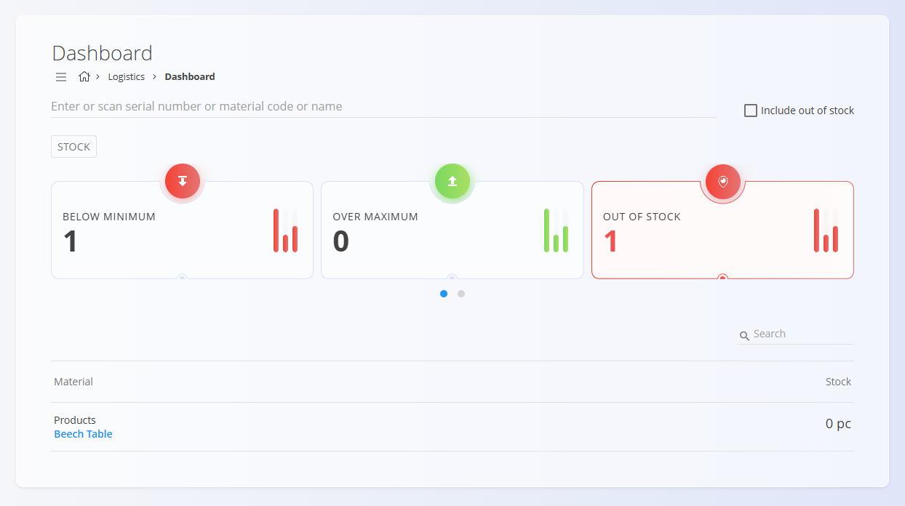

<!-- app_route: /sitemap/logistics -->
<!-- app_label: Logistika -->
<!-- canonical_source_url: https://github.com/Tom-PIT/Connected.Docs/blob/main/sl/Domene/Logistika/Domena/Logistika.md -->
<!-- canonical_source_title: Logistika -->

# Logistika

Področje **Logistika** pokriva vse skladiščne in logistične operacije znotraj organizacije. Vključuje procese ravnanja z zalogo, strukturo skladišč, premike materialov ter vso dokumentacijo, potrebno za sledenje fizičnemu toku blaga.

Medtem ko področje **[Materiali](../../Sredstva/Domena/Materiali.md)** določa, *kaj* obstaja na zalogi, področje Logistike določa, *kje je material shranjen*, *kako se premika* in *kako se nadzira*.

Za dostop do tega področja pojdite na **Logistika** v [navigaciji](../../../Skupno/UI/Navigacija.md).

> [!NOTE]
> Razpoložljiva področja so odvisna od konfiguracije podjetja in poslovnega modela.

## Kaj vključuje področje Logistika?

Področje je razdeljeno na več funkcionalnih sklopov:

- **[Nadzorna plošča](../Pregledi/NadzornaPlosca.md)** – hiter pregled logističnih aktivnosti in delovanja skladišč (kazalniki samo za branje)  
- **[Zaloga](../Pregledi/Zaloga.md)** – pregled zaloge v realnem času (samo za branje; filtriranje po skladišču, lokaciji, materialu, seriji/serijski številki)  
- **[Dokumenti](#dokumenti)** – vsi logistični dokumenti, ki vplivajo na zalogo  
- **[Pregledi](#pregledi)** – analitični pregledi porabe, izdaj in razporeditve zaloge  
- **[Šifranti](#sifranti)** – konfiguracija skladišč, lokacij in logističnih pravil  

## Nadzorna plošča

**[Nadzorna plošča](../Pregledi/NadzornaPlosca.md)** omogoča hiter pregled logistične učinkovitosti in aktivnosti v skladiščih. Prikazuje operativne kazalnike (npr. število prevzemov in izdaj, odprte inventure, neskladja), ki uporabnikom pomagajo razumeti trenutno obremenitev, premike zaloge in aktivne skladiščne procese.

Nadzorna plošča služi kot vstopna točka za skladiščne vodje in operaterje, ki potrebujejo takojšen vpogled v stanje logističnih operacij.

## Zaloga

Razdelek **[Zaloga](../Pregledi/Zaloga.md)** omogoča operativni vpogled v materiale in njihove trenutne količine v skladiščih. Prikazuje vse materiale po skladiščih in lokacijah, vključno z razpoložljivimi količinami, serijami, serijskimi številkami in fizičnimi pozicijami. Ta pogled je samo za branje.

## Dokumenti

Razdelek **Dokumenti** vsebuje vse logistične transakcije, ki **spreminjajo količino zaloge** ali **beležijo skladiščne aktivnosti**.

Razpoložljivi logistični dokumenti vključujejo:

- **[Prevzemi](../Dokumenti/Prevzemi.md)** – beleženje vnosa blaga v skladišče (nabava, proizvodnja, vračila). Povečuje zalogo.
- **[Poenostavljen prevzem](../Dokumenti/PoenostavljenPrevzem.md)** – poenostavljena možnost za hitre vnose.
- **[Izdajnice](../Dokumenti/Izdajnice.md)** – beleženje iznosa blaga iz skladišča (poraba, dobava, proizvodni vhodi). Zmanjšuje zalogo.
- **[Med-skladiščni promet](../Dokumenti/MedSkladiscniPromet.md)** – premiki materiala med skladišči ali lokacijami.
- **[Premakni serijsko številko](../Dokumenti/PremakniSerijskoStevilko.md)** – premik serijsko ali lotno vodenih materialov (brez spremembe količine).
- **[Inventure](../Dokumenti/Inventure.md)** – izvajanje inventur in usklajevanje razlik.
- **[Odpisi](../Dokumenti/Odpisi.md)** – odpis poškodovanih, izgubljenih ali pretečenih materialov. Zmanjšuje zalogo.
- **[Posoje](../Dokumenti/Posoje.md)** – sledenje materialom, izdanih zaposlenim ali zunanjim partnerjem.
- **[Porabe](../Dokumenti/Porabe.md)** – beleženje porabe materialov. Zmanjšuje zalogo.
- **[Proizvodnje](../Dokumenti/Proizvodnje.md)** – prevzem končnih ali polizdelkov iz proizvodnje. Povečuje zalogo.
- **[Storno](../Dokumenti/Storno.md)** – razveljavitev predhodnih logističnih dokumentov.
- **[Vsebniki](../Dokumenti/Vsebniki.md)** – upravljanje logističnih vsebnikov, palet ali združenih postavk.
- **[Demontaže](../Dokumenti/Demontaze.md)** – razstavljanje garnitur na komponente. Povečuje zalogo komponent.
- **[Korekcije](../Dokumenti/Korekcije.md)** – ročne prilagoditve zaloge (z revizijsko sledjo).
- **[Premik vsebnika](../Dokumenti/PremikVsebnika.md)** – premik vsebnika kot enote.
- **[Analiza materialov](../Dokumenti/AnalizaMaterialov.md)** – izvajanje analiz ali kontrol kakovosti materialov.

Vsak od teh dokumentov prispeva k sledljivosti in natančnosti skladiščnih operacij.

## Pregledi

Razdelek **Pregledi** ponuja analitična orodja za razumevanje premikov zaloge, vzorcev porabe in razporeditve po lokacijah.

Razpoložljivi pregledi vključujejo:

- **[Postavke porabe](../Pregledi/PostavkePorabe.md)** – vpogled v trende porabe materialov; filtriranje po datumu, materialu, skladišču, uporabniku ali stroškovnem mestu.
- **[Postavke izdaj](../Pregledi/PostavkeIzdaj.md)** – razčlenitev izdaj po materialih, dokumentih, skladiščih in lokacijah.
- **[Pogled zaloge po lokacijah](../Pregledi/PogledZalogePoLokacijah.md)** – hierarhični prikaz zaloge po skladiščih, conah in lokacijah.

Ti zasloni **ne ustvarjajo transakcij** – namenjeni so podpori odločanja.

## Upravljanje

Razdelek **Upravljanje** vsebuje konfiguracijo in osnovne podatke, ki jih uporabljajo vsi logistični procesi.

Razpoložljivi šifranti vključujejo:

- **[Konfiguracija](../Upravljanje/KonfiguracijaLogistike.md)** – splošne nastavitve logističnih procesov.
- **[Poslovni imenik](../../../Skupno/Upravljanje/PoslovniImenik.md)** – notranji in zunanji poslovni subjekti.
- **[Skladišča](../Upravljanje/Skladisca.md)** – definicija fizičnih skladišč.
- **[Države](../../../Skupno/Upravljanje/Drzave.md)** – geografski podatki.
- **[Lokacije](../Upravljanje/Lokacije.md)** – skladiščne lokacije (regali, police).
- **[Meje zaloge](../Upravljanje/MejeZaloge.md)** – omejitve in posebna pravila obravnave zaloge.
- **[Merske enote](../../../Skupno/Upravljanje/MerskeEnote.md)** – enotne merske enote v sistemu.
- **[Analiza materialov](../Upravljanje/AnalizaMaterialov.md)** – nastavitve za analize materialov.

> [!TIP]
Oglejte si celoten seznam upravljanja: **[Kazalo upravljanja](../../../KazaloUpravljanja.md)**.

## Logistični procesi

Logistične operacije sledijo doslednemu življenjskemu ciklu:

### 1. Prevzem blaga
- Blago vstopa v skladišče prek **[Prevzemov](../Dokumenti/Prevzemi.md)** ali **[Proizvodnje](../Dokumenti/Proizvodnje.md)**.

### 2. Premiki in razporeditev
- Blago se shranjuje in premika z uporabo **[Med-skladiščnega prometa](../Dokumenti/MedSkladiscniPromet.md)**, **[Premika serijske številke](../Dokumenti/PremakniSerijskoStevilko.md)** in **[Premika vsebnika](../Dokumenti/PremikVsebnika.md)**.

### 3. Izdaja in poraba
- Zaloga zapušča skladišče prek **[Izdajnic](../Dokumenti/Izdajnice.md)** in **[Porab](../Dokumenti/Porabe.md)**.

### 4. Inventura in usklajevanje
- Natančnost se zagotavlja z **[Inventurami](../Dokumenti/Inventure.md)**, **[Odpisi](../Dokumenti/Odpisi.md)** in **[Korekcijami](../Dokumenti/Korekcije.md)**.

### 5. Poročanje in analiza
- Pregledi omogočajo vpogled v uporabo, razpoložljivost in odstopanja zaloge.

## Logistika in druga področja

Logistika je tesno povezana z drugimi področji sistema:

| Področje | Povezava |
|--------|----------|
| **[Materiali](../../Sredstva/Domena/Materiali.md)** | Določa materiale, ki se skladiščijo in premikajo. |
| **[Sredstva](../../Sredstva/Domena/DomenaSredstve.md)** | Razpoložljivost temelji na stanju zaloge. |
| **[Proizvodnja](../../Proizvodnja/Domena/Proizvodnja.md)** | Izdaje in prevzemi povezujejo logistiko s proizvodnjo. |
| **[Vzdrževanje](../../Vzdrzevanje/Domena/Vzdrzevanje.md)** | Rezervni deli in materiali tečejo skozi logistiko. |
| **[Prodaja](../../Prodaja/Domena/Prodaja.md)** / **[Nabava](../../Nabava/Domena/Nabava.md)** | Logistika zagotavlja pravilno izpolnjevanje naročil. |

## Povzetek

Področje Logistika predstavlja operativno središče upravljanja zaloge. Zagotavlja:

- natančne količine zaloge  
- sledljivost premikov materialov  
- strukturirana skladišča in lokacije  
- zanesljive vhodne in izhodne tokove  
- transparentno poročanje  

Povezuje fizično ravnanje z blagom z digitalnimi procesi prodaje, proizvodnje, nabave in vzdrževanja.
