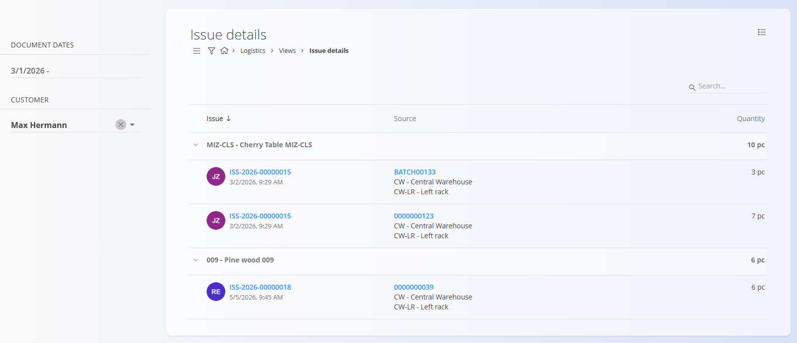
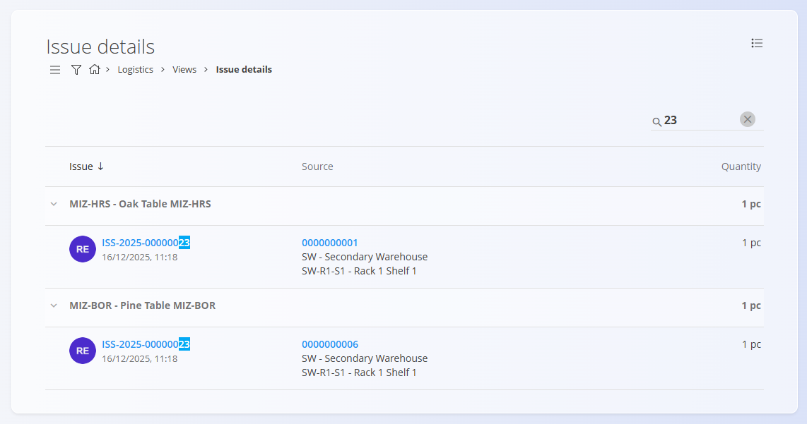

<!-- app_route: /warehouse/views/issue-details -->
<!-- app_label: Postavke izdaj -->
<!-- canonical_source_url: https://github.com/Tom-PIT/Connected.Docs/blob/main/sl/Domene/Logistika/Pregledi/PostavkeIzdaj.md -->
<!-- canonical_source_title: Postavke izdaj -->

# Postavke izdaj

Pogled **Postavke izdaj** nudi analitični pregled vseh **materialov in končnih izdelkov, izdanih iz zaloge** v izbranem časovnem obdobju. Namesto osredotočanja na posamezne dokumente izdaj ta pogled združuje **izdane postavke** ter jasno prikazuje, **kateri [dokumenti izdaj](../Dokumenti/Izdajnice.md)** so bili uporabljeni in **iz katerih skladiščnih lokacij** so bile postavke izdane.

Za dostop do tega pogleda pojdite na **Logistika / Pregledi / Postavke izdaj** v [navigaciji](../../../Skupno/UI/Navigacija.md).

## Seznam postavk izdaj

Seznam prikazuje **vse izdane materiale in izdelke**, združene po postavki. Vsaka vrstica prikazuje **skupno izdano količino** za posamezno postavko v izbranem časovnem obdobju.

Vrstico postavke lahko razširite in si ogledate **posamezne dokumente izdaj**, ki sestavljajo skupno količino.

### Hierarhija

Seznam je strukturiran na naslednji način:

- **Postavka** – material ali končni izdelek in skupna izdana količina  
  - **Dokument izdaje** – posamezen zapis izdaje  
    - **Izvor** – skladišče in lokacija, iz katere je bila postavka izdana  
    - **Količina** – količina, izdana v tem dokumentu  

Ko je dokument izdaje razširjen, so prikazani naslednji podatki:

- **Številka dokumenta** – klikljiva, odpre [dokument izdaje](../Dokumenti/Izdajnice.md)  
- **Datum in čas dokumenta**  
- **Izvor** – skladišče in lokacija (klikljivo)  
- **Izdana količina**

## Navigacija po Izvoru

Stolpec **Izvor** prikazuje:

- **Skladišče**
- **Točno skladiščno lokacijo**

Klik na Izvor odpre zaslon **[Pogled zaloge po lokacijah](PogledZalogePoLokacijah.md)**, filtriran na lokacijo, iz katere je bila postavka izdana. To omogoča pregled razpoložljive zaloge in drugih materialov, shranjenih na tej lokaciji.

## Filtri

Leva stranska vrstica vsebuje naslednji filter:

- **Datumi dokumentov** – omeji prikaz na dokumente izdaj znotraj izbranega časovnega obdobja
- **Stranka** – omeji prikaz na dokumente izdaj za izbrano stranko

## Iskanje

Uporabite **iskalno polje** v zgornjem desnem kotu za hitro filtriranje rezultatov. Iskanje deluje po:

- kodah postavk  
- imenih postavk  
- Å¡tevilkah dokumentov  
- kodah skladišč in lokacij  

To omogoča hitro iskanje izdaj, povezanih z določenim materialom, izdelkom, dokumentom ali skladiščno lokacijo.

## Namen

Pogled **Postavke izdaj** je uporaben za:

- analizo materialov in izdelkov, izdanih kupcem ali internim procesom  
- sledenje, katere postavke so bile izdane in od kod  
- revizijo izdanih količin po postavkah  
- preiskovanje izhodnih premikov zaloge  

Ta pogled je **zgolj analitičen**. Ne omogoča ustvarjanja, urejanja ali brisanja dokumentov.

> [!NOTE]
> - Količine so prikazane v osnovni merski enoti postavke (npr. kos, meter).  
> - Ta pogled se osredotoča na **izdaje zaloge** (npr. prodajne dobave, interne izdaje).  
> - Poraba materialov, povezana s proizvodnjo, je prikazana v **[Postavkah porabe](PostavkePorabe.md)**, ne tukaj.
