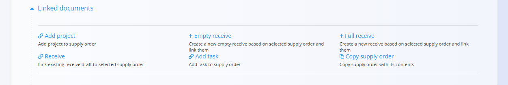

<!-- app_route: /supply/documents/supply-orders -->
<!-- app_label: Nabavni nalogi -->
<!-- canonical_source_url: https://github.com/Tom-PIT/Connected.Docs/blob/main/sl/Domene/Nabava/Dokumenti/NabavniNalogi.md -->
<!-- canonical_source_title: Nabavni nalogi -->

# Nabavni nalogi

**Nabavni nalog** je uradni nabavni dokument, s katerim organizacija potrdi naročilo materialov ali storitev pri dobavitelju. Določa, *kaj* bo organizacija prejela, *kdaj* in *pod kakšnimi pogoji*, ter predstavlja osnovo za nadaljnje operativne procese, kot so **prevzemi materiala** in **razporejanje stroškov**.

Za dostop do **Nabavnih nalogov** pojdite na **Nabava / Dokumenti / Nabavni nalogi** v [navigaciji](../../../Skupno/UI/Navigacija.md).

## Kako se nabavni nalogi vključujejo v nabavni proces

Nabavni nalogi predstavljajo formalno potrditveno fazo v procesu nabave.

1. Zahteva se običajno začne s **[Povpraševanjem](Povprasevanja.md)**.  
2. Po potrditvi se iz povpraševanja ustvari **Nabavni nalog** prek razdelka **Povezani dokumenti**.  
   - Nabavni nalogi se lahko ustvarijo tudi neposredno, brez predhodnega povpraševanja, ter se po potrebi naknadno povežejo.  
3. Iz nabavnega naloga lahko ustvarite enega ali več **[Prevzemov](../../Logistika/Dokumenti/Prevzemi.md)**:  
   - več **delnih prevzemov**, ali  
   - en **celoten prevzem**.  
4. Ko so vsi materiali prevzeti, se nabavni nalog samodejno premakne v stanje **Zaključeno**.  
   - Če je prevzem le delni, dokument ostane v stanju **Na voljo**, dokler ni v celoti zaključen.

## Shema

  
<strong>Dokument</strong>

| Polje | Opis |
|------|------|
| [**Šifra**](../../../Skupno/UI/SifreDokumentov.md) | Sistemsko generiran enolični identifikator nabavnega naloga. |
| **Dobavitelj** | Dobavitelj materialov ali storitev, izbran iz **[Poslovnega imenika](../../../Skupno/Upravljanje/PoslovniImenik.md)**. |
| **Datum dokumenta** | Datum nastanka nabavnega naloga. |
| **Datum dobave** | Načrtovani datum dobave zahtevanih materialov (obvezno). |
| **Rabat** | Neobvezni popust, uporabljen za celoten nabavni nalog. |
| [**Stroškovno mesto**](../../../Skupno/Upravljanje/StroskovnaMesta.md) | Interno stroškovno mesto, povezano z nabavo. Če je določena davčna stopnja **0 %**, se samodejno uporabi pri naročilu pri dobavitelju s sedežem zunaj matične države. |
| **Šifra ponudbe** | Neobvezna referenca na ponudbo dobavitelja ali zunanji dokument. |
| **Dostava – podjetje / naslov** | Podatki o lokaciji dostave, povzeti iz Poslovnega imenika ali ročno prilagojeni. |
| **Vsebina na vrhu** | Vnaprej določeno uvodno besedilo iz **[Vnaprej določenih besedil](../../../Skupno/Upravljanje/VnaprejDolocenaBesedila.md)** (entiteta: *Nabavni nalog*). |
| **Vsebina na dnu** | Zaključna ali pravna besedila iz vnaprej določenih besedil. |

  
<strong>Postavke</strong>

### Polja postavk

| Polje | Opis |
|------|------|
| [**Material**](../../Sredstva/Materiali.md) | Material, ki se nabavlja. |
| **EAN** | Črtna koda materiala (neobvezno). |
| **Količina** | Naročena količina. |
| **Datum opravljene storitve** | Specifični datum dobave za to postavko. |
| **Neto cena (na enoto)** | Cena na enoto, povzeta iz **[Materialov dobaviteljev](../Upravljanje/MaterialiDobaviteljev.md)** ali vnesena ročno. |
| **Popust (%)** | Neobvezni popust za posamezno postavko. |
| [**Davčna stopnja**](../../../Skupno/Upravljanje/DavcneStopnje.md) | Uporabljena davčna stopnja. |
| **Dobaviteljeva šifra** | Interna oznaka materiala pri dobavitelju. |
| **Skupna cena** | Znesek postavke (količina × neto cena − popust + davek). |

## Upravljanje

### Stanja dokumenta

Nabavni nalogi se v svojem življenjskem ciklu pomikajo skozi naslednja stanja:

- **Osnutki** – dokument še ni objavljen; vsa polja je mogoče prosto urejati.  
- **Potrjeno** – dokument je objavljen in ga ni več mogoče izbrisati ali prosto spreminjati.
  - **Na voljo** – nalog je veljaven in pripravljen za prevzeme.
  - **V zaključevanju** – del materialov je že bil prevzet (delni prevzemi).
  - **Zaključen** – vsi materiali so prevzeti in dokument je v celoti obdelan.

### Seznam dokumentov

Seznam **Nabavnih nalogov** prikazuje vse dokumente z njihovim trenutnim stanjem in načrtovanimi datumi dobave.

Na vrhu seznama sistem prikaže dva ključna indikatorja:

- **Čez rok dobave** (interaktivno) – nabavni nalogi, katerih načrtovani datum dobave je potekel in še niso v celoti prevzeti. S klikom se seznam samodejno filtrira.
- **Skupni znesek** – prikazuje skupno vrednost (neto + davek) vseh nabavnih nalogov v aktivnem filtru.

#### Menu

Seznam ima gumb **Menu**, ki omogoča izvoz seznama kot CSV datoteko.

### Filtri

Razpoložljivi filtri vključujejo:

- **Datumi dokumentov**  
- **Datumi dobave**  
- **Pogled**
  - Osnutki  
- **Potrjeno**
  - Na voljo  
  - V obdelavi  
  - Zaključeno  
- **Stanje storna: Stornirano**  
- **Dobavitelj**  
- Iskalno polje  

## Dejanja

### Ustvariti novi nabavni nalog

Kliknite [akcijski gumb](../../../Skupno/UI/AkcijskiGumb.md), da ustvarite novi nalog.

Za podroben postopek ustvarjanja si oglejte vodnik [**Kako ustvariti nabavni nalog**](NabavniNalogiUstvarjanje.md).

### Urediti nabavni nalog

Kliknite nabavni nalog v seznamu, da ga odprete. Nabavne naloge v stanju **Osnutek** je mogoče prosto urejati.

Razširljivi razdelki vključujejo:

- [**Povezani dokumenti**](#povezani-dokumenti) 
- [**Priponke**](NabavniNalogiUstvarjanje.md#priponke)
- [**Dokument**](NabavniNalogiUstvarjanje.md#korak-2--izpolnjevanje-glave-dokumenta)
- [**Dostava**](NabavniNalogiUstvarjanje.md#razdelek-dostava)
- [**Vsebina na vrhu in na dnu**](NabavniNalogiUstvarjanje.md#vsebina-na-vrhu-in-vsebina-na-dnu)
- [**Postavke**](NabavniNalogiUstvarjanje.md#korak-3--dodajanje-postavk)

#### Povezani dokumenti

Razdelek **Povezani dokumenti** omogoča ustvarjanje in povezovanje nadaljnjih operativnih dokumentov.

Za podrobnosti o povezavah med dokumenti, sledljivosti in ustvarjanju povezanih dokumentov glejte [**Povezani dokumenti**](../../../Skupno/Koncepti/PovezaniDokumenti.md).

Razpoložljiva dejanja vključujejo:

- **Dodaj projekt**  
- [**+ Prazen prevzem**](../../Logistika/Dokumenti/Prevzemi.md)  
- [**+ Polni prevzem**](../../Logistika/Dokumenti/Prevzemi.md)  
- [**Prevzem**](../../Logistika/Dokumenti/Prevzemi.md) – povezava obstoječega osnutka prevzema  
- **Dodaj opravilo**  
- **Kopiraj nabavni nalog**

### Zaključiti nabavni nalog

Nabavni nalog se šteje za zaključen, ko so vsi materiali v celoti prevzeti.

Ob zaključevanju:

- dokument preide iz stanja **Na voljo** v **Zaključeno**,  
- urejanje postane omejeno,  
- večina dejanj v **Povezanih dokumentih** je onemogočena (vključno z ustvarjanjem novih prevzemov),  
- morebitne preostale odprte količine se obravnavajo kot zaključene.

> [!NOTE]
> Zaključevanje nabavnega naloga je administrativno dejanje, ki zaključi njegov življenjski cikel. Ne povzroča dodatnih premikov zaloge — ti se izvajajo v povezanih dokumentih **Prevzema**.

### Izbrisati nabavni nalog

Nabavne naloge v stanju **Osnutek** je mogoče izbrisati na zaslonu za urejanje, vendar le, če **ne vsebujejo postavk**.

Če osnutek vsebuje postavke:

1. Kliknite postavko, da odprete zaslon za urejanje.  
2. Kliknite **Izbriši** v oknu za urejanje postavke.  
3. Postopek ponovite za vse postavke.

Ko dokument ne vsebuje več postavk, kliknite **Izbriši** za trajno odstranitev.

> [!NOTE]
> - Izbris je mogoč samo za nabavne naloge v stanju **Osnutek**.  
> - Objavljenih dokumentov ni mogoče izbrisati.  
> - Objavljeni dokumenti se lahko **[stornirajo](../../Logistika/Dokumenti/Storno.md)**.

## Meni

Meni omogoča dodatna dejanja, ki so na voljo na tej strani.

Na voljo so naslednja dejanja:

- **Tiskanje**
- **Izvoz v PDF**
- **Pošlji preko e-pošte**
- [**Storniranje dokument**](../../Logistika/Dokumenti/Storno.md)  
- **Vrni v osnutek**

Za podrobnosti o dejanjih menija glejte [**Dejanja menija**](../../../Skupno/Koncepti/MeniDejanja.md).