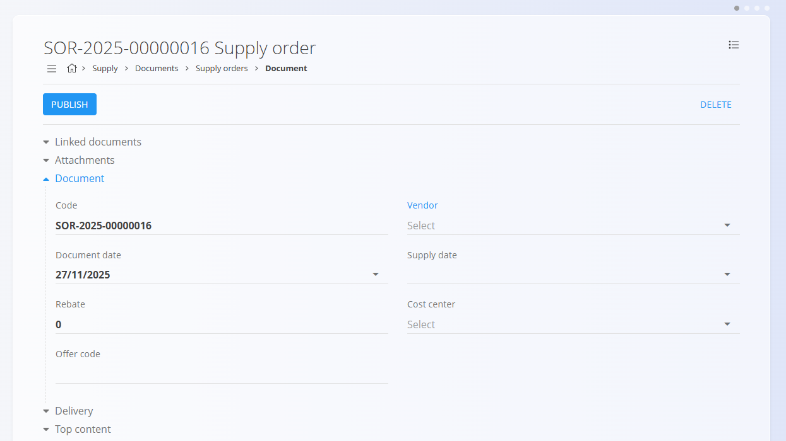
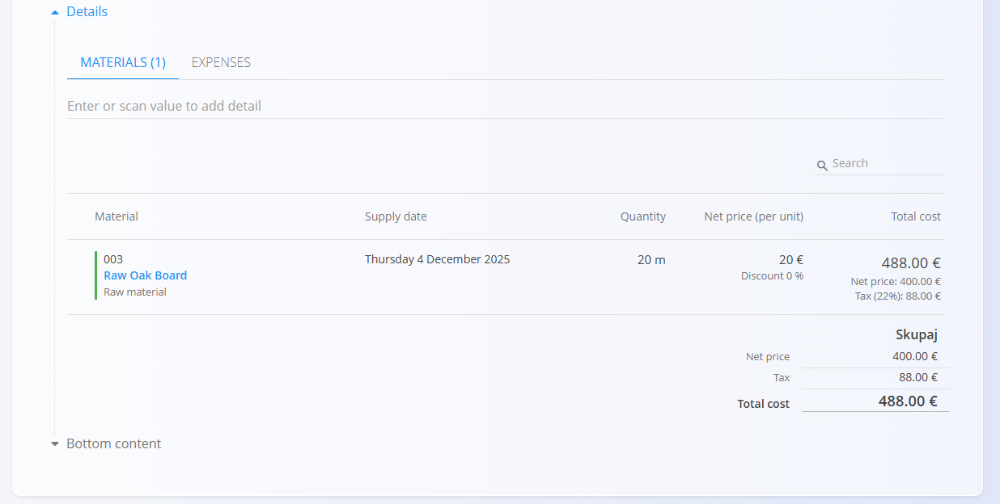

<!-- app_route: /supply/documents/supply-orders -->
<!-- app_label: Nabavni nalogi -->
<!-- app_navigation_hint: Odprite Nabavni nalogi, nato kliknite akcijski gumb za ustvarjanje novega osnutka nabavnega naloga. -->
<!-- canonical_source_url: https://github.com/Tom-PIT/Connected.Docs/blob/main/sl/Domene/Nabava/Dokumenti/NabavniNalogiUstvarjanje.md -->
<!-- canonical_source_title: Kako ustvariti novi nabavni nalog -->

# Kako ustvariti novi nabavni nalog

Novi [nabavni nalogi](NabavniNalogi.md) se lahko ustvarijo:

- ročno iz zaslona **Nabavni nalogi** z uporabo [**akcijskega gumba**](../../../Skupno/UI/AkcijskiGumb.md)
- iz povezanih dokumentov prek **Povezani dokumenti → + Nabavni nalog**, na primer iz [povpraševanja](Povprasevanja.md)

Ko je dokument ustvarjen iz drugega dokumenta, sistem samodejno predizpolni večino podatkov nabavnega naloga, vključno z dobaviteljem, podatki o dostavi in postavkami.

## Korak 1 — Ustvarjanje dokumenta

Ustvarite nov osnutek nabavnega naloga na enega izmed naslednjih načinov:

- Kliknite [**akcijski gumb**](../../../Skupno/UI/AkcijskiGumb.md) na zaslonu **Nabavni nalogi**
- Uporabite **Povezani dokumenti → + Nabavni nalog** iz povezanega dokumenta, kot je [povpraševanje](Povprasevanja.md)

Ustvari se nov osnutek nabavnega naloga. Če je ustvarjen iz drugega dokumenta, bo večina polj že samodejno izpolnjena.

## Korak 2 — Izpolnjevanje glave dokumenta

Vnesite **Dobavitelja**, **Datum dokumenta** in **Datum dobave** (ali jih preverite, če so bili predizpolnjeni iz dokumenta povpraševanja).

## Korak 3 — Dodajanje postavk

Dodajte postavke v razdelku **Postavke**. Postavke določajo naročene materiale ali storitve ter njihove količine, cene, davke in popuste.

Za dodajanje nove postavke:

1. Vnesite ali skenirajte **serijsko številko**, **EAN** ali **ime materiala** v vrstico **Postavke**. Sistem prikaže vse ujemajoče se postavke.

   

2. Izberite želeno postavko s seznama.
3. Prilagodite **količino**, **ceno**, **popust** ali **davčne podatke**, nato kliknite **Shrani**.

   

## Korak 4 — Dodatne nastavitve

### Razdelek Dostava

Razdelek Dostava določa, kam bodo naročeni materiali dostavljeni. Podatki se samodejno izpolnijo iz podatkov podjetja, vendar jih je mogoče po potrebi prilagoditi za posamezno nabavo.

Te vrednosti vplivajo na tiskani nabavni nalog in nadaljnje logistične dokumente (kot so [prevzemi](../../Logistika/Dokumenti/Prevzemi.md)), ne spreminjajo pa osnovnih podatkov v Poslovnem imeniku.

### Priponke

Razdelek **Priponke** uporabite za nalaganje in upravljanje datotek, povezanih z dokumentom, kot so fotografije, PDF datoteke, certifikati ali podporni dokumenti.

Za podrobna navodila glejte [**Priponke**](../../../Skupno/Koncepti/Priponke.md).

### Vsebina na vrhu in vsebina na dnu

Vnaprej pripravljeni razdelki omogočajo dodajanje standardnih besedil na vrh ali dno dokumenta. To je uporabno za splošne pogoje, navodila ali druga besedila, ki morajo biti prikazana na izpisu dokumenta.

Besedilo se izbira iz [**Vnaprej določenih besedil**](../../../Skupno/Upravljanje/VnaprejDolocenaBesedila.md).

### Povezani dokumenti

Razdelek [**Povezani dokumenti**](NabavniNalogi.md#povezani-dokumenti) omogoča ustvarjanje neposrednih povezav med povezanimi dokumenti. Na primer, nabavni nalog lahko povežete s povpraševanjem ali enim oziroma več prevzemi. To omogoča sledljivost in enostavno navigacijo skozi nabavni proces.

## Korak 5 — Objava nabavnega naloga

Ko so vsi potrebni podatki vneseni, kliknite **Objavi**, da zaključite pripravo nabavnega naloga.

Po objavi se dokument premakne v stanje **Potrjeno → Na voljo**, kar omogoči nadaljnje postopke, kot je ustvarjanje [prevzemov](../../Logistika/Dokumenti/Prevzemi.md).