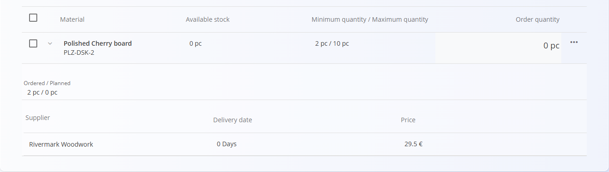

# Planiranje nabave po mejah zaloge

Pogled **Planiranje nabave po mejah zaloge** omogoča proaktivno načrtovanje nabav z identifikacijo materialov, katerih zaloga je padla pod določeno **minimalno mejo zaloge**. S tega zaslona lahko neposredno ustvarite **[nabavne naloge](NabavniNalogi.md)** ali **[povpraševanja](Povprasevanja.md)** za izbrane materiale, pri čemer je večina podatkov že samodejno predizpolnjenih.

Ta stran tesno sodeluje z naslednjimi šifranti:

- **[Meje zaloge](../../Logistika/Upravljanje/MejeZaloge.md)** – določanje minimalnih in maksimalnih količin  
- **[Materiali dobaviteljev](../Upravljanje/MaterialiDobaviteljev.md)** – povezava materialov z dobavitelji  

Za dostop do **Planiranja nabave po mejah zaloge** pojdite na **Nabava / Dokumenti / Planiranje nabave po mejah zaloge** v [**navigaciji**](../../../Skupno/UI/Navigacija.md).

## Kako deluje

Material se prikaže v tem pogledu samo, če so izpolnjeni **vsi** naslednji pogoji:

1. Za material so v **[Mejah zaloge](../../Logistika/Upravljanje/MejeZaloge.md)** določene **minimalne in maksimalne količine**  
2. Material je dodeljen vsaj enemu dobavitelju v **[Materialih dobaviteljev](../Upravljanje/MaterialiDobaviteljev.md)**  
3. **Razpoložljiva zaloga** je **nižja od minimalne količine**

Ko so pogoji izpolnjeni, material postane viden in ga je mogoče obravnavati v seznamu planiranja.

## Seznam

Glavni seznam prikazuje materiale, ki zahtevajo pozornost, z naslednjimi stolpci:

- **Material**
- **Razpoložljiva zaloga**
- **Minimalna / maksimalna količina**
- **Količina za naročilo**

### Filtri

Leva stranska vrstica omogoča filtriranje po:

- **Dobavitelju**
- **Materialu**

Prikazani so samo materiali, ki ustrezajo izbranim filtrom in pogojem planiranja.

### Podrobnosti vrstice

Vsako vrstico je mogoče razširiti in prikazati dodatne informacije za planiranje, kot so:

- **Naročeno / planirano**  
- Obstoječi **nabavni nalogi** ali **povpraševanja**  
- **Dobavitelj**  
- **Datum opravljene storitve**  
- **Cena**

Ti podatki pomagajo oceniti, ali je obnavljanje zaloge že v teku, še preden ustvarite nove dokumente.

## Ustvarjanje nabavnih dokumentov

Nabavne dokumente ustvarite neposredno iz tega pogleda.

1. Izberite enega ali več materialov s potrditvenim poljem in pišete in po želji prilagodite **Naročeno količino** neposredno na seznamu.

   

2. Kliknite [**akcijski gumb**](../../../Skupno/UI/AkcijskiGumb.md) in izberite:
   - **Ustvari nov [nabavni nalog](NabavniNalogi.md)**, ali
   - **[Povpraševanje](Povprasevanja.md)**

   

3. Odpre se pogovorno okno, kjer potrdite:
   - **Dobavitelja**
   - **Datum opravljene storitve**

   

4. Kliknite **Ustvari** za nadaljevanje.

Sistem vas nato preusmeri na nov **nabavni nalog** ali **povpraševanje**, kjer so vsi pomembni podatki — material, količine in dobavitelj — že vnaprej izpolnjeni.

## Namen in koristi

**Planiranje nabave po mejah zaloge** omogoča:

- zgodnje zaznavanje nizkih zalog  
- centralizirano planiranje obnove zaloge  
- manj ročnega vnosa pri ustvarjanju nabavnih dokumentov  
- boljše usklajevanje odločitev o nabavi na podlagi dejanskega stanja zaloge in obstoječih naročil  

Ta pogled je posebej uporaben za planerje in nabavne ekipe, ki upravljajo več dobaviteljev in širok nabor materialov.
