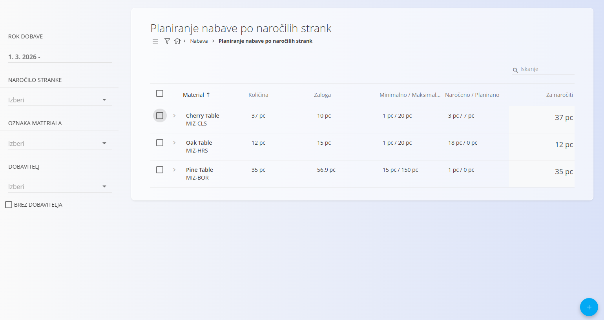
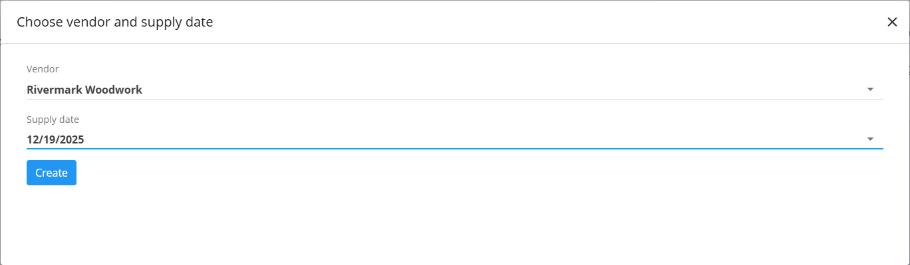

<!-- app_route: /supply/documents/supply-planning-by-sales -->
<!-- app_label: Planiranje nabave po prodaji -->
<!-- canonical_source_url: https://github.com/Tom-PIT/Connected.Docs/blob/main/sl/Domene/Nabava/Dokumenti/PlaniranjeNabavePoProdaji.md -->
<!-- canonical_source_title: Planiranje nabave po prodaji -->

# Planiranje nabave po prodaji

Pogled **Planiranje nabave po prodaji** omogoča načrtovanje nabav na podlagi **prodajnega povpraševanja**.  
Uporablja enak delovni tok kot **[Planiranje nabave po mejah zaloge](PlaniranjeNabavePoMejahZaloge.md)**, hkrati pa vključuje podatke o **prodanih količinah**, ki pomagajo pri določanju prioritet obnove zaloge glede na nedavno prodajno aktivnost (ne glede na stanje).

Pogled je namenjen operativnemu delu in omogoča neposredno ustvarjanje **[nabavnih nalogov](NabavniNalogi.md)** ter **[povpraševanj](Povprasevanja.md)**.

Za dostop do tega pogleda pojdite na **Nabava / Dokumenti / Planiranje nabave po prodaji** v [navigaciji](../../../Skupno/UI/Navigacija.md).

## Seznam

Glavni seznam prikazuje materiale, ki glede na prodajo in stanje zaloge zahtevajo nabavo.

Prikazani so podatki, kot so:

- **Material**
- **Prodana količina** – količina, prodana v izbranem časovnem obdobju
- **Razpoložljiva zaloga**
- **Minimalna / maksimalna količina**
- **Naročeno / planirano** – količine, ki so že pokrite z obstoječimi nabavnimi dokumenti
- **Količina za naročilo** – predlagana količina za nabavo

## Filtri

Levi stranski panel omogoča omejevanje prikaza materialov glede na izbrane kriterije:

- **Rok dobave**
- **Naročilo stranke**
- **Oznaka materiala**
- **Dobavitelj** - 

Filtri vplivajo samo na prikaz seznama in ne spreminjajo izračunov mej zaloge.

## Izbira materialov

Za ustvarjanje nabavnih dokumentov lahko izberete enega ali več materialov neposredno iz seznama.

- Izbira se izvede s potrditvenimi polji v prvi koloni.
- Po potrebi lahko ročno prilagodite **Količino za naročilo**.

## Ustvarjanje nabavnih dokumentov

Ko so materiali izbrani, uporabite [akcijski gumb](../../../Skupno/UI/AkcijskiGumb.md) za nadaljevanje.

Na voljo sta naslednji možnosti:

- **Ustvari nov [nabavni nalog](NabavniNalogi.md)**, ali
- **[Povpraševanje](Povprasevanja.md)**

### Izbira dobavitelja in datuma

Po izbiri dejanja se odpre pogovorno okno, kjer določite:

- **Dobavitelja**
- **Datum opravljene storitve**

S klikom na **Ustvari** sistem ustvari izbrani dokument in vas preusmeri nanj.  
Materiali, količine in dobavitelj so že predizpolnjeni.

## Povezava z drugimi pogledi

Obnašanje ustvarjanja dokumentov, pravila brisanja in nadaljnje delo z nabavnimi dokumenti so enaki kot pri:

- **[Planiranje nabave po mejah zaloge](PlaniranjeNabavePoMejahZaloge.md)**

## Namen in koristi

**Planiranje nabave po prodaji** omogoča:

- povezovanje prodajnih podatkov z odločitvami o nabavi,
- hitrejšo obnovo zaloge za pogosto prodajane materiale,
- bolj informirane nabavne odločitve na podlagi dejanske prodaje,
- uporabo že znanega in preverjenega delovnega toka planiranja.
