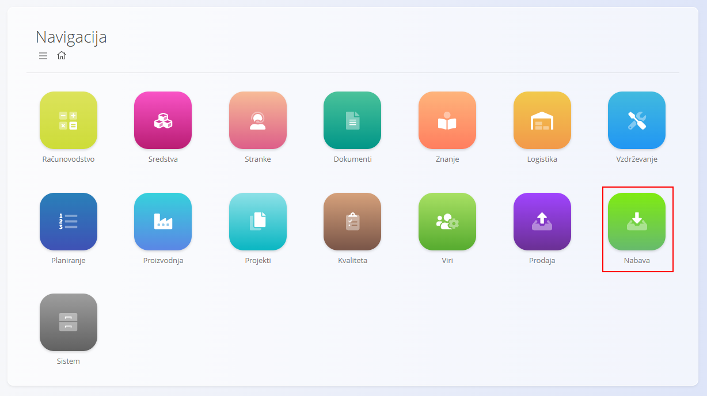
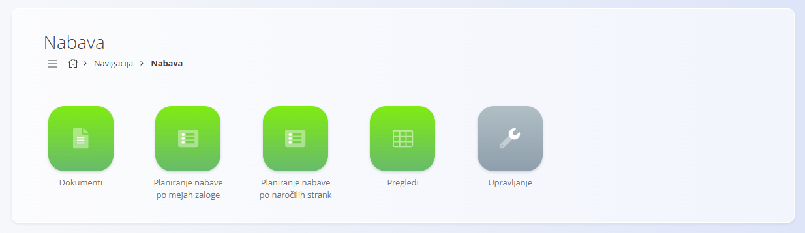
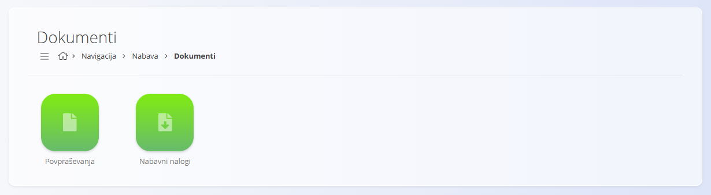
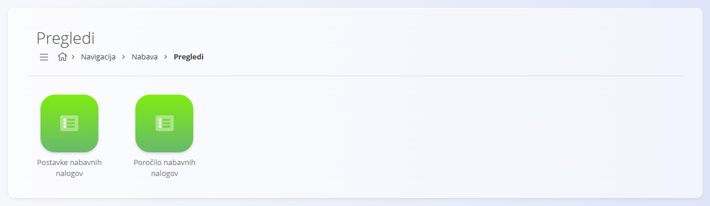
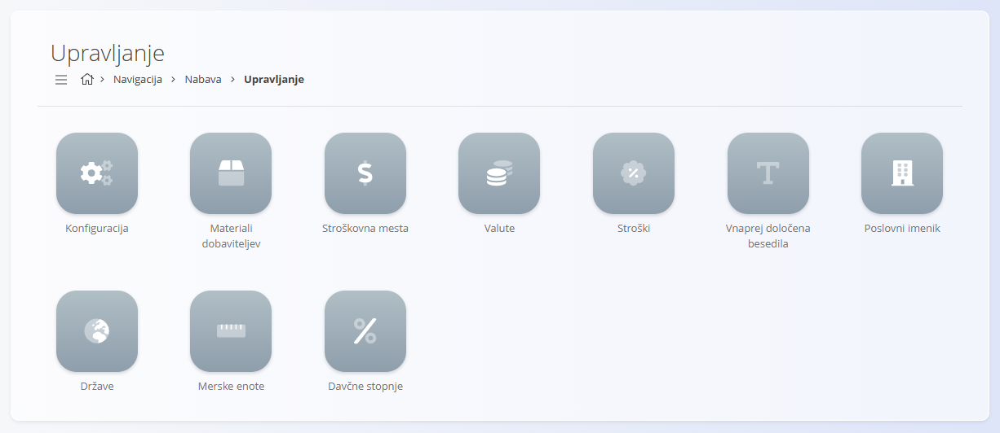

<!-- app_route: /sitemap/supply -->
<!-- app_label: Nabava -->
<!-- canonical_source_url: https://github.com/Tom-PIT/Connected.Docs/blob/main/sl/Domene/Nabava/Nabava.md -->
<!-- canonical_source_title: Nabava -->

# Nabava

Področje **Nabava** upravlja vse procese, povezane z nabavo, sodelovanjem z dobavitelji in planiranjem vhodnih materialov. Vključuje povpraševanja pri dobaviteljih, nabavne naloge, orodja za planiranje ter analitične preglede, ki pomagajo vzdrževati optimalne zaloge in zagotavljati pravočasno oskrbo.

Medtem ko področje **[Prodaja](../Prodaja/Prodaja.md)** upravlja procese, usmerjene k strankam, področje Nabava upravlja procese, usmerjene k dobaviteljem, ki zagotavljajo razpoložljivost materialov ob pravem času.

Za dostop do področja Nabava pojdite na **Nabava** v [navigaciji](../../Skupno/UI/Navigacija.md).

> [!NOTE]  
> Razpoložljiva področja so odvisna od konfiguracije in poslovnega modela posameznega podjetja.

## Kaj vključuje področje Nabava?

Področje je organizirano v več funkcionalnih sklopov:

- **[Dokumenti](#dokumenti)** – nabavni dokumenti za povpraševanje in naročanje materialov  
- **[Planiranje nabave po mejah zaloge](Dokumenti/PlaniranjeNabavePoMejahZaloge.md)** – planiranje na podlagi pravil mej zaloge
- **[Planiranje nabave po naročilih strank](Dokumenti/PlaniranjeNabavePoNarocilihStrank.md)** – planiranje na podlagi prodajnega povpraševanja
- **[Pregledi](#pregledi)** – analitični pregledi za spremljanje nabavnih trendov  
- **[Šifranti](#sifranti)** – nastavitve in osnovni podatki za nabavne procese

## Dokumenti

Razdelek **Dokumenti** vsebuje nabavne dokumente, ki se uporabljajo za povpraševanje po ponudbah ali za izdajo nabavnih nalogov dobaviteljem.

Razpoložljivi dokumenti vključujejo:

- **[Povpraševanja](Dokumenti/Povprasevanja.md)** – Povpraševanja, poslana dobaviteljem za pridobitev cen, razpoložljivosti ali dobavnih rokov. Ne vplivajo na zalogo in jih je mogoče pretvoriti v nabavne naloge preko povezanih dokumentov.
- **[Nabavni nalogi](Dokumenti/NabavniNalogi.md)** – Potrjeni nalogi, izdani dobaviteljem za blago ali storitve. Prevzemi se evidentirajo v **Logistiki** preko dokumentov [prevzemi](../Logistika/Dokumenti/Prevzemi.md).

Ti dokumenti predstavljajo osnovo nabavnega procesa in omogočajo popolno sledljivost aktivnosti z dobavitelji.

> [!NOTE]
> Nabavni dokumenti sledijo standardnim statusom, kot sta Osnutek in Potrjeno. Razpoložljivost akcij je odvisna od trenutnega statusa dokumenta.

## Pregledi

Razdelek **Pregledi** omogoča analitičen vpogled v nabavne naloge in nabavne vzorce. Pregledi so namenjeni samo za branje.

Razpoložljivi pregledi vključujejo:

- **[Postavke nabavnih nalogov](Pregledi/PostavkeNabavnihNalogov.md)** – Podroben pregled postavk nabavnih nalogov, vključno z roki dobave in podatki o dobaviteljih.  
- **[Poročilo nabavnih nalogov](Pregledi/PorociloNabavnihNalogov.md)** – Agregiran pregled obsega, trendov in statusov nabavnih nalogov.

Ti pregledi podpirajo analizo in odločanje, vendar **ne ustvarjajo** transakcij.

## Upravljanje

Razdelek **Upravljanje** vsebuje konfiguracijo in osnovne podatke, potrebne za delovanje nabavnih procesov.

Razpoložljive nastavitve in šifranti vključujejo:

- **[Konfiguracija nabave](Upravljanje/KonfiguracijaNabave.md)** – Nastavitve nabave, vključno s pravili in številčenjem nabavnih nalogov.  
- **[Materiali dobaviteljev](Upravljanje/MaterialiDobaviteljev.md)** – Povezava med dobavitelji in materiali; lahko vključuje dobavne roke, minimalne količine in cenike.  
- **[Stroški](Upravljanje/Stroski.md)** – Kategorije stroškov (npr. prevoz, carina), ki vplivajo na skupni strošek nabave.  
- **[Poslovni imenik](../../Skupno/Upravljanje/PoslovniImenik.md)** – Podatki o dobaviteljih in partnerjih.  
- **[Stroškovna mesta](../../Skupno/Upravljanje/StroskovnaMesta.md)** – Finančna razporeditev nabavnih stroškov.  
- **[Valute](../../Skupno/Upravljanje/Valute.md)** – Definicije valut, uporabljene v nabavnih dokumentih.  
- **[Vnaprej določena besedila](../../Skupno/Upravljanje/VnaprejDolocenaBesedila.md)** – Standardna besedila v nabavnih dokumentih.  
- **[Države](../../Skupno/Upravljanje/Drzave.md)** – Geografski podatki za profile dobaviteljev.  
- **[Merske enote](../../Skupno/Upravljanje/MerskeEnote.md)** – Enote mere, uporabljene v nabavnih dokumentih.  
- **[Davčne stopnje](../../Skupno/Upravljanje/DavcneStopnje.md)** – Davčne definicije, uporabljene pri nabavi.

Ti elementi določajo, kako se nabavni procesi izvajajo in kako so strukturirani nabavni podatki.

> [!TIP]
> Oglejte si celoten seznam upravljanja: **[Kazalo upravljanja](../../KazaloUpravljanja.md)**.

## Nabavni procesi

Nabavni procesi običajno sledijo strukturiranemu življenjskemu ciklu:

### **1. Povpraševanje**  
[Povpraševanje](Dokumenti/Povprasevanja.md) se pošlje dobavitelju za pridobitev cen, razpoložljivosti in predvidenih dobavnih rokov.

### **2. Naročanje**  
[Nabavni nalog](Dokumenti/NabavniNalogi.md) se ustvari na podlagi potreb po materialu ali dogovorov z dobavitelji.

### **3. Dobava in prevzem**  
Dobavljeno blago se obdeluje v **Logistiki** preko dokumentov [**Prevzemi**](../Logistika/Dokumenti/Prevzemi.md).

### **4. Planiranje in obnova zalog**  
[**Meje zaloge**](../Logistika/Upravljanje/MejeZaloge.md) in planirni pregledi (glej [**Planiranje nabave po mejah zaloge**](Dokumenti/PlaniranjeNabavePoMejahZaloge.md)) pomagajo določiti, kdaj se začne nov nabavni cikel.

### **5. Analiza**  
Pregledi omogočajo vpogled v uspešnost dobaviteljev, roke dobave in splošno učinkovitost nabave.

## Nabava in druga področja

Področje Nabava je povezano z drugimi operativnimi področji:

| Področje | Povezava |
|--------|----------|
| **[Materiali](../Sredstva/Materiali.md)** | Določa materiale, ki se nabavljajo. |
| **[Logistika](../Logistika/Logistika.md)** | Prevzema vhodno blago in posodablja zalogo. |
| **[Proizvodnja](../Proizvodnja/Proizvodnja.md)** | Uporablja kupljene materiale v proizvodnih procesih. |
| **[Prodaja](../Prodaja/Prodaja.md)** | Se zanaša na nabavo za zagotavljanje razpoložljivosti prodajnih izdelkov. |
