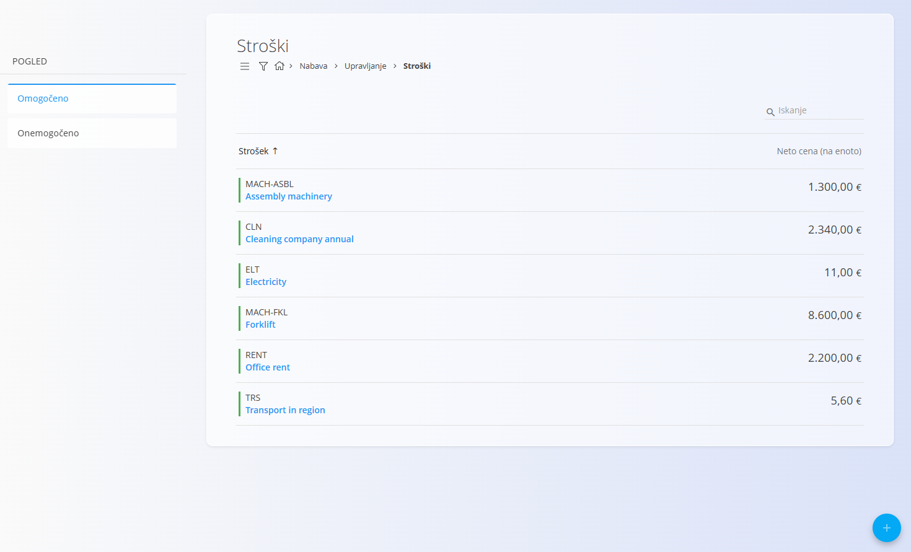
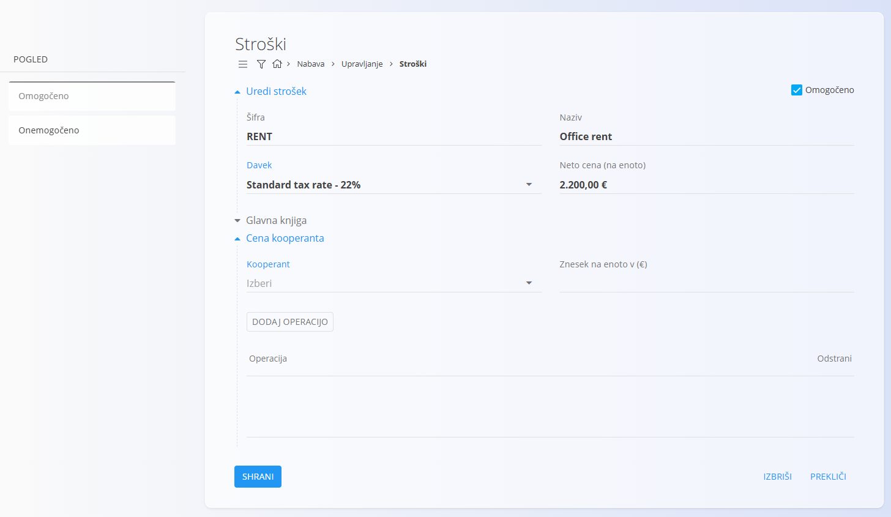
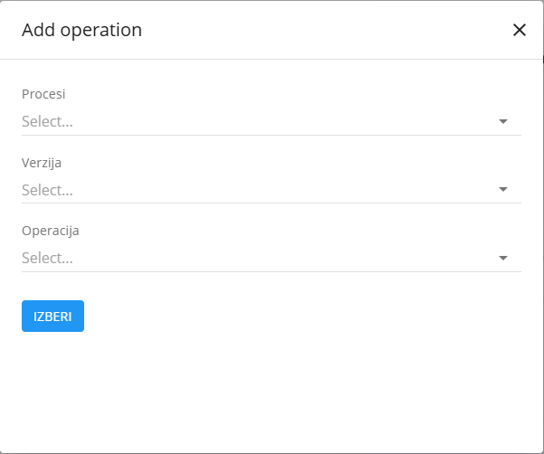

<!-- app_route: /management/common-types/expenses -->
<!-- app_label: Stroški -->
<!-- canonical_source_url: https://github.com/Tom-PIT/Connected.Docs/blob/main/sl/Domene/Nabava/Upravljanje/Stroski.md -->
<!-- canonical_source_title: Stroški -->

# Stroški

Šifrant **Stroški** vsebuje vse stroške, ki jih organizacija želi evidentirati kot vnaprej določene stroške. Ti lahko vključujejo ponavljajoče se storitve, stroške, povezane z opremo, stroške podizvajalcev ali katerikoli drug operativni ali finančni strošek, ki se uporablja v procesih nabave ali proizvodnje.

Ta seznam zagotavlja doslednost, saj so vsi stroški shranjeni na enem mestu in na voljo za uporabo v dokumentih ter operativnih delovnih tokovih.

Za dostop do **Stroškov** pojdite na **Nabava / Šifranti / Stroški** v [**navigaciji**](../../../Skupno/UI/Navigacija.md).

## Shema

  
<strong>Dokument</strong>

| Polje | Opis |
|------|------|
| [**Šifra**](../../../Skupno/UI/SifreDokumentov.md) | Enolični identifikator stroška. |
| **Naziv** | Opisni naziv stroška. |
| [**Davek**](../../../Skupno/Upravljanje/DavcneStopnje.md) | Davčna stopnja, ki se uporablja za strošek. |
| **Neto cena (na enoto)** | Privzeta neto cena stroška. |
| **Omogočeno** | Označuje, ali je strošek na voljo za uporabo v dokumentih. |
| **Kooperant** | Poslovni partner, ki izvaja podizvajalsko storitev, izbran iz **[Poslovnega imenika](../../../Skupno/Upravljanje/PoslovniImenik.md)**. |
| **Znesek na enoto v (€)** | Cena te podizvajalske storitve na enoto. |
| **Operacija** | Seznam operacij, povezanih s tem stroškom podizvajalca. |

  
<strong>Operacija</strong>

| Polje | Opis |
|------|------|
| [**Procesi**](../../Proizvodnja/Upravljanje/Procesi.md) | Proces, v katerem se operacija uporablja. |
| **Verzija** | Različica izbranega procesa. |
| **Operacija** | Posamezna operacija, ki pripada izbranemu procesu in različici. |

  
<strong>Glavna knjiga</strong>

| Polje | Opis |
|-------|------|
| [**Konto**](../../Racunovodstvo/Upravljanje/GlavnaKnjiga/Konti.md) | Konto glavne knjige, uporabljen za knjiženja, ki nastanejo iz tega stroška. |
| **Tip davka** | Razvrstitev davčne obravnave stroška (npr. Zaloga, Standardni strošek, Nepremičnine). |
| **Tip sredstva** | Narava nabave za poročanje (npr. Blago, Storitve). |
| **Odbij davek** | Označuje, ali je vstopni davek za ta strošek odbiten. |
| **Samoobdavčitev** | Označuje, ali se uporablja mehanizem obrnjene davčne obveznosti (samoobdavčitev). |
| **Upoštevaj za finančno zalogo** | Strošek se zabeleži, vendar se ne vključi v finančno vrednost zaloge ob obdelavi prejetega računa. |

## Upravljanje

### Seznam stroškov

Seznam prikazuje vse definirane stroške skupaj z njihovo privzeto neto ceno artikla.

Vsak zapis vključuje indikator stanja na levi strani naziva:
- **Modra** – strošek je **omogočen**
- **Siva** – strošek je **onemogočen**

### Filtri

Leva stranska vrstica vsebuje dva filtra:

- **Omogočeno**
- **Onemogočeno**

Filtri določajo, ali seznam prikazuje aktivne ali neaktivne zapise stroškov.

## Dodati nov strošek

Kliknite [**akcijski gumb**](../../../Skupno/UI/AkcijskiGumb.md) za ustvarjanje novega stroška. Vnosni obrazec vključuje naslednje razdelke:

- **Dodaj nov strošek**
- **Glavna knjiga**
- **Strošek podizvajalca**

V polje **Neto cena (na enoto)** vnesite zahtevane podatke in stroške, če so znani. Kliknite **Shrani**, da ustvarite stroške. Nov zapis se bo nato prikazal na seznamu.

> [!OPOMBA]
> Stroški stroškov bodo samodejno izpolnjeni v nabavnem nalogu, če je strošek dodan kot postavka in je **Neto cena (na enoto)** znana.

### Strošek podizvajalca

Ta izbirni razdelek omogoča dodajanje stroškov, povezanih s podizvajalci.  
Določite lahko:

- **Podizvajalca**  
- **Ceno na enoto (€)**  
- **Operacije** 

Kliknite **Dodaj operacijo**, da odprete pogovorno okno za izbiro operacije.

Po vnosu podatkov kliknite **Dodaj**, da shranite zapis, ali **Prekliči**, da se vrnete na seznam.

#### Glavna knjiga

V tem razdelku strošek dodelimo ustreznemu kontu glavne knjige. Oglejte si [**Konti**](../../Racunovodstvo/Upravljanje/GlavnaKnjiga/Konti.md).

Možnosti v tem razdelku določajo, kako se strošek obravnava pri finančnih knjiženjih in poročanju. Vključujejo:

- **Odbij davek**
- **Samoobdavčitev**
- **Upoštevaj za finančno zalogo**

Te nastavitve je mogoče po potrebi spremeniti tudi na prejetem računu.

## Urediti strošek

Za urejanje stroška kliknite zapis v seznamu. Sistem odpre način urejanja.

Vsa polja – vključno s stroški podizvajalca in operacijami – je mogoče spremeniti. Strošek lahko omogočite ali onemogočite z uporabo potrditvenega polja **Omogočeno**.

Ko zaključite z urejanjem, kliknite **Shrani**. Če sprememb ne želite shraniti, kliknite **Prekliči**.

## Izbrisati strošek

Na zaslonu za urejanje kliknite **Izbriši**, da trajno odstranite strošek.

**Ali ste prepričani, da želite izbrisati ta zapis?**

Brisanje je dovoljeno samo, če strošek ni uporabljen v odvisnih zapisih.

> [!NOTE]
> Onemogočeni stroški ostanejo v sistemu, vendar jih ni mogoče izbrati v novih dokumentih.
