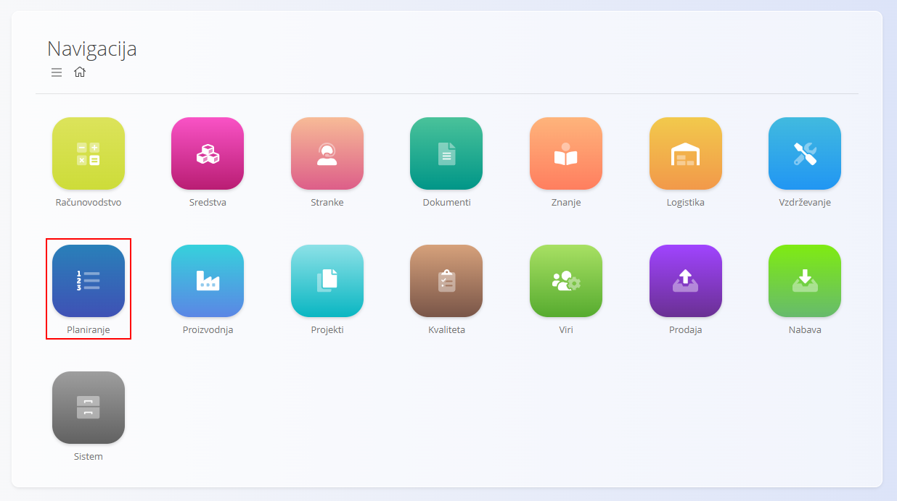
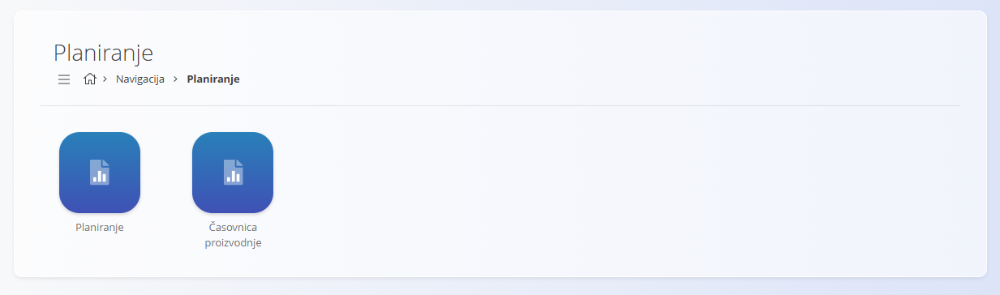

<!-- app_route: /sitemap/planning -->
<!-- app_label: Planiranje -->
<!-- canonical_source_url: https://github.com/Tom-PIT/Connected.Docs/blob/main/sl/Domene/Planiranje/Domena/DomenaPlaniranje.md -->
<!-- canonical_source_title: Planiranje -->

# Planiranje

Domena **Planiranje** se uporablja za **razporejanje in spremljanje proizvodnih nalogov**. Omogoča vizualna orodja za upravljanje časovnic proizvodnje in pregled planiranega dela.

Do te domene dostopate preko **Planiranje** v [**navigaciji**](../../../Common/UI/Navigation.md).

## Razpoložljivi pogledi

Domena vključuje naslednje poglede:

- **[Planiranje](../Pregledi/Planiranje.md)** – koledarski prikaz planiranih proizvodnih nalogov, kjer lahko razporejate in prilagajate časovnice proizvodnje  
- **Časovnica proizvodnih nalogov** – časovni prikaz zaporedja in trajanja proizvodnih nalogov  

