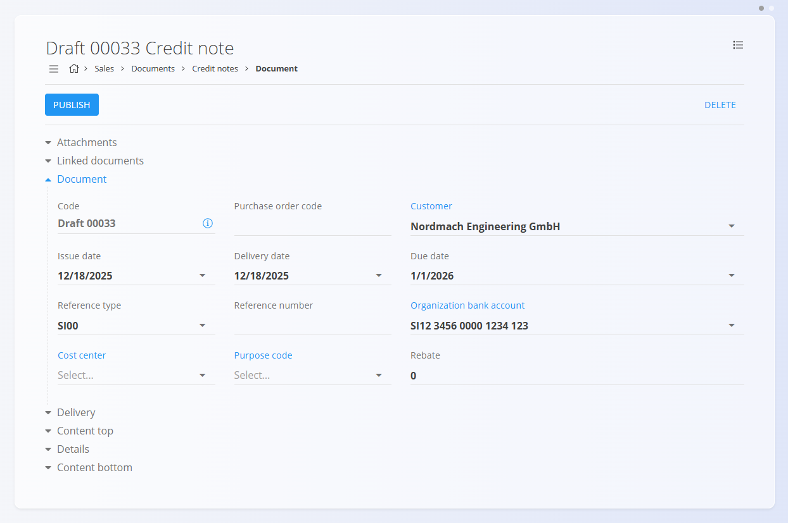

<!-- app_route: /sales/documents/credit-notes -->
<!-- app_label: Dobropisi -->
<!-- canonical_source_url: https://github.com/Tom-PIT/Connected.Docs/blob/main/sl/Domene/Prodaja/Dokumenti/Dobropisi.md -->
<!-- canonical_source_title: Dobropisi -->

# Dobropisi

**Dobropis** je prodajni dokument, ki se uporablja za zmanjšanje ali razveljavitev celotnega ali dela že izdanega računa. Običajno se ustvari ob vračilu blaga, napačnem obračunu ali kadar je po izdaji računa potrebna korekcija.

Dobropisi zmanjšujejo odprto obveznost stranke. Za povečanja ali dodatne zaračune glejte **[Bremepise](Bremepisi.md)**.

> [!TIP]
> Za hiter pregled trenutnih **bremenitev in dobropisov** po posameznih strankah uporabite pregled **[Kartice podjetij](../Pregledi/PoslovneKartice.md)**.

Za dostop do tega dokumenta pojdite na **Prodaja / Dokumenti / Dobropisi** v [**navigaciji**](../../../Skupno/UI/Navigacija.md).

## Vloga dobropisov v prodajnem procesu

Dobropisi se uporabljajo po tem, ko je bil račun že izdan:

1. Izdajte **[Izdani račun](IzdaniRacuni.md)** za dobavljeno blago ali storitve.  
2. Ugotovite potrebo po popravku (vračilo, popust ali napaka v ceni).  
3. Ustvarite **Dobropis**, povezan z izdanim računom ali kot samostojen dokument.  
4. Preglejte in objavite dobropis, s čimer preide v stanje **Potrjeno**.  
5. Dobropisani znesek zmanjša obveznost stranke ali se povrne skladno s plačilnimi pogoji.  
6. Če je bil dobropis ustvarjen pomotoma, ga stornirajte (glejte **[Storno](../../Logistika/Dokumenti/Storno.md)**).

Dobropisi vplivajo izključno na računovodstvo in ne vplivajo na zalogo.

## Shema

  
<strong>Dokument</strong>

| Polje | Opis |
|------|------|
| [**Šifra**](../../../Skupno/UI/SifreDokumentov.md) | Sistemsko generiran identifikator dobropisa. |
| **Številka naročilnice** | Neobvezna referenca na naročilo stranke. |
| **Stranka** | Stranka, ki prejme dobropis, izbrana iz šifranta [**Poslovni imenik**](../../../Skupno/Upravljanje/PoslovniImenik.md) (obvezno). |
| **Datum dokumenta** | Datum izdaje dobropisa. |
| **Datum opravljene storitve** | Prvotni datum dobave zaračunanega blaga ali storitev. |
| **Datum zapadlosti** | Datum, ko dobropis stopi v veljavo (obvezno). |
| **Tip reference** | Vrsta uporabljenega plačilnega sklica (obvezno). |
| **Sklic** | Sklicna številka glede na izbrano vrsto sklica. |
| [**Bančni račun organizacije**](../Upravljanje/BancniRacuniOrganizacije.md) | Bančni račun za vračila ali računovodsko obdelavo (obvezno). |
| [**Stroškovno mesto**](../../../Skupno/Upravljanje/StroskovnaMesta.md) | Neobvezna razporeditev na stroškovno mesto. |
| **Koda namena** | Neobvezna oznaka ali razlog za dobropis. |
| **Rabat** | Skupni rabat, uporabljen na dobropis. |
| **Vsebina zgoraj** | Uvodno besedilo iz [**Vnaprej določenih besedil**](../../../Skupno/Upravljanje/VnaprejDolocenaBesedila.md). |
| **Vsebina spodaj** | Zaključna ali pravna besedila iz [**Vnaprej določenih besedil**](../../../Skupno/Upravljanje/VnaprejDolocenaBesedila.md). |

  
<strong>Transport, alternativna valuta in dostava</strong>

| Polje | Opis |
|--------|-------------|
| **[Pogoj dobave](../../../Skupno/Upravljanje/PogojiDobave.md)** | Dobavni pogoji, dogovorjeni s stranko. |
| **[Vrsta transporta](../../../Skupno/Upravljanje/VrstaTransporta.md)** | Način transporta, dogovorjen s stranko. |
| [**Alternativna valuta**](../../../Skupno/Upravljanje/Valute.md) | Alternativna valuta glede na privzeto valuto, uporabljeno v dokumentu. |
| [**Tečaj**](../Upravljanje/MenjalniTecaji.md) | Tečaj alternativne valute glede na privzeto valuto. |
| **Dobava – Podjetje / Naslov** | Dobavni podatki stranke, povzeti iz [Poslovnega imenika](../../../Skupno/Upravljanje/PoslovniImenik.md). |

  
<strong>Postavke</strong>

| Polje | Opis |
|--------|-------------|
| **Vrsta blaga oz. storitev** | Izdelek, storitev ali sredstvo, izbrano za to postavko. |
| **Naziv postavke** | Prikazni naziv izbrane postavke (po potrebi ga je mogoče urediti). |
| **[Davčna stopnja](../../../Skupno/Upravljanje/DavcneStopnje.md)** | Davčna stopnja, uporabljena na postavki (nastavljena v konfiguraciji davkov). |
| **Cena brez DDV (na enoto)** | Cena na enoto brez davka. |
| **Cena z DDV (na enoto)** | Cena na enoto z davkom (samodejno izračunana glede na davčno stopnjo). |
| **Količina** | Količina izbrane postavke. |
| **Popust (%)** | Odstotek popusta, uporabljen na neto ceno. |
| **Skupni znesek brez davka** | Izračunan neto znesek (Cena brez DDV × Količina − Popust). |
| **Skupni znesek z davkom** | Skupni znesek z vključenim davkom. |
| **Vrsta obračuna DDV** | Določa način obračuna DDV v posebnih primerih: • **Tristranske dobave** – Za trikotne EU transakcije, kjer DDV obračuna končni kupec (obrnjena davčna obveznost). • **DDV obračuna kupec** – Uporaba obrnjene davčne obveznosti; DDV obračuna kupec namesto prodajalca. • **Izvozne storitve** – Za storitve, opravljene kupcem zunaj EU (običajno oproščene DDV). • **Prevozne storitve** – Posebna davčna obravnava za prevoz blaga. • **Prevoz potnikov** – Posebna pravila DDV za prevoz potnikov. • **Potovalne agencije** – Uporaba posebne maržne sheme za potovalne agencije. • **Po carinskih postopkih 42 in 63** – Za uvoz, kjer je DDV odložen v namembno državo EU. • **Prodaja odpoklicanega blaga iz EU** – Posebna davčna obravnava za vrnjeno ali odpoklicano blago znotraj EU. |
| **Opis** | Dodatne informacije o postavki (neobvezno). |
| **Alternativna valuta** | Možnost prikaza zneska postavke v izbrani alternativni valuti. Ob izbiri se znesek preračuna glede na tečaj, določen v dokumentu. |

  
<strong>Glavna knjiga in Intrastat postavke</strong>

| Polje | Opis |
|--------|-------------|
| **Glavna knjiga – Konto prihodka** | [Konto](../../Racunovodstvo/Upravljanje/GlavnaKnjiga/Konti.md) za knjiženje prihodkov ali odhodkov postavke. |
| **Glavna knjiga – Konto davka** | [Konto](../../Racunovodstvo/Upravljanje/GlavnaKnjiga/Konti.md) za knjiženje davka, vezanega na postavko dokumenta. |
| **[Intrastat – Tarifa](../../Racunovodstvo/Upravljanje/Intrastat/Tarife.md)** | Tarifna oznaka (šifra blaga) za poročanje Intrastat. |
| **Intrastat – Država porekla** | Država, iz katere blago izvira. |
| **Intrastat – Neto teža (kg)** | Neto teža za statistično poročanje. |
| **Intrastat – Statistična vrednost** | Prijavljena statistična vrednost blaga za poročanje Intrastat. |

## Upravljanje

Dobropisi imajo lahko status **Osnutek** ali **Potrjeno**.

### Seznam

Seznam dobropisov je mogoče filtrirati po:
- **Datumih dokumentov**
- **Pogledu** (Osnutki / Potrjeno)
- **Stranki**

Vsaka vrstica prikazuje:
- Stranko  
- Kodo dokumenta  
- Datum dokumenta  
- Znesek dobropisa (negativna vrednost)

Osnutke je mogoče urejati, potrjeni dobropisi pa so dokončni, razen če so stornirani.

## Dejanja

### Ustvarjanje novega dobropisa

Dobropise je mogoče ustvariti na dva načina:

- Z uporabo [**akcijskega gumba**](../../../Skupno/UI/AkcijskiGumb.md) na zaslonu **Dobropisi**  
- Iz obstoječega **[Izdanega računa](IzdaniRacuni.md)** prek *Povezani dokumenti → + Dobropis*

Po začetku novega dobropisa sledite korakom:

1. Ustvarite nov osnutek dobropisa.

   

2. Izpolnite zahtevana polja, kot so **Stranka**, **Datumi**, **Tip reference** in **Bančni račun organizacije**.

3. V razdelku **Postavke** dodajte postavke z vnosom ali skeniranjem **naziva sredstva**, **EAN** ali **serijske številke**.

   

4. Prilagodite količine in vrednosti ter kliknite **Shrani**.

> [!NOTE]
> Ob dodajanju nove postavke v **Dobropis** je **količina privzeto nastavljena na `-1`**, saj dobropisi predstavljajo zmanjšanje zaračunanega zneska.

5. Ko je dobropis pripravljen, kliknite **Objavi**.  
   Dokument preide iz stanja **Osnutek** v **Potrjeno** in postane finančno veljaven.

> [!NOTE]
> Po objavi dobropisa ga ni več mogoče urejati. Vse popravke je treba izvesti s storniranjem.

#### Postavke

Postavke določajo naročene artikle ter njihove količine, cene, davke in popuste. Vsaka postavka predstavlja določen izdelek, storitev ali sredstvo.

##### Glavna knjiga

Razdelek **Glavna knjiga** določa, kako se dokument knjiži v glavno knjigo. Opredeljuje, kateri konti se uporabijo za knjiženje prihodkov, odhodkov in davkov ob shranjevanju in knjiženju dokumenta.

Ob knjiženju dokumenta:

- **Neto znesek** se knjiži na izbrani konto prihodka ali odhodka.
- **Znesek davka** se knjiži na izbrani konto davka.
- Sistem samodejno ustvari ustrezne temeljnice v glavni knjigi.

Razpoložljivi konti so določeni v **[Kontnem načrtu](../../Racunovodstvo/Upravljanje/GlavnaKnjiga/Konti.md)**.

##### Intrastat

Če je omogočeno poročanje Intrastat in transakcija vključuje kupca iz druge države EU, se v obrazcu za urejanje postavke prikaže dodatni razdelek **Intrastat**.

Ta razdelek vsebuje statistične podatke, ki so potrebni za poročanje Intrastat.

Polja so obvezna pri čezmejnih EU transakcijah, kadar je organizacija zavezana k poročanju Intrastat.

### Urejanje dobropisa

Urejati je mogoče samo dobropise v stanju **Osnutek**.

Uredite lahko:
- Dokument
- Alternativna valuta
- Transport
- Podatki o dostavi
- Postavke  
- Besedila (zgoraj in spodaj)

Potrjeni dobropisi so samo za branje.

#### Priponke

V razdelku **Priponke** lahko shranite podporne dokumente, kot so potrdila o vračilu ali dogovori.

#### Povezani dokumenti

Razdelek **Povezani dokumenti** omogoča povezavo s predhodno ustvarjenim **[Izdanim računom](IzdaniRacuni.md)**.

Potrjeni dobropisi razdelka **Povezani dokumenti** ne prikazujejo.

#### Alternativna valuta

Razdelek Alternativna valuta omogoča izražanje cen v dokumentu v valuti, ki je različna od privzete sistemske valute. To se običajno uporablja pri mednarodni prodaji. Tečaji se povzemajo iz šifranta [Devizni tečaji](../Upravljanje/MenjalniTecaji.md).

Ko je izbrana alternativna valuta, se cene v dokumentu samodejno preračunajo z uporabo navedenega deviznega tečaja.

#### Razdelka Transport in Intrastat

Ko je **Intrastat** nastavljen na **Obvezno** v **Sistem / Konfiguracija / Intrastat**, se v obrazcu dokumenta prikažeta dodatna razdelka.

- **Transport** – Uporablja se za zajem logističnih informacij o načinu dostave blaga.
- **Intrastat** – Uporablja se za zbiranje podatkov, potrebnih za Intrastat poročanje. Ta polja so prikazana samo, kadar je Intrastat poročanje omogočeno v sistemu.

> [!NOTE]  
> Več vrednosti, povezanih z Intrastat, je prevzetih iz **šifrantov materialov** (Intrastat konfiguracija), kot sta država in vrsta posla. Ta polja niso prosto nastavljiva na ravni dokumenta in so odvisna od predhodno definiranih matičnih podatkov.

## Meni

Meni dokumenta omogoča dodatna dejanja:

- **Tiskanje**
- **Izvoz**
- **Pošlji preko e-pošte**
- **Izbriši vse postavke** (če je dokument v stanju Osnutek)
- [**Storniranje dokument**](../../Logistika/Dokumenti/Storno.md)  
- **Vrni v osnutek** (če je dovoljeno)

Storniranje dobropisa izniči njegov finančni učinek. Za podrobnosti glejte **[Storno](../../Logistika/Dokumenti/Storno.md)**.

## Brisanje

Dokumente v stanju **Osnutek** je mogoče izbrisati v pogledu za urejanje, **samo če ne vsebujejo postavk**.

Če osnutek še vedno vsebuje vrstice v razdelku **Postavke**:

1. Odprite meni dokumenta (zgornji desni kot).
2. Izberite **Izbriši vse postavke**, da odstranite vse vrstice hkrati.
3. Ko dokument ne vsebuje več postavk, kliknite **Izbriši**, da odstranite osnutek.

Če želite odstraniti samo določen material in ne vseh postavk:

1. Kliknite serijsko številko materiala, da odprete zaslon **Uredi postavko**.
2. V oknu za urejanje kliknite **Izbriši**.

> [!NOTE]  
> Objavljenih dobropisov **ni mogoče izbrisati**, lahko pa jih [stornirate](../../Logistika/Dokumenti/Storno.md) ali **vrnete v osnutek**.
