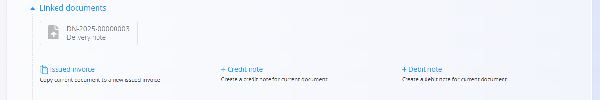
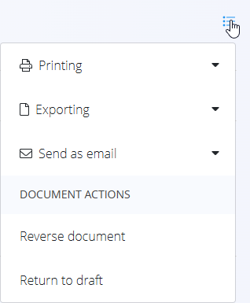

<!-- app_route: /sales/documents/issued-invoices -->
<!-- app_label: Izdani računi -->
<!-- canonical_source_url: https://github.com/Tom-PIT/Connected.Docs/blob/main/sl/Domene/Prodaja/Dokumenti/IzdaniRacuni.md -->
<!-- canonical_source_title: Izdani računi -->

# Izdani računi

**Izdani računi** so finančni dokumenti, poslani strankam za plačilo potrjenih prodaj. Povzemajo dobavljeno blago ali storitve, davke, roke plačila in izbrane načine plačila. Na strani **Izdani računi** lahko evidentirate tudi delna ali celotna plačila neposredno na posameznem računu.

Za dostop do te strani pojdite na **Prodaja / Dokumenti / Izdani računi** v [**navigaciji**](../../../Skupno/UI/Navigacija.md).

## Vloga izdanih računov v prodajnem procesu

Izdani računi se običajno ustvarijo na koncu prodajnega procesa:

1. Stranka sprejme **[Ponudbo](Ponudbe.md)**.  
2. Ustvari in izvede se **[Naročilo stranke](NarocilaStrank.md)**.  
3. Blago se odpremi z uporabo **[Dobavnic](Dobavnice.md)** in povezanih izdaj.  
4. Na koncu se ustvari **Izdani račun** (pogosto iz dobavnice ali naročila stranke) in se pošlje stranki v plačilo.

Račune je mogoče ustvariti tudi ročno kot samostojne dokumente, kadar je to potrebno.

## Shema

  
<strong>Dokument</strong>

| Polje | Opis |
|------|------|
| [**Šifra**](../../../Skupno/UI/SifreDokumentov.md) | Enolični identifikator računa (sistemsko generiran). |
| **Številka naročila kupca** | Neobvezna referenca na naročilo stranke. |
| **Stranka** | Prejemnik računa, izbran iz šifranta [**Poslovni imenik**](../../../Skupno/Upravljanje/PoslovniImenik.md) (obvezno). |
| **Datum dokumenta** | Datum izdaje računa. |
| **Datum opravljene storitve** | Datum, ko je bilo blago ali storitev dobavljena. |
| **Datum zapadlosti** | Rok plačila, prikazan stranki (obvezno). |
| **Tip reference** | Vrsta plačilnega sklica (npr. strukturiran sklic, model) (obvezno). |
| **Sklic** | Sklicna številka za plačilne dokumente, glede na izbrano vrsto sklica. |
| [**Bančni računi organizacije**](../Upravljanje/BancniRacuniOrganizacije.md) | Račun za prejem plačila, izbran iz šifranta bančnih računov organizacije (obvezno). |
| [**Stroškovno mesto**](../../../Skupno/Upravljanje/StroskovnaMesta.md) | Neobvezna razporeditev prihodka na stroškovno mesto. |
| **Koda namena** | Neobvezna koda namena računa (če je konfigurirana). |
| **Rabat** | Skupni rabat, uporabljen na celoten znesek računa. |
| **Vsebina zgoraj** | Uvodno besedilo iz [**Vnaprej določenih besedil**](../../../Skupno/Upravljanje/VnaprejDolocenaBesedila.md). |
| **Vsebina spodaj** | Zaključna ali pravna besedila iz [**Vnaprej določenih besedil**](../../../Skupno/Upravljanje/VnaprejDolocenaBesedila.md). |
| **Način plačila** | Izbrani način plačila iz šifranta [**Način plačila**](../Upravljanje/NacinPlacila.md). |

  
<strong>Transport, alternativna valuta in dostava</strong>

| Polje | Opis |
|--------|-------------|
| **[Pogoj dobave](../../../Skupno/Upravljanje/PogojiDobave.md)** | Dobavni pogoji, dogovorjeni s stranko. |
| **[Vrsta transporta](../../../Skupno/Upravljanje/VrstaTransporta.md)** | Način transporta, dogovorjen s stranko. |
| [**Alternativna valuta**](../../../Skupno/Upravljanje/Valute.md) | Alternativna valuta glede na privzeto valuto, uporabljeno v dokumentu. |
| [**Tečaj**](../Upravljanje/MenjalniTecaji.md) | Tečaj alternativne valute glede na privzeto valuto. |
| **Dobava – Podjetje / Naslov** | Dobavni podatki stranke, povzeti iz [Poslovnega imenika](../../../Skupno/Upravljanje/PoslovniImenik.md). |

  
<strong>Intrastat</strong>

| Polje | Opis |
|------|------|
| [**Država prejema**](../../../Skupno/Upravljanje/Drzave.md) | Država, iz katere je bilo blago odposlano. Vrednost je običajno povzeta iz Intrastat konfiguracije materiala. |
| [**Vrsta posla**](../../Racunovodstvo/Upravljanje/Intrastat/VrstaPosla.md) | Klasifikacija vrste transakcije za Intrastat poročanje (npr. neposredna prodaja ali nakup). |
| [**Lega kraja**](../../Racunovodstvo/Upravljanje/Intrastat/LegaKraja.md) | Označuje kraj dostave blaga v skladu z Intrastat definicijami. |

  
<strong>Postavke</strong>

| Polje | Opis |
|--------|-------------|
| **Vrsta blaga oz. storitev** | Izdelek, storitev ali sredstvo, izbrano za to postavko. |
| **Naziv postavke** | Prikazni naziv izbrane postavke (po potrebi ga je mogoče urediti). |
| **[Davčna stopnja](../../../Skupno/Upravljanje/DavcneStopnje.md)** | Davčna stopnja, uporabljena na postavki (nastavljena v konfiguraciji davkov). |
| **Cena brez DDV (na enoto)** | Cena na enoto brez davka. |
| **Cena z DDV (na enoto)** | Cena na enoto z davkom (samodejno izračunana glede na davčno stopnjo). |
| **Količina** | Količina izbrane postavke. |
| **Popust (%)** | Odstotek popusta, uporabljen na neto ceno. |
| **Skupni znesek brez davka** | Izračunan neto znesek (Cena brez DDV × Količina − Popust). |
| **Skupni znesek z davkom** | Skupni znesek z vključenim davkom. |
| **Vrsta obračuna DDV** | Določa način obračuna DDV v posebnih primerih: • **Tristranske dobave** – Za trikotne EU transakcije, kjer DDV obračuna končni kupec (obrnjena davčna obveznost). • **DDV obračuna kupec** – Uporaba obrnjene davčne obveznosti; DDV obračuna kupec namesto prodajalca. • **Izvozne storitve** – Za storitve, opravljene kupcem zunaj EU (običajno oproščene DDV). • **Prevozne storitve** – Posebna davčna obravnava za prevoz blaga. • **Prevoz potnikov** – Posebna pravila DDV za prevoz potnikov. • **Potovalne agencije** – Uporaba posebne maržne sheme za potovalne agencije. • **Po carinskih postopkih 42 in 63** – Za uvoz, kjer je DDV odložen v namembno državo EU. • **Prodaja odpoklicanega blaga iz EU** – Posebna davčna obravnava za vrnjeno ali odpoklicano blago znotraj EU. |
| **Opis** | Dodatne informacije o postavki (neobvezno). |
| **Alternativna valuta** | Možnost prikaza zneska postavke v izbrani alternativni valuti. Ob izbiri se znesek preračuna glede na tečaj, določen v dokumentu. |

  
<strong>Glavna knjiga in Intrastat postavke</strong>

| Polje | Opis |
|--------|-------------|
| **Glavna knjiga – Konto prihodka** | [Konto](../../Racunovodstvo/Upravljanje/GlavnaKnjiga/Konti.md) za knjiženje prihodkov ali odhodkov postavke. |
| **Glavna knjiga – Konto davka** | [Konto](../../Racunovodstvo/Upravljanje/GlavnaKnjiga/Konti.md) za knjiženje davka, vezanega na postavko dokumenta. |
| **[Intrastat – Tarifa](../../Racunovodstvo/Upravljanje/Intrastat/Tarife.md)** | Tarifna oznaka (šifra blaga) za poročanje Intrastat. |
| **Intrastat – Država porekla** | Država, iz katere blago izvira. |
| **Intrastat – Neto teža (kg)** | Neto teža za statistično poročanje. |
| **Intrastat – Statistična vrednost** | Prijavljena statistična vrednost blaga za poročanje Intrastat. |

## Upravljanje

### Statusi dokumenta

Izdani računi uporabljajo plačilno osnovane statuse:

- **Osnutki** – Račun še ni objavljen; vsa polja so prosto uredljiva.

- **Obdelan** – Račun je objavljen in postane uradni finančni dokument. Po potrditvi je mogoče spreminjati le omejena polja, dokumenta pa ni mogoče izbrisati.

  - **Neplačani** – Račun je izdan, vendar plačila še niso evidentirana.  
  - **Delno plačani** – Evidentirano je eno ali več plačil, vendar ostaja odprt znesek.  
  - **Plačani** – Račun je v celoti poravnan.  
  - **Stornirano** – Ustvarjen je bil storno dokument za popravek ali preklic računa.

Ti statusi določajo razpoložljiva dejanja (evidentiranje plačil, storniranje, izvoz ipd.) in način prikaza v seznamih.

### Seznam

Seznam prikazuje vse račune, ki ustrezajo izbranim filtrom in časovnim obdobjem.

**Kazalniki**

Na vrhu seznama so prikazani ključni kazalniki:

- **Zapadli neplačani** (interaktivno) – Število in vrednost zapadlih neplačanih računov; klik prikaže samo te račune.  
- **Skupni znesek** – Skupni bruto znesek računov v trenutnem pogledu.

Kazalniki se posodabljajo glede na izbrane filtre:
- **Datumi dokumentov**
- **Datum opravljene storitve**
- **Datum zapadlosti**
- **Pogled**  
  - **Osnutki**  
  - **Obdelan**  
  - **Neplačani**  
  - **Delno plačani**  
  - **Plačani**  
  - **Vsi**
- **Stanje storniranja**
- **Stranka**
- **Način plačila**

Za hitro iskanje uporabite polje **Iskanje**.

#### Meni seznama

V pogledu seznama meni v zgornjem desnem kotu ponuja dodatne možnosti:

- **Izvoz** – Izvozi v CSV. Na voljo sta dve možnosti poročila:
    - **Dokument** – Izvozi celoten seznam računov na seznamu.
    - **Postavke** – Izvozi vse podrobnosti postavk za vse račune na seznamu.

## Dejanja

### Ustvariti izdani račun

Kliknite [**akcijski gumb**](../../../Skupno/UI/AkcijskiGumb.md) da ustvarite nov račun.

Za podroben postopek ustvarjanja si oglejte vodnik [**Kako ustvariti izdani račun**](IzdaniRacuniUstvarjanje.md).

### Urediti izdani račun

Kliknite kateri koli izdan račun na seznamu, da ga odprete. Osnutke je mogoče prosto urejati. Dokument je razdeljen na več razširljivih razdelkov.

Dokler je račun v statusu **Osnutek**, lahko urejate vse razdelke:

- [Glavna polja](IzdaniRacuniUstvarjanje.md#korak-2--izpolnjevanje-glave-dokumenta) (datumi, sklici, stranka, bančni račun itd.)
- [**Alternativna valuta**](IzdaniRacuniUstvarjanje.md#alternativna-valuta)
- [**Transport**](IzdaniRacuniUstvarjanje.md#transport-in-intrastat)
- [**Dostava**](IzdaniRacuniUstvarjanje.md#dostava)
- [**Postavke**](IzdaniRacuniUstvarjanje.md#korak-3--dodajanje-postavk) – dodajanje, odstranjevanje ali spreminjanje postavk
- [**Načini plačila**](IzdaniRacuniUstvarjanje.md#načini-plačila) – določanje načina plačila
- [**Vsebina zgoraj** in **Vsebina spodaj**](IzdaniRacuniUstvarjanje.md#vsebina-zgoraj-in-vsebina-spodaj) – izbor vnaprej določenih besedil

#### Povezani dokumenti

Razdelek **Povezani dokumenti** omogoča ustvarjanje in pregled povezanih dokumentov.

> [!NOTE]
> Razpoložljiva dejanja v razdelku **Povezani dokumenti** so odvisna od tipa in statusa dokumenta.

Primer za osnutek:

Razpoložljiva dejanja lahko vključujejo:

- **Izdani račun** – kopira trenutni dokument v nov izdani račun
- [**+ Dobropis**](Dobropisi.md) – ustvari dobropis
- [**+ Bremepis**](Bremepisi.md) – ustvari bremepis
- [**Dobavnica**](Dobavnice.md) – povezava z obstoječo dobavnico
- [**Predplačila**](Predplacila.md) – povezava z obstoječimi predplačili

### Objaviti izdani račun

Ko je račun pripravljen, kliknite **Objavi**, da ga potrdite in premaknete iz stanja **Osnutek** v **Obdelan**. Po objavi postanejo na voljo povezana dejanja in računovodski izvoz.

### Evidentiranje plačil

Po objavi računa kliknite **Plačilo**, da evidentirate prejeto plačilo.

V pogovornem oknu za plačilo so prikazani:

- **Za plačilo** – bruto znesek računa in datum zapadlosti.  
- **Plačilo** – trenutno plačani znesek in datum plačila.  
- **Preostali znesek** – odprt znesek po evidentiranem plačilu.

Možno je evidentirati več plačil skozi čas. Sistem samodejno posodobi status računa:

- **Neplačani** – še ni evidentiranih plačil.  
- **Delno plačani** – evidentirana plačila, vendar ostaja odprti znesek.  
- **Plačani** – preostali znesek je nič.

> [!NOTE]  
> Ko je račun v celoti pokrit z evidentiranimi plačili, se prikaže v pogledu **Plačani**. Delno plačani dokumenti se prikažejo pod **Delno plačani**, neplačani pa pod **Neplačani**.

## Meni

Meni v zgornjem desnem kotu omogoča:

- **Tiskanje**  
- **Izvoz ** 
- **Pošlji preko e-pošte**  
- **Izbriši vse postavke** (če je dokument v stanju Osnutek)
- [**Storniranje dokument**](../../Logistika/Dokumenti/Storno.md)  
- **Vrnitev v osnutek** (če je dovoljeno)

## Brisati izdani račun

Dokumente v stanju **Osnutek** je mogoče izbrisati v pogledu za urejanje, **samo če ne vsebujejo postavk**.

Če osnutek še vedno vsebuje vrstice v razdelku **Postavke**:

1. Odprite meni dokumenta (zgornji desni kot).
2. Izberite **Izbriši vse postavke**, da odstranite vse vrstice hkrati.
3. Ko dokument ne vsebuje več postavk, kliknite **Izbriši**, da odstranite osnutek.

Če želite odstraniti samo določen material in ne vseh postavk:

1. Kliknite serijsko številko materiala, da odprete zaslon **Uredi postavko**.
2. V oknu za urejanje kliknite **Izbriši**.

> [!NOTE]  
> Objavljenih računov **ni mogoče izbrisati**, lahko pa jih [stornirate](../../Logistika/Dokumenti/Storno.md) ali **vrnete v osnutek**.
Če so bila evidentirana plačila, računa ni mogoče izbrisati, dokler plačila niso odstranjena in dokument vrnjen v osnutek.