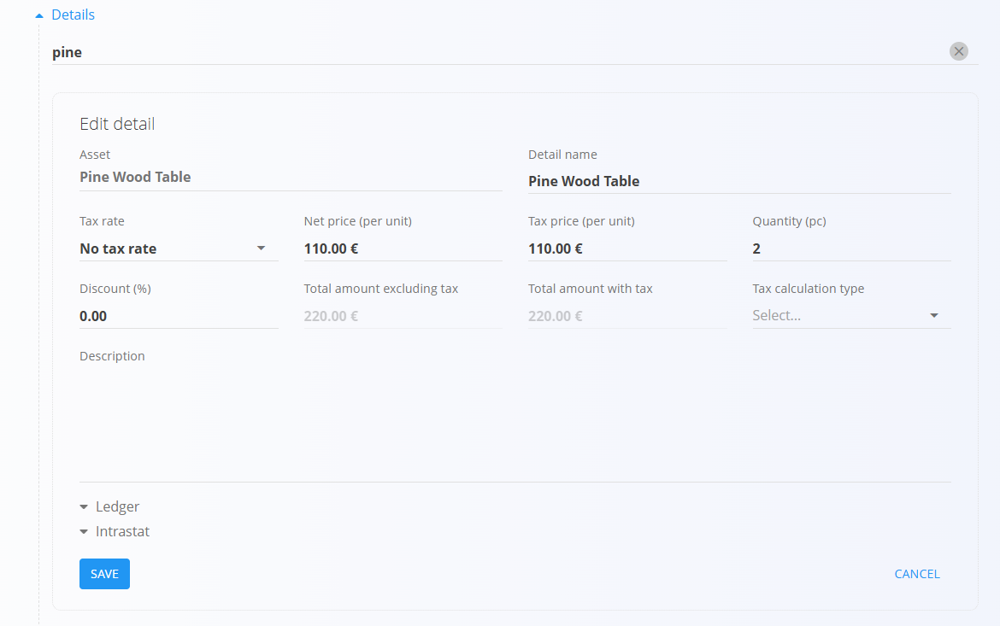

<!-- app_route: /sales/documents/issued-invoices -->
<!-- app_label: Izdani računi -->
<!-- app_navigation_hint: Odprite Izdane račune, nato kliknite akcijski gumb za ustvarjanje novega osnutka računa. -->
<!-- canonical_source_url: https://github.com/Tom-PIT/Connected.Docs/blob/main/sl/Domene/Prodaja/Dokumenti/IzdaniRacuniUstvarjanje.md -->
<!-- canonical_source_title: Kako ustvariti izdani račun -->

# Kako ustvariti izdani račun

Nove [izdane račune](IzdaniRacuni.md) je mogoče ustvariti:

- ročno na zaslonu **Izdani računi**
- iz povezanih prodajnih dokumentov prek **Povezani dokumenti → + Izdani račun**

Podprti izvorni dokumenti vključujejo:

- potrjena [**Naročila stranke**](NarocilaStrank.md)
- [**Dobavnice**](Dobavnice.md)

Ko je račun ustvarjen iz drugega dokumenta, sistem samodejno predizpolni večino podatkov, vključno s stranko, podatki o dostavi in postavkami.

## Korak 1 — Ustvarjanje dokumenta

Ustvarite nov osnutek računa na enega od naslednjih načinov:

- Kliknite [akcijski gumb](../../../Skupno/UI/AkcijskiGumb.md) na zaslonu **Izdani računi**
- Uporabite **Povezani dokumenti → + Izdani račun** iz povezanega prodajnega dokumenta (npr. [Naročilo stranke](NarocilaStrank.md), [Dobavnica](Dobavnice.md))

Ustvari se nov osnutek izdanega računa. Če je račun ustvarjen iz drugega dokumenta, bo večina polj že samodejno izpolnjena.

## Korak 2 — Izpolnjevanje glave dokumenta

Izpolnite ključna polja v zgornjem delu obrazca računa. Pri ustvarjanju iz povezanega dokumenta je večina teh polj samodejno izpolnjena na podlagi izvornega dokumenta:

- [**Stranka**](../../../Skupno/Upravljanje/PoslovniImenik.md)
- **Datum dokumenta**
- **Datum opravljene storitve**
- **Datum zapadlosti** (obvezno)
- **Tip reference / Sklic**
- [**Bančni račun organizacije**](../Upravljanje/BancniRacuniOrganizacije.md)
- [**Način plačila**](../Upravljanje/NacinPlacila.md)

## Korak 3 — Dodajanje postavk

Dodajte postavke v razdelku **Postavke**. Postavke določajo naročene artikle ter njihove količine, cene, davke in popuste. Vsaka postavka predstavlja določen izdelek, storitev ali sredstvo.

Za dodajanje nove postavke:

1. V vrstico za postavke vnesite ali skenirajte **serijsko številko**, **EAN** ali **naziv artikla**. Sistem prikaže vse ustrezne zadetke.
2. Izberite želeno postavko s seznama.
3. Prilagodite **količino**, **ceno**, **popust** ali **davčne podatke**, nato kliknite **Shrani**.

4. Nadaljujte z dodajanjem poljubnega števila postavk. Po shranjevanju se postavka prikaže na seznamu:

Za informacije o delu s postavkami dokumenta glejte [**Postavke dokumenta**](../../../Skupno/Koncepti/PostavkeDokumenta.md).

### Glavna knjiga

Razdelek **Glavna knjiga** določa, kako se dokument knjiži v glavno knjigo. Opredeljuje, kateri konti se uporabijo za knjiženje prihodkov, odhodkov in davkov ob shranjevanju in knjiženju dokumenta.

Ob knjiženju dokumenta:

- **Neto znesek** se knjiži na izbrani konto prihodka ali odhodka
- **Znesek davka** se knjiži na izbrani konto davka
- Sistem samodejno ustvari ustrezne temeljnice v glavni knjigi

Razpoložljivi konti so določeni v **[Kontnem načrtu](../../Racunovodstvo/Upravljanje/GlavnaKnjiga/Konti.md)**.

> [!NOTE]
> Po objavi izdanega računa dokumenta ni več mogoče urejati ali izbrisati. Za popravke uporabite dejanje **[Storniraj dokument](../../Logistika/Dokumenti/Storno.md)** v meniju.

## Korak 4 — Dodatne nastavitve

### Alternativna valuta

Razdelek **Alternativna valuta** omogoča prikaz cen v dokumentu v valuti, ki se razlikuje od privzete sistemske valute. To se običajno uporablja pri mednarodni prodaji. Tečaji se prevzemajo iz šifranta [**Menjalni tečaji**](../Upravljanje/MenjalniTecaji.md).

Ko je izbrana alternativna valuta, se cene v dokumentu samodejno preračunajo glede na določen menjalni tečaj.

### Dostava

Preglejte ali prilagodite podatke o dostavi v razdelku **Dostava**.

Razdelek Dostava določa, kam bo blago odposlano. Samodejno se izpolni iz podatkov o stranki ali dobavitelju, vendar ga je mogoče prilagoditi za vsak dokument posebej.

Te vrednosti vplivajo na natisnjen dokument in dokumente nadaljnje logistike, vendar ne spreminjajo glavnih podatkov.

### Transport in Intrastat

Ko je **Intrastat** nastavljen na **Obvezno** v **Sistem / Konfiguracija / Intrastat**, se v dokumentu prikažeta dodatna razdelka.

- **Transport** – uporablja se za zajem logističnih podatkov o dostavi blaga
- **Intrastat** – uporablja se za zbiranje podatkov, potrebnih za Intrastat poročanje

Ta polja so prikazana samo, kadar je v sistemu omogočeno Intrastat poročanje.

> [!NOTE]
> Več Intrastat vrednosti je prevzetih iz **šifrantov materialov** (Intrastat konfiguracija), kot sta država in vrsta posla. Ta polja niso prosto nastavljiva na ravni dokumenta in so odvisna od predhodno definiranih matičnih podatkov.

#### Intrastat postavke

Ko je omogočeno Intrastat poročanje in transakcija vključuje kupca iz druge države EU, se v obrazcu za urejanje postavke prikaže dodaten razdelek **Intrastat**.

Ta razdelek vsebuje statistične podatke, potrebne za Intrastat poročanje.

Polja so obvezna pri čezmejnih EU transakcijah, kadar je organizacija zavezana k Intrastat poročanju.

### Priponke

Razdelek **Priponke** uporabite za nalaganje in upravljanje datotek, povezanih z dokumentom, kot so fotografije, PDF datoteke, certifikati ali podporni dokumenti.

Za podrobna navodila glejte [**Priponke**](../../../Skupno/Koncepti/Priponke.md).

### Vsebina zgoraj in vsebina spodaj

Vnaprej pripravljeni razdelki vsebine omogočajo dodajanje predlog besedila na vrh ali dno računa. To je uporabno za vključevanje splošnih pogojev, navodil za plačilo ali drugih informacij, ki morajo biti prikazane na izpisu dokumenta.

Besedilo se izbira iz [**Vnaprej določena besedila**](../../../Skupno/Upravljanje/VnaprejDolocenaBesedila.md).

#### Načini plačila

Načini plačila so prikazani na dnu dokumenta.

Kliknite **Dodaj način plačila**, da naročilu dodelite [način plačila](../Upravljanje/NacinPlacila.md). To polje je informativne narave in samo po sebi ne sproži nobenih finančnih transakcij. Uporablja se za interno sledenje, kako stranka namerava plačati naročilo.

## Korak 5 — Objava računa

Ko je račun pripravljen, kliknite **Objavi** na vrhu strani. Objava premakne dokument iz stanja **Osnutek** v **Obdelan**, zaključi izračune in omogoči računovodski izvoz ter nadaljnjo obdelavo.