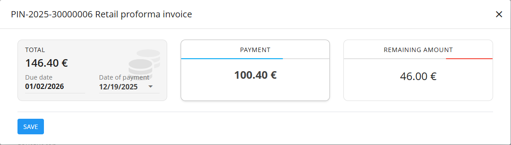

<!-- app_route: /sales/documents/retail-prepayments -->
<!-- app_label: Maloprodajna predplačila -->
<!-- canonical_source_url: https://github.com/Tom-PIT/Connected.Docs/blob/main/sl/Domene/Prodaja/Dokumenti/MaloprodajnaPredplacila.md -->
<!-- canonical_source_title: Maloprodajna predplačila -->

# Maloprodajna predplačila

**Maloprodajno predplačilo** je prodajni dokument, ki se uporablja v maloprodajnih scenarijih za evidentiranje prodaje v obliki predračuna, pri čemer omogoča **fleksibilno evidentiranje plačil** (takojšnja ali kasnejša plačila).  
Dokument je namenjen prodaji na blagajni ali v trgovini in podpira enak življenjski cikel plačil kot **[maloprodajni računi](MaloprodajniRacuni.md)**.

Maloprodajna predplačila je mogoče natisniti ali poslati stranki v katerikoli fazi.

Za dostop do te strani pojdite na **Prodaja / Dokumenti / Maloprodajna predplačila** v [**navigaciji**](../../../Skupno/UI/Navigacija.md).

## Vloga maloprodajnih predplačil v prodajnem procesu

Maloprodajna predplačila se uporabljajo pri neposredni prodaji končnim kupcem:

1. Kupec izbere enega ali več izdelkov v trgovini.  
2. Uporabnik ročno ustvari **Maloprodajno predplačilo** z uporabo [**akcijskega gumba**](../../../Skupno/UI/AkcijskiGumb.md).  
3. Dokument se objavi in preide v stanje **Neplačani**.  
4. Plačila se evidentirajo z gumbom **Plačilo**:
   - Delna plačila premaknejo dokument v stanje **Delno plačani**.
   - Celotno plačilo premakne dokument v stanje **V celoti plačani**.
5. Dokument je mogoče natisniti ali poslati stranki.  
6. Zaloga se prilagodi **ločeno** z dokumentom [**Izdaja**](../../Logistika/Dokumenti/Izdajnice.md)  
   (ali z uporabo [**Dobavnice**](Dobavnice.md) in nato **Izdaje**).

> [!IMPORTANT]  
> Maloprodajna predplačila **ne vplivajo na zalogo**.

## Shema

  
<strong>Dokument</strong>

| Polje | Opis |
|------|------|
| [**Šifra**](../../../Skupno/UI/SifreDokumentov.md) | Sistemsko generiran identifikator dokumenta. |
| **Številka naročilnice** | Neobvezna referenca kupca. |
| **Stranka** | Obvezno. Izbrana iz [**Poslovnega imenika**](../../../Skupno/Upravljanje/PoslovniImenik.md). Na voljo so le zapisi z oznakama **Stranka** in **Oseba**. |
| **Datum dokumenta** | Datum nastanka dokumenta. |
| **Datum opravljene storitve** | Datum izročitve ali prevzema blaga. |
| **Datum zapadlosti** | Rok plačila (obvezno). |
| **Tip reference** | Vrsta plačilnega sklica (obvezno). |
| **Sklic** | Sklicna številka za plačilo. |
| [**Bančni račun organizacije**](../Upravljanje/BancniRacuniOrganizacije.md) | Račun za prejem plačila (obvezno). |
| [**Stroškovno mesto**](../../../Skupno/Upravljanje/StroskovnaMesta.md) | Neobvezna razporeditev prihodka. |
| **Koda namena** | Neobvezna koda namena transakcije. |
| **Rabat** | Skupni rabat na dokumentu. |
| **Vsebina zgoraj** | Uvodno besedilo iz [**Vnaprej določenih besedil**](../../../Skupno/Upravljanje/VnaprejDolocenaBesedila.md). |
| **Vsebina spodaj** | Zaključna ali pravna besedila iz [**Vnaprej določenih besedil**](../../../Skupno/Upravljanje/VnaprejDolocenaBesedila.md). |

  
<strong>Transport, alternativna valuta in dostava</strong>

| Polje | Opis |
|--------|-------------|
| **[Pogoj dobave](../../../Skupno/Upravljanje/PogojiDobave.md)** | Dobavni pogoji, dogovorjeni s stranko. |
| **[Vrsta transporta](../../../Skupno/Upravljanje/VrstaTransporta.md)** | Način transporta, dogovorjen s stranko. |
| [**Alternativna valuta**](../../../Skupno/Upravljanje/Valute.md) | Alternativna valuta glede na privzeto valuto, uporabljeno v dokumentu. |
| [**Tečaj**](../Upravljanje/MenjalniTecaji.md) | Tečaj alternativne valute glede na privzeto valuto. |
| **Dobava – Podjetje / Naslov** | Dobavni podatki stranke, povzeti iz [Poslovnega imenika](../../../Skupno/Upravljanje/PoslovniImenik.md). |

  
<strong>Postavke</strong>

| Polje | Opis |
|--------|-------------|
| **Vrsta blaga oz. storitev** | Izdelek, storitev ali sredstvo, izbrano za to postavko. |
| **Naziv postavke** | Prikazni naziv izbrane postavke (po potrebi ga je mogoče urediti). |
| **[Davčna stopnja](../../../Skupno/Upravljanje/DavcneStopnje.md)** | Davčna stopnja, uporabljena na postavki (nastavljena v konfiguraciji davkov). |
| **Cena brez DDV (na enoto)** | Cena na enoto brez davka. |
| **Cena z DDV (na enoto)** | Cena na enoto z davkom (samodejno izračunana glede na davčno stopnjo). |
| **Količina** | Količina izbrane postavke. |
| **Popust (%)** | Odstotek popusta, uporabljen na neto ceno. |
| **Skupni znesek brez davka** | Izračunan neto znesek (Cena brez DDV × Količina − Popust). |
| **Skupni znesek z davkom** | Skupni znesek z vključenim davkom. |
| **Vrsta obračuna DDV** | Določa način obračuna DDV v posebnih primerih: • **Tristranske dobave** – Za trikotne EU transakcije, kjer DDV obračuna končni kupec (obrnjena davčna obveznost). • **DDV obračuna kupec** – Uporaba obrnjene davčne obveznosti; DDV obračuna kupec namesto prodajalca. • **Izvozne storitve** – Za storitve, opravljene kupcem zunaj EU (običajno oproščene DDV). • **Prevozne storitve** – Posebna davčna obravnava za prevoz blaga. • **Prevoz potnikov** – Posebna pravila DDV za prevoz potnikov. • **Potovalne agencije** – Uporaba posebne maržne sheme za potovalne agencije. • **Po carinskih postopkih 42 in 63** – Za uvoz, kjer je DDV odložen v namembno državo EU. • **Prodaja odpoklicanega blaga iz EU** – Posebna davčna obravnava za vrnjeno ali odpoklicano blago znotraj EU. |
| **Opis** | Dodatne informacije o postavki (neobvezno). |
| **Alternativna valuta** | Možnost prikaza zneska postavke v izbrani alternativni valuti. Ob izbiri se znesek preračuna glede na tečaj, določen v dokumentu. |

  
<strong>Glavna knjiga in Intrastat postavke</strong>

| Polje | Opis |
|--------|-------------|
| **Glavna knjiga – Konto prihodka** | [Konto](../../Racunovodstvo/Upravljanje/GlavnaKnjiga/Konti.md) za knjiženje prihodkov ali odhodkov postavke. |
| **Glavna knjiga – Konto davka** | [Konto](../../Racunovodstvo/Upravljanje/GlavnaKnjiga/Konti.md) za knjiženje davka, vezanega na postavko dokumenta. |
| **[Intrastat – Tarifa](../../Racunovodstvo/Upravljanje/Intrastat/Tarife.md)** | Tarifna oznaka (šifra blaga) za poročanje Intrastat. |
| **Intrastat – Država porekla** | Država, iz katere blago izvira. |
| **Intrastat – Neto teža (kg)** | Neto teža za statistično poročanje. |
| **Intrastat – Statistična vrednost** | Prijavljena statistična vrednost blaga za poročanje Intrastat. |

## Upravljanje

Maloprodajna predplačila podpirajo naslednja stanja:

- **Osnutki**
- **Neplačani**
- **Delno plačani**
- **Plačani**

Po objavi dokumenta postane na voljo gumb **Plačilo**.

### Seznam

Seznam je mogoče filtrirati po:
- **Datumih dokumentov**
- **Pogledu** (Osnutki, Neplačani, Delno plačani, Plačani)
- **Stranki**

Vsaka vrstica prikazuje:
- Stranko  
- Kodo dokumenta  
- Datum dokumenta  
- Plačan znesek  
- Skupni znesek  

## Dejanja

### Ustvarjanje novega maloprodajnega predplačila

Maloprodajna predplačila je mogoče ustvariti **samo ročno**.

1. Kliknite [**akcijski gumb**](../../../Skupno/UI/AkcijskiGumb.md) za ustvarjanje novega osnutka.

   

2. Izberite **Stranko**. Na voljo so le zapisi z oznakama **Stranka** in **Oseba**.

   

3. Izpolnite obvezna polja: **Datum zapadlosti**, **Tip reference**, **Sklic** in **Bančni račun organizacije**.

4. V razdelku **Postavke** dodajte postavke z vnosom ali skeniranjem **serijske številke**, **EAN** ali **naziva sredstva**.

   

5. Shranite postavke.

6. (Neobvezno) Izberite **Način plačila** na dnu dokumenta.

   

7. Kliknite **Objavi**.  
   Dokument preide iz **Osnutka** v **Neplačani**.

#### Alternativna valuta

Razdelek Alternativna valuta omogoča izražanje cen v dokumentu v valuti, ki je različna od privzete sistemske valute. To se običajno uporablja pri mednarodni prodaji. Tečaji se povzemajo iz šifranta [Devizni tečaji](../Upravljanje/MenjalniTecaji.md).

Ko je izbrana alternativna valuta, se cene v dokumentu samodejno preračunajo z uporabo navedenega deviznega tečaja.

#### Razdelka Transport in Intrastat

Ko je **Intrastat** nastavljen na **Obvezno** v **Sistem / Konfiguracija / Intrastat**, se v obrazcu dokumenta prikažeta dodatna razdelka.

- **Transport** – Uporablja se za zajem logističnih informacij o načinu dostave blaga.
- **Intrastat** – Uporablja se za zbiranje podatkov, potrebnih za Intrastat poročanje. Ta polja so prikazana samo, kadar je Intrastat poročanje omogočeno v sistemu.

> [!NOTE]  
> Več vrednosti, povezanih z Intrastat, je prevzetih iz **šifrantov materialov** (Intrastat konfiguracija), kot sta država in vrsta posla. Ta polja niso prosto nastavljiva na ravni dokumenta in so odvisna od predhodno definiranih matičnih podatkov.

#### Postavke

Postavke določajo naročene artikle ter njihove količine, cene, davke in popuste. Vsaka postavka predstavlja določen izdelek, storitev ali sredstvo.

##### Glavna knjiga

Razdelek **Glavna knjiga** določa, kako se dokument knjiži v glavno knjigo. Opredeljuje, kateri konti se uporabijo za knjiženje prihodkov, odhodkov in davkov ob shranjevanju in knjiženju dokumenta.

Ob knjiženju dokumenta:

- **Neto znesek** se knjiži na izbrani konto prihodka ali odhodka.
- **Znesek davka** se knjiži na izbrani konto davka.
- Sistem samodejno ustvari ustrezne temeljnice v glavni knjigi.

Razpoložljivi konti so določeni v **[Kontnem načrtu](../../Racunovodstvo/Upravljanje/GlavnaKnjiga/Konti.md)**.

##### Intrastat

Če je omogočeno poročanje Intrastat in transakcija vključuje kupca iz druge države EU, se v obrazcu za urejanje postavke prikaže dodatni razdelek **Intrastat**.

Ta razdelek vsebuje statistične podatke, ki so potrebni za poročanje Intrastat.

Polja so obvezna pri čezmejnih EU transakcijah, kadar je organizacija zavezana k poročanju Intrastat.

### Evidentiranje plačil

Plačila se evidentirajo z gumbom **Plačilo** na vrhu dokumenta.

V pogovornem oknu so prikazani:
- **Skupni znesek**  
- **Plačilo** – znesek in datum plačila  
- **Preostali znesek**

Evidentirati je mogoče več plačil. Sistem samodejno posodobi stanje dokumenta:
- **Neplačani**
- **Delno plačani**
- **V celoti plačani**

## Urejanje maloprodajnega predplačila

Dokument je mogoče urejati **le v stanju Osnutek**.

Urejate lahko:
- Glavo dokumenta  
- Postavke  
- Dobavne podatke  
- Vsebino zgoraj in spodaj  

Po objavi urejanje ni več dovoljeno, razen če je dokument **vrnjen v osnutek** (če to dovoljuje konfiguracija).

## Meni

Meni dokumenta omogoča:
- **Tiskanje**
- **Izvoz**
- **Pošlji preko e-pošte**
- **Izbriši vse postavke** (če je dokument v stanju Osnutek)
- [**Storniranje dokument**](../../Logistika/Dokumenti/Storno.md) (zaključeni dokumenti))  
- **Vrni v osnutek**

> [!NOTE]
> Osnutki nimajo možnosti **Storniraj dokument**, imajo pa možnost **Izbriši vse postavke**.

## Ravnanje z zalogo

Maloprodajna predplačila **ne zmanjšujejo zaloge**, ne glede na stanje plačila.

Za prilagoditev zaloge:
- ustvarite dokument [**Izdaja**](../../Logistika/Dokumenti/Izdajnice.md), ali  
- ustvarite [**Dobavnico**](Dobavnice.md) in nato [**Izdajo**](../../Logistika/Dokumenti/Izdajnice.md).

## Brisanje

Dokumente v stanju **Osnutek** je mogoče izbrisati v pogledu za urejanje, **samo če ne vsebujejo postavk**.

Če osnutek še vedno vsebuje vrstice v razdelku **Postavke**:

1. Odprite meni dokumenta (zgornji desni kot).
2. Izberite **Izbriši vse postavke**, da odstranite vse vrstice hkrati.
3. Ko dokument ne vsebuje več postavk, kliknite **Izbriši**, da odstranite osnutek.

Če želite odstraniti samo določen material in ne vseh postavk:

1. Kliknite serijsko številko materiala, da odprete zaslon **Uredi postavko**.
2. V oknu za urejanje kliknite **Izbriši**.

> [!NOTE]  
> Objavljenih računov **ni mogoče izbrisati**, lahko pa jih [stornirate](../../Logistika/Dokumenti/Storno.md) ali **vrnete v osnutek**.
