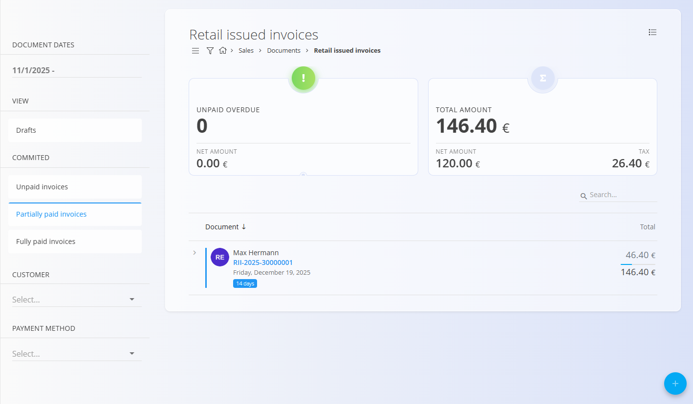
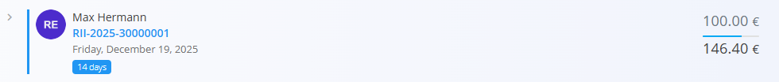

<!-- app_route: /sales/documents/retail-issued-invoices -->
<!-- app_label: Maloprodajni računi -->
<!-- canonical_source_url: https://github.com/Tom-PIT/Connected.Docs/blob/main/sl/Domene/Prodaja/Dokumenti/MaloprodajniRacuni.md -->
<!-- canonical_source_title: Maloprodajni računi -->

# Maloprodajni računi

**Maloprodajni račun** je prodajni dokument, namenjen neposredni prodaji končnim kupcem (npr. prodaja na blagajni ali v trgovini). Običajno se ustvari ob samem nakupu, brez predhodne ponudbe ali naročila stranke.  
Maloprodajni računi omogočajo takojšnje ali kasnejše evidentiranje plačil, vendar **ne vplivajo na stanje zaloge**. Premiki zaloge se vedno izvajajo ločeno prek logističnih dokumentov.

Za dostop do te strani pojdite na **Prodaja / Dokumenti / Maloprodajni računi** v [navigaciji](../../../Skupno/UI/Navigacija.md).

## Vloga maloprodajnih računov v prodajnem procesu

Maloprodajni računi so namenjeni hitri prodaji »na licu mesta«:

1. Kupec izbere enega ali več izdelkov.  
2. Uporabnik ročno ustvari **Maloprodajni račun**.  
3. Račun se objavi in je privzeto v stanju **Neplačano**.  
4. Plačila se evidentirajo neposredno na računu (delna ali celotna).  
5. Račun se samodejno premakne v stanje **Delno plačano** ali **V celoti plačano**, glede na prejeta plačila.  
6. Zaloga se prilagodi ločeno z dokumentom [**Izdaja**](../../Logistika/Dokumenti/Izdajnice.md) (ali z uporabo [**Dobavnice**](Dobavnice.md) + [**Izdaje**](../../Logistika/Dokumenti/Izdajnice.md), če gre za dostavo).

## Ravnanje z zalogo

Maloprodajni računi **ne zmanjšujejo zaloge**, ne glede na stanje plačila.

Za prilagoditev zaloge:
- ustvarite dokument [**Izdaja**](../../Logistika/Dokumenti/Izdajnice.md), ali  
- ustvarite [**Dobavnico**](Dobavnice.md) in nato [**Izdajo**](../../Logistika/Dokumenti/Izdajnice.md).

## Pogoji za davčno potrjevanje maloprodajnega izdanega računa (če je davčno potrjevanje omogočeno v sistemu)

Da se maloprodajni izdani račun lahko davčno potrdi, morajo biti izpolnjeni naslednji pogoji:

1. **Osebna konfiguracija:** Oseba, ki ustvarja račun, mora imeti določeno **davčno številko** v svojem [zapisu vira](../../Proizvodnja/Upravljanje/Viri.md).
2. **Sistemska konfiguracija:** Sistem mora biti nastavljen za davčno potrjevanje, potrebne [nastavitve davčnega potrjevanja](../../Sistem/Nastavitve/KonfiguracijaMaloprodajaSI.md) pa morajo biti pravilno konfigurirane.
3. **Konfiguracija blagajne:** Konfiguracija konkretne blagajne, uporabljene za transakcijo. To konfiguracijo nastavi ekipa **Tom PIT** ob implementaciji in je uporabnik ne more spreminjati. Specifične blagajne so nastavljene na zaslonu [Stroškovna mesta](../../../Skupno/Upravljanje/StroskovnaMesta.md).

Ko so ti pogoji izpolnjeni, se lahko maloprodajni izdani račun ob objavi davčno potrdi, kar zagotavlja skladnost z davčno zakonodajo za maloprodajo.

> [!NOTE]
> Tom PIT Connected trenutno omogoča davčno potrjevanje maloprodajnih izdanih računov v **Sloveniji** in **Hrvaški**. Davčno potrjevanje je proces sprotnega poročanja prodajnih transakcij davčnemu organu, kar zagotavlja skladnost z lokalnimi davčnimi predpisi za maloprodajo.

## Shema

  
<strong>Dokument</strong>

| Polje | Opis |
|------|------|
| [**Šifra**](../../../Skupno/UI/SifreDokumentov.md) | Sistemsko generiran identifikator maloprodajnega računa. |
| **Številka naročila kupca** | Neobvezna referenca kupca. |
| **Stranka** | Kupec, izbran iz [**Poslovnega imenika**](../../../Skupno/Upravljanje/PoslovniImenik.md) (obvezno). Na voljo so le zapisi z oznakama **Stranka** in **Oseba**. |
| **Datum dokumenta** | Datum izdaje računa. |
| **Datum dobave** | Datum izročitve ali dostave blaga. |
| **Datum zapadlosti** | Rok plačila (obvezno). |
| **Tip reference** | Vrsta plačilnega sklica (obvezno). |
| **Sklic** | Sklicna številka glede na izbrano vrsto sklica. |
| [**Bančni račun organizacije**](../Upravljanje/BancniRacuniOrganizacije.md) | Račun za prejem plačila (obvezno). |
| [**Stroškovno mesto**](../../../Skupno/Upravljanje/StroskovnaMesta.md) | Neobvezna razporeditev prihodka. |
| **Koda namena** | Neobvezna koda namena transakcije. |
| **Rabat** | Skupni rabat na računu. |
| **Dobava** | Podatki o podjetju in naslovu dobave. |
| **Vsebina zgoraj** | Uvodno besedilo iz [**Vnaprej določenih besedil**](../../../Skupno/Upravljanje/VnaprejDolocenaBesedila.md). |
| **Vsebina spodaj** | Zaključna ali pravna besedila iz [**Vnaprej določenih besedil**](../../../Skupno/Upravljanje/VnaprejDolocenaBesedila.md). |

  
<strong>Transport, alternativna valuta in dostava</strong>

| Polje | Opis |
|--------|-------------|
| **[Pogoj dobave](../../../Skupno/Upravljanje/PogojiDobave.md)** | Dobavni pogoji, dogovorjeni s stranko. |
| **[Vrsta transporta](../../../Skupno/Upravljanje/VrstaTransporta.md)** | Način transporta, dogovorjen s stranko. |
| [**Alternativna valuta**](../../../Skupno/Upravljanje/Valute.md) | Alternativna valuta glede na privzeto valuto, uporabljeno v dokumentu. |
| [**Tečaj**](../Upravljanje/MenjalniTecaji.md) | Tečaj alternativne valute glede na privzeto valuto. |
| **Dobava – Podjetje / Naslov** | Dobavni podatki stranke, povzeti iz [Poslovnega imenika](../../../Skupno/Upravljanje/PoslovniImenik.md). |

  
<strong>Postavke</strong>

| Polje | Opis |
|--------|-------------|
| **Vrsta blaga oz. storitev** | Izdelek, storitev ali sredstvo, izbrano za to postavko. |
| **Naziv postavke** | Prikazni naziv izbrane postavke (po potrebi ga je mogoče urediti). |
| **[Davčna stopnja](../../../Skupno/Upravljanje/DavcneStopnje.md)** | Davčna stopnja, uporabljena na postavki (nastavljena v konfiguraciji davkov). |
| **Cena brez DDV (na enoto)** | Cena na enoto brez davka. |
| **Cena z DDV (na enoto)** | Cena na enoto z davkom (samodejno izračunana glede na davčno stopnjo). |
| **Količina** | Količina izbrane postavke. |
| **Popust (%)** | Odstotek popusta, uporabljen na neto ceno. |
| **Skupni znesek brez davka** | Izračunan neto znesek (Cena brez DDV × Količina − Popust). |
| **Skupni znesek z davkom** | Skupni znesek z vključenim davkom. |
| **Vrsta obračuna DDV** | Določa način obračuna DDV v posebnih primerih: • **Tristranske dobave** – Za trikotne EU transakcije, kjer DDV obračuna končni kupec (obrnjena davčna obveznost). • **DDV obračuna kupec** – Uporaba obrnjene davčne obveznosti; DDV obračuna kupec namesto prodajalca. • **Izvozne storitve** – Za storitve, opravljene kupcem zunaj EU (običajno oproščene DDV). • **Prevozne storitve** – Posebna davčna obravnava za prevoz blaga. • **Prevoz potnikov** – Posebna pravila DDV za prevoz potnikov. • **Potovalne agencije** – Uporaba posebne maržne sheme za potovalne agencije. • **Po carinskih postopkih 42 in 63** – Za uvoz, kjer je DDV odložen v namembno državo EU. • **Prodaja odpoklicanega blaga iz EU** – Posebna davčna obravnava za vrnjeno ali odpoklicano blago znotraj EU. |
| **Opis** | Dodatne informacije o postavki (neobvezno). |
| **Alternativna valuta** | Možnost prikaza zneska postavke v izbrani alternativni valuti. Ob izbiri se znesek preračuna glede na tečaj, določen v dokumentu. |

  
<strong>Glavna knjiga in Intrastat postavke</strong>

| Polje | Opis |
|--------|-------------|
| **Glavna knjiga – Konto prihodka** | [Konto](../../Racunovodstvo/Upravljanje/GlavnaKnjiga/Konti.md) za knjiženje prihodkov ali odhodkov postavke. |
| **Glavna knjiga – Konto davka** | [Konto](../../Racunovodstvo/Upravljanje/GlavnaKnjiga/Konti.md) za knjiženje davka, vezanega na postavko dokumenta. |
| **[Intrastat – Tarifa](../../Racunovodstvo/Upravljanje/Intrastat/Tarife.md)** | Tarifna oznaka (šifra blaga) za poročanje Intrastat. |
| **Intrastat – Država porekla** | Država, iz katere blago izvira. |
| **Intrastat – Neto teža (kg)** | Neto teža za statistično poročanje. |
| **Intrastat – Statistična vrednost** | Prijavljena statistična vrednost blaga za poročanje Intrastat. |

## Upravljanje

Maloprodajni računi prehajajo skozi naslednja stanja:

- **Osnutek**
- **Neplačani**
- **Delno plačani**
- **V celoti plačani**

### Seznam

Seznam je mogoče filtrirati po:
- **Datumih dokumentov**
- **Pogledu** (Osnutki, Obdelan, Neplačani, Delno plačani, Plačani)
- **Stranki**
- **Načinu plačila**

Vsaka vrstica prikazuje:
- Ime stranke  
- Šifro dokumenta  
- Datum dokumenta  
- Plačan znesek in skupni znesek  

Pri delnem plačilu se dokument prikaže v pogledu **Delno plačani**, vrstica pa je označena z **modro** barvo.

Pri celotnem plačilu se dokument prikaže v pogledu **V celoti plačani**, vrstica pa je označena z **zeleno** barvo.

#### Meni seznama

V pogledu seznama meni v zgornjem desnem kotu ponuja dodatne možnosti:

- **Izvoz** – Izvozi v CSV. Na voljo sta dve možnosti poročila:
    - **Dokument** – Izvozi celoten seznam računov na seznamu.
    - **Postavke** – Izvozi vse podrobnosti postavk za vse račune na seznamu.

## Dejanja

### Ustvariti novi maloprodajni račun

Maloprodajne račune je mogoče ustvariti **samo ročno**.

1. Kliknite [akcijski gumb](../../../Skupno/UI/AkcijskiGumb.md) za ustvarjanje novega osnutka.

   

2. Izberite **Stranko**. Na voljo so le zapisi z oznakama **Stranka** in **Oseba**.

   

3. Izpolnite obvezna polja, kot so **Datum zapadlosti**, **Tip reference** in **Bančni račun organizacije**.

4. V razdelku **Postavke** dodajte postavke z vnosom ali skeniranjem naziva ali šifre sredstva.

   

5. Shranite postavke in preverite izračune.

6. (Neobvezno) Dodajte **Načine plačila** na dnu dokumenta.

   

7. Kliknite **Objavi**.  
   Dokument preide v stanje **Neplačani**.

#### Alternativna valuta

Razdelek Alternativna valuta omogoča izražanje cen v dokumentu v valuti, ki je različna od privzete sistemske valute. To se običajno uporablja pri mednarodni prodaji. Tečaji se povzemajo iz šifranta [Devizni tečaji](../Upravljanje/MenjalniTecaji.md).

Ko je izbrana alternativna valuta, se cene v dokumentu samodejno preračunajo z uporabo navedenega deviznega tečaja.

#### Razdelka Transport in Intrastat

Ko je **Intrastat** nastavljen na **Obvezno** v **Sistem / Konfiguracija / Intrastat**, se v obrazcu dokumenta prikažeta dodatna razdelka.

- **Transport** – Uporablja se za zajem logističnih informacij o načinu dostave blaga.
- **Intrastat** – Uporablja se za zbiranje podatkov, potrebnih za Intrastat poročanje. Ta polja so prikazana samo, kadar je Intrastat poročanje omogočeno v sistemu.

> [!NOTE]  
> Več vrednosti, povezanih z Intrastat, je prevzetih iz **šifrantov materialov** (Intrastat konfiguracija), kot sta država in vrsta posla. Ta polja niso prosto nastavljiva na ravni dokumenta in so odvisna od predhodno definiranih matičnih podatkov.

#### Postavke

Postavke določajo naročene artikle ter njihove količine, cene, davke in popuste. Vsaka postavka predstavlja določen izdelek, storitev ali sredstvo.

##### Glavna knjiga

Razdelek **Glavna knjiga** določa, kako se dokument knjiži v glavno knjigo. Opredeljuje, kateri konti se uporabijo za knjiženje prihodkov, odhodkov in davkov ob shranjevanju in knjiženju dokumenta.

Ob knjiženju dokumenta:

- **Neto znesek** se knjiži na izbrani konto prihodka ali odhodka.
- **Znesek davka** se knjiži na izbrani konto davka.
- Sistem samodejno ustvari ustrezne temeljnice v glavni knjigi.

Razpoložljivi konti so določeni v **[Kontnem načrtu](../../Racunovodstvo/Upravljanje/GlavnaKnjiga/Konti.md)**.

##### Intrastat

Če je omogočeno poročanje Intrastat in transakcija vključuje kupca iz druge države EU, se v obrazcu za urejanje postavke prikaže dodatni razdelek **Intrastat**.

Ta razdelek vsebuje statistične podatke, ki so potrebni za poročanje Intrastat.

Polja so obvezna pri čezmejnih EU transakcijah, kadar je organizacija zavezana k poročanju Intrastat.

### Evidentirati plačila

Plačila se evidentirajo z gumbom **Plačilo** na vrhu dokumenta.

V oknu za plačilo so prikazani:
- **Skupni znesek**  
- **Plačilo** – znesek in datum trenutnega plačila  
- **Preostali znesek**

Možno je evidentirati več plačil. Sistem samodejno posodablja stanje dokumenta:
- **Neplačani**
- **Delno plačani**
- **V celoti plačani**

### Izbrisati maloprodajni račun

Maloprodajni računi v stanju **Osnutek** se lahko izbrišejo le, če **ne vsebujejo postavk**.

Če osnutek vsebuje postavke:
1. Kliknite postavko za urejanje.  
2. Kliknite **Izbriši** v oknu urejanja.  
3. Postopek ponovite za vse postavke.

Objavljenih računov (ne glede na stanje plačila) **ni mogoče izbrisati**, mogoče pa jih je **stornirati** ali **vrniti v osnutek**, če je to dovoljeno s konfiguracijo.

## Meni

Meni omogoča dodatna dejanja, ki so na voljo na tej strani.

Na voljo so naslednja dejanja:

- **Tiskanje**
- **Izvoz**
- **Pošlji preko e-pošte**
- **Izbriši vse postavke** (če je dokument v stanju Osnutek)
- [**Storniranje dokument**](../../Logistika/Dokumenti/Storno.md)  
- **Vrni v osnutek** (če je dovoljeno)

Za podrobnosti o dejanjih menija glejte [**Dejanja menija**](../../../Skupno/Koncepti/MeniDejanja.md).

> [!NOTE]
> Storniranje maloprodajnega računa izniči njegov finančni učinek. Za podrobnosti glejte **[Storno](../../Logistika/Dokumenti/Storno.md)**.
