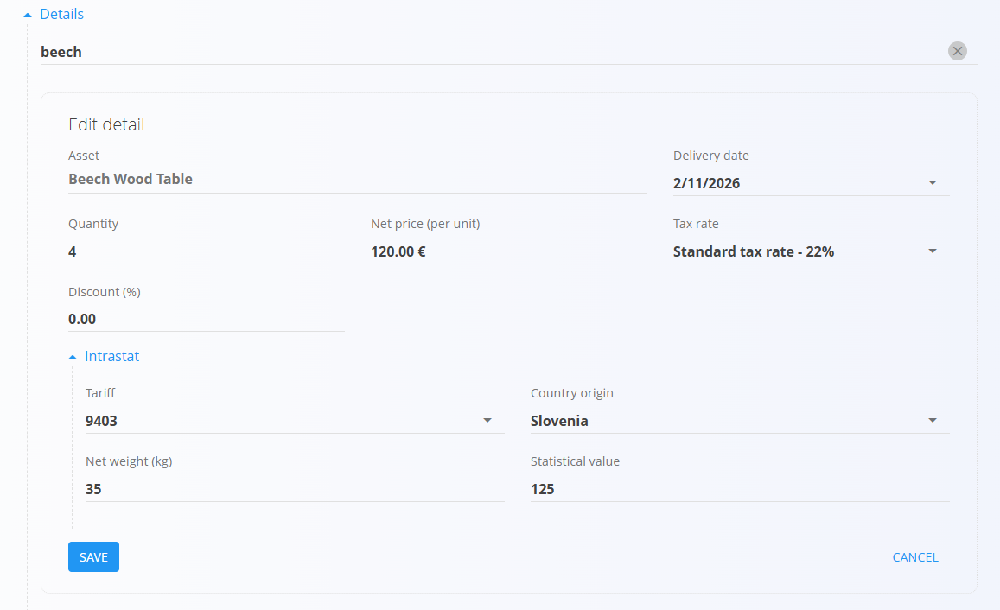
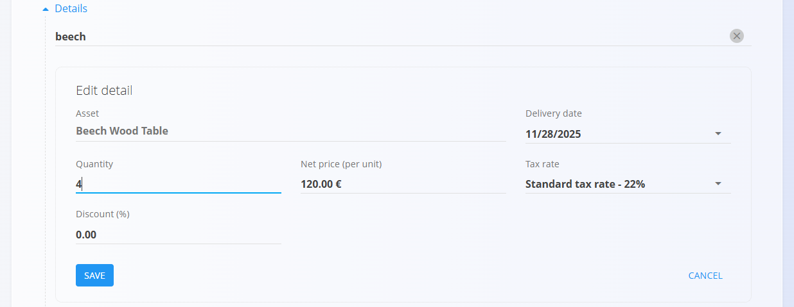

<!-- app_route: /sales/documents/sales-orders -->
<!-- app_label: Naročila strank -->
<!-- app_navigation_hint: Odprite Naročila strank, nato kliknite akcijski gumb za ustvarjanje novega osnutka naročila. -->
<!-- canonical_source_url: https://github.com/Tom-PIT/Connected.Docs/blob/main/sl/Domene/Prodaja/Dokumenti/NarocilaStrankUstvarjanje.md -->
<!-- canonical_source_title: Kako ustvariti naročilo stranke -->

# Kako ustvariti naročilo stranke

Nova naročila strank je mogoče ustvariti:

- ročno na zaslonu **Naročila strank** z uporabo [akcijskega gumba](../../../Skupno/UI/AkcijskiGumb.md)
- iz objavljene [ponudbe](Ponudbe.md) prek **Povezani dokumenti → + Naročilo stranke**

> [!NOTE]
> - Ročno ustvarjena naročila strank vsebujejo prazna polja.
>
> - Ko je naročilo stranke ustvarjeno iz ponudbe, sistem samodejno predizpolni večino polj iz izvornega dokumenta, vključno s podatki o stranki, podatki o dostavi in postavkami.

## Korak 1 — Ustvarjanje dokumenta

Ustvarite nov osnutek naročila stranke na enega od naslednjih načinov:

- Neposredno na zaslonu **Naročila strank** z uporabo [akcijskega gumba](../../../Skupno/UI/AkcijskiGumb.md)
- Iz potrjene [**Ponudbe**](Ponudbe.md) prek **Povezani dokumenti → + Naročilo stranke**. V tem primeru se večina polj — kot so stranka, podatki o dostavi in postavke — samodejno izpolni na podlagi ponudbe.

## Korak 2 — Izpolnjevanje glave dokumenta

Vnesite ali preverite naslednja polja:

- **Stranka**
- **Datum dokumenta**
- **Datum dobave**

## Korak 3 — Dodajanje postavk

Dodajte postavke v razdelek **Postavke**. Postavke določajo naročene artikle ter njihove količine, cene, davke in popuste. Vsaka postavka predstavlja določen izdelek, storitev ali artikel.

Za dodajanje nove postavke:

1. Vnesite ali skenirajte **serijsko številko**, **EAN** ali **naziv materiala** v vrstico Postavke. Sistem prikaže vse ujemajoče se artikle in serijske številke. Če obstaja več zadetkov, izberite pravilnega s seznama.

   

2. Po potrebi prilagodite **Količino**, **Datum dobave** ali druga polja.
3. Kliknite **Shrani**, da potrdite dodane postavke.
4. Po potrebi ponovite korak 1 za dodajanje dodatnih postavk.

Za informacije o delu s postavkami dokumenta glejte [**Postavke dokumenta**](../../../Skupno/Koncepti/PostavkeDokumenta.md).

Shranjena postavka:

### Intrastat postavke

Ko je omogočen Intrastat, se v razdelku Postavke prikažejo dodatna polja, kot so:

- **Tarifa**
- **Država porekla**
- **Neto teža**
- **Statistična vrednost**

Ta polja so potrebna za Intrastat poročanje, vendar ne vplivajo na obdelavo naročila stranke.

## Korak 4 — Dodatne nastavitve

### Dobava

Preglejte ali prilagodite podatke v razdelku **Dobava**.

Razdelek Dobava določa, kam bo blago dostavljeno. Podatki se samodejno izpolnijo iz podatkov stranke, vendar jih je mogoče prilagoditi za posamezen dokument.

Te vrednosti vplivajo na izpis dokumenta in nadaljnje logistične dokumente, vendar ne spreminjajo matičnih podatkov.

### Alternativna valuta

Razdelek Alternativna valuta omogoča prikaz cen v dokumentu v valuti, ki se razlikuje od privzete sistemske valute. To se običajno uporablja pri mednarodni prodaji. Tečaji se prevzemajo iz šifranta [**Menjalni tečaji**](../Upravljanje/MenjalniTecaji.md).

Ko je izbrana alternativna valuta, se cene v dokumentu samodejno preračunajo glede na določen menjalni tečaj.

### Razdelka Transport in Intrastat

Ko je **Intrastat** nastavljen na **Obvezno** v **Sistem / Konfiguracija / Intrastat**, se v dokumentu prikažeta dodatna razdelka.

- **Transport** – uporablja se za zajem logističnih podatkov o dostavi blaga.
- **Intrastat** – uporablja se za zbiranje podatkov, potrebnih za Intrastat poročanje. Ta polja so prikazana samo, kadar je Intrastat poročanje omogočeno v sistemu.

> [!NOTE]
> Več Intrastat vrednosti je prevzetih iz **šifrantov materialov** (Intrastat konfiguracija), kot sta država in vrsta posla. Ta polja niso prosto nastavljiva na ravni dokumenta in so odvisna od predhodno definiranih matičnih podatkov.

### Načini plačila

Načini plačila so prikazani na dnu dokumenta.

Kliknite **Dodaj način plačila**, da naročilu dodelite [način plačila](../Upravljanje/NacinPlacila.md). To polje je informativne narave in samo po sebi ne sproži finančnih transakcij. Uporablja se za interno spremljanje načina, kako namerava stranka poravnati naročilo.

### Priponke

Razdelek **Priponke** uporabite za nalaganje in upravljanje datotek, povezanih z dokumentom, kot so fotografije, PDF datoteke, certifikati ali podporni dokumenti.

Za podrobna navodila glejte [**Priponke**](../../../Skupno/Koncepti/Priponke.md).

## Korak 5 — Objava dokumenta

Kliknite **Objavi** na vrhu strani.

Po objavi se naročilo stranke premakne v stanje **Potrjeno → Na voljo** in omogoči nadaljnja dejanja, kot so ustvarjanje dobavnic, proizvodnih nalogov, vzdrževalnih nalogov ali izdanih računov prek razdelka [Povezani dokumenti](NarocilaStrank.md#povezani-dokumenti).