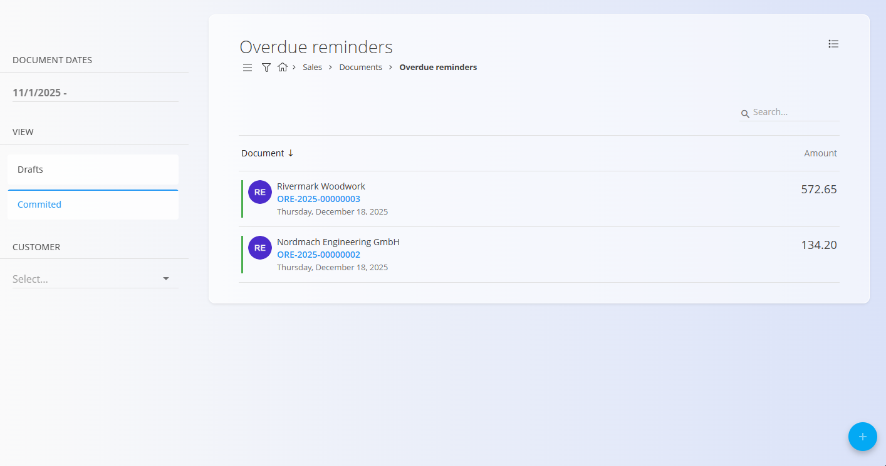
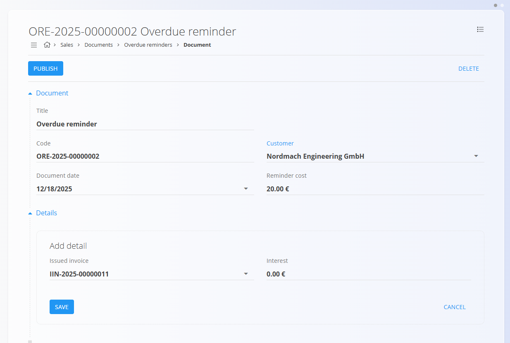

# Opomini

**Opomin** je prodajni dokument, ki se uporablja za obveščanje strank o **neplačanih izdanih računih** in za zahtevo po plačilu. Po potrebi lahko vključuje **strošek opomina** in **zamudne obresti**.

Za dostop do te strani pojdite na **Prodaja / Dokumenti / Opomini** v [**navigaciji**](../../../Skupno/UI/Navigacija.md).

## Vloga opominov v prodajnem procesu

Tipičen potek:

1. Prepoznate **[izdani račun](IzdaniRacuni.md)**, ki ima zapadli neplačani znesek.
2. Ustvarite **Opomin**, ki vsebuje podatke o računu, morebitne stroške opomina in zamudne obresti.
3. Opomin pošljete stranki in po potrebi evidentirate nadaljnje aktivnosti.
4. Ko je račun poravnan, dodatni opomini niso več potrebni.

Opomini so informativni in služijo kot formalno opozorilo, ne pa kot nadomestilo za račun.

## Shema

| Polje | Opis |
|------|------|
| [**Šifra**](../../../Skupno/UI/SifreDokumentov.md) | Sistemsko generiran identifikator opomina. |
| **Title** | Naziv dokumenta. Privzeto je nastavljen na *Opomin*. |
| **Stranka** | Stranka, ki prejme opomin, izbrana iz šifranta [**Poslovni imenik**](../../../Skupno/Upravljanje/PoslovniImenik.md) (obvezno). |
| **Datum dokumenta** | Datum nastanka opomina. |
| **Strošek opomina** | Fiksni strošek pošiljanja opomina (npr. administrativni strošek). Lahko se uporabi na ravni dokumenta ali posamezne postavke. |
| **Postavke** | Seznam zapadlih postavk, povezanih z [**izdanimi računi**](IzdaniRacuni.md), z zneski in morebitnimi obrestmi. |
| [**Izdani račun**](IzdaniRacuni.md) | Zapadli račun, na katerega se opomin nanaša. Ob izbiri se samodejno naloži odprti znesek. |
| **Obresti** | Znesek zamudnih obresti za zapadlo obdobje (vnos je ročen). |

## Upravljanje

### Seznam

Seznam opominov omogoča pregled vseh dokumentov, razdeljenih v skupini:

- **Osnutki** – Dokument še ni objavljen; vsa polja so prosto uredljiva.
- **Obdelan** – Dokument je objavljen; ni ga mogoče izbrisati ali urejati.

Filtri na levi strani omogočajo omejevanje seznama po:
- **Datumih dokumentov**
- **Statusu**
- **Stranki**

## Dejanja

### Ustvarjanje novega opomina

1. Uporabite [**akcijski gumb**](../../../Skupno/UI/AkcijskiGumb.md) za ustvarjanje novega opomina v statusu osnutka.

   

2. Izpolnite polja **Stranka**, **Datum dokumenta** in po potrebi **Strošek opomina**.

3. V razdelku **Postavke** dodajte zapadle postavke:
   - Kliknite **Dodaj postavko**.
   - Izberite zapadli **[izdani račun](IzdaniRacuni.md)**.
   - Sistem samodejno vnese **odprti znesek** in upošteva morebiten strošek opomina.
   - Po potrebi ročno vnesite **Obresti**.

   

4. Kliknite **Shrani**, da potrdite dodano postavko. Postopek ponovite za dodajanje več postavk.

   

5. Ko je opomin pripravljen, kliknite **Objavi** na vrhu strani.

> [!NOTE]
> S klikom na **Objavi** se dokument potrdi in premakne iz stanja **Osnutek** v skupino **Obdelan**.

## Urejanje opomina

- **Osnutke** je mogoče prosto urejati – kliknite dokument v seznamu osnutkov.
- **Potrjenih** opominov ni mogoče urejati.

## Meni

Zgornji meni omogoča:
- tiskanje
- izvoz (PDF)

## Brisanje

Opomine je mogoče izbrisati **samo v stanju Osnutek**.

> [!NOTE]
> Potrjenih opominov **ni mogoče** izbrisati.
