<!-- app_route: /sales/documents/offers -->
<!-- app_label: Ponudbe -->
<!-- canonical_source_url: https://github.com/Tom-PIT/Connected.Docs/blob/main/sl/Domene/Prodaja/Dokumenti/Ponudbe.md -->
<!-- canonical_source_title: Ponudbe -->

# Ponudbe

**Ponudba** je prodajni dokument, namenjen predstavitvi predlagane cene, količine in dobavnih pogojev stranki, preden je prodaja potrjena.  
Ponudbe pomagajo formalizirati ponudbe, primerjati cenovne možnosti ter omogočajo nemoten prehod v nadaljnje dokumente, kot so **Prodajni nalogi**, **Dobavnice** in **Izdani računi**.

Za dostop do tega dokumenta pojdite na **Prodaja / Dokumenti / Ponudbe** v [navigaciji](../../../Skupno/UI/Navigacija.md).

## Kako se ponudbe vključujejo v prodajni proces

Tipičen potek:

1. Ustvarite **Ponudbo** in jo pošljete stranki.  
2. Ko je ponudba potrjena, jo preko razdelka **Povezani dokumenti** pretvorite v [**Prodajni nalog**](NarocilaStrank.md).  
3. Iz prodajnega naloga se proces nadaljuje v operativne faze – proizvodnja, nabava, dostava ipd.  
4. Na koncu se ustvari [**Dobavnica**](Dobavnice.md) in nato še [**Izdani račun**](IzdaniRacuni.md).

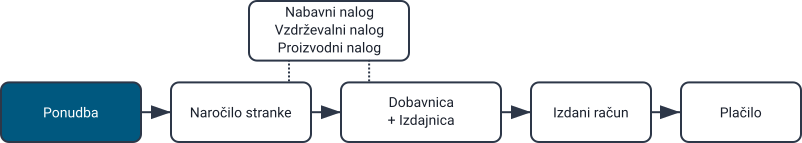

## Shema

  
<strong>Dokument</strong>

| Polje | Opis |
|------|------|
| [**Šifra**](../../../Skupno/UI/SifreDokumentov.md) | Sistemsko generiran identifikator ponudbe. |
| **Stranka** | Stranka, ki prejme ponudbo, izbrana iz šifranta [Poslovni imenik](../../../Skupno/Upravljanje/PoslovniImenik.md) (obvezno). |
| **Datum dokumenta** | Datum nastanka ponudbe. |
| **Datum veljavnosti** | Datum do katerega ponudba velja (obvezno). |
| **Rabat** | Neobvezen skupni popust na celotno ponudbo (npr. vnesite *2* za 2 % popust). |
| **Vsebina zgoraj** | Uvodno besedilo iz šifranta [Vnaprej določena besedila](../../../Skupno/Upravljanje/VnaprejDolocenaBesedila.md) (entiteta: *Ponudba*). |
| **Vsebina spodaj** | Zaključna ali pravna besedila iz [Vnaprej določena besedila](../../../Skupno/Upravljanje/VnaprejDolocenaBesedila.md) (entiteta: *Ponudba*). |
| [**Način plačila**](../Upravljanje/NacinPlacila.md) | Načini plačila, prikazani stranki. |

  
<strong>Transport, alternativna valuta in dostava</strong>

| Polje | Opis |
|--------|-------------|
| **[Pogoj dobave](../../../Skupno/Upravljanje/PogojiDobave.md)** | Dobavni pogoji, dogovorjeni s stranko. |
| **[Vrsta transporta](../../../Skupno/Upravljanje/VrstaTransporta.md)** | Način transporta, dogovorjen s stranko. |
| [**Alternativna valuta**](../../../Skupno/Upravljanje/Valute.md) | Alternativna valuta glede na privzeto valuto, uporabljeno v dokumentu. |
| [**Tečaj**](../Upravljanje/MenjalniTecaji.md) | Tečaj alternativne valute glede na privzeto valuto. |
| **Dobava – Podjetje / Naslov** | Dobavni podatki stranke, povzeti iz [Poslovnega imenika](../../../Skupno/Upravljanje/PoslovniImenik.md). |

  
<strong>Intrastat</strong>

| Polje | Opis |
|------|------|
| [**Država odpošiljanja**](../../../Skupno/Upravljanje/Drzave.md) | Država, iz katere je bilo blago odposlano. Ta vrednost je običajno določena na podlagi Intrastat konfiguracije materiala. |
| [**Vrsta posla**](../../Racunovodstvo/Upravljanje/Intrastat/VrstaPosla.md) | Klasifikacija vrste transakcije za Intrastat poročanje (npr. neposredna prodaja ali nakup). |
| [**Lega kraja**](../../Racunovodstvo/Upravljanje/Intrastat/LegaKraja.md) | Označuje kraj dostave blaga v skladu z Intrastat definicijami. |

  
<strong>Postavke</strong>

| Polje | Opis |
|------|------|
| [**Sredstvo**](../../Sredstva/Materiali/Izdelki.md) | Izdelek ali storitev, ki se ponuja. |
| **Datum dobave** | Predviden datum dobave za to postavko. |
| **Količina** | Količina sredstva. |
| **Cena brez DDV (na enoto)** | Cena na enoto, povzeta iz nastavitev sredstva ali ustreznega [cenika sredstev](../../Sredstva/Materiali/CenikiMaterialov.md). |
| **Popust (%)** | Neobvezen popust za posamezno postavko. |
| [**Davčne stopnje**](../../../Skupno/Upravljanje/DavcneStopnje.md) | Uporabljena davčna stopnja. |
| **Vrednost** | Skupna vrednost postavke (količina × neto cena po popustih). |
| **[Intrastat – Tarifa](../../Racunovodstvo/Upravljanje/Intrastat/Tarife.md)** | Tarifna oznaka blaga, uporabljena za Intrastat poročanje. |
| **Intrastat – Država porekla** | Država, iz katere blago izvira. |
| **Intrastat – Neto teža (kg)** | Neto teža, uporabljena za statistično poročanje. |
| **Intrastat – Statistična vrednost** | Prijavljena statistična vrednost blaga za Intrastat poročanje. |

## Upravljanje

### Statusi dokumenta

Dokumenti v svojem življenjskem ciklu prehajajo med naslednjimi statusi:

- **Osnutki** – Dokument še ni objavljen; vsa polja so prosto uredljiva.
- **Obdelan** – Dokument je objavljen; ni ga mogoče izbrisati ali prosto spreminjati.
  - **Na voljo** – Dokument je veljaven in pripravljen za nadaljnjo obdelavo.
  - **V zaključevanju** – Dokument je delno obdelan (npr. delno dobavljen).
  - **Zaključen** – Vsa dejanja, povezana z dokumentom, so izvedena.

### Seznam

Seznam ponudb omogoča pregled vseh ponudb, razdeljenih na **Osnutke**, **Na voljo**, **V zaključevanju** in **Zaključene**.

Na vrhu seznama sistem prikazuje ključne kazalnike za trenutno filtrirane podatke:

- **Pretečene ponudbe** – Ponudbe, katerih datum veljavnosti je potekel in niso bile potrjene ali zaključene.
- **Plačane ponudbe** (interaktivno) – Ponudbe, za katere je bilo evidentirano celotno plačilo; klik prikaže samo plačane ponudbe.
- **Skupna cena** – Skupna vrednost vseh ponudb, vključenih v aktivni filter.

Filtri na levi strani omogočajo zoženje rezultatov po **datumih dokumentov**, **statusu** in **stranki**.

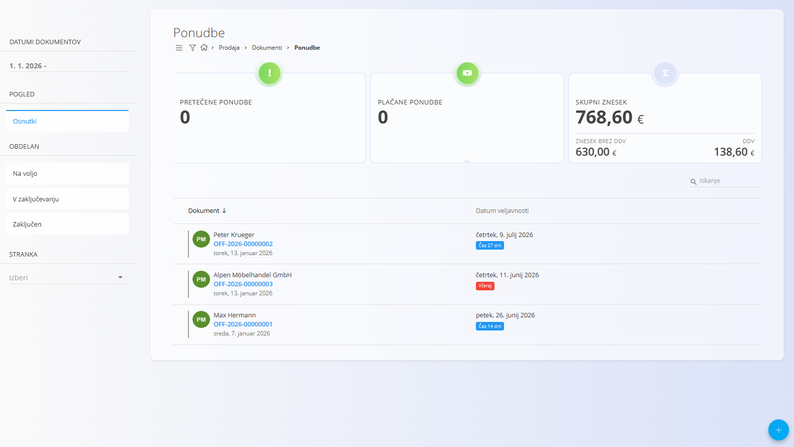

Primer seznama **Zaključenih** ponudb:

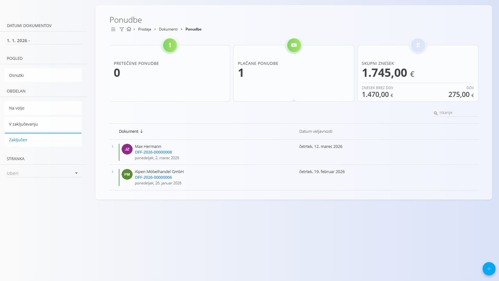

## Dejanja

### Ustvariti nove ponudbe

1. Uporabite [akcijski gumb](../../../Skupno/UI/AkcijskiGumb.md) za ustvarjanje nove ponudbe v statusu osnutka.

2. Izpolnite polja **Stranka**, **Datum veljavnosti** in po potrebi **Rabat**.

   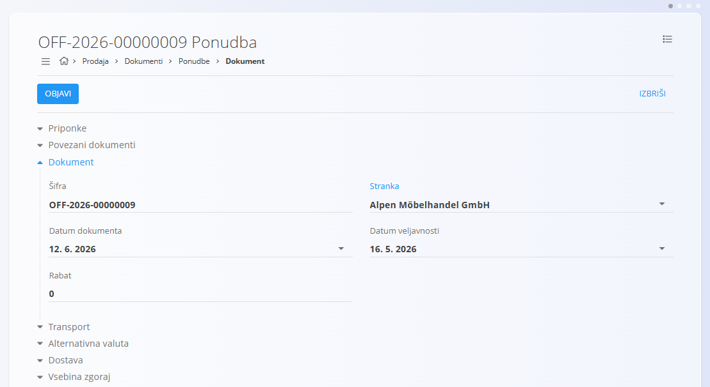

3. Dodajte postavke v razdelek Postavke. Vnesite ali skenirajte **serijsko številko**, **EAN** ali **naziv materiala**.
   - Sistem prikaže **vsa ujemajoča se sredstva in serijske številke**; ob več ujemanjih izberite pravilno.

   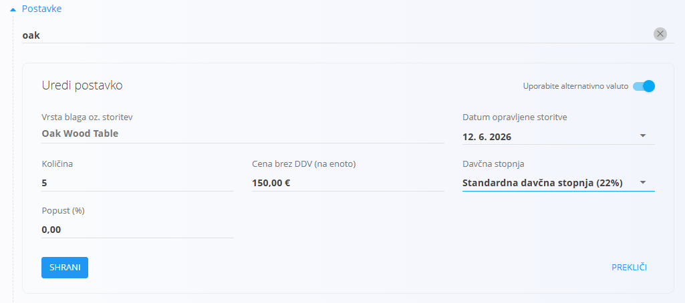

4. Kliknite **Shrani**, da potrdite dodane postavke. Korak 3 ponovite za dodajanje dodatnih postavk.

   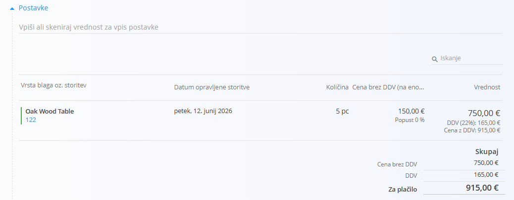

5. Izberite **Način plačila**.

   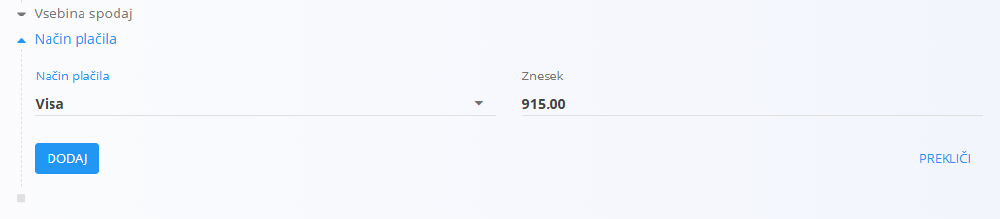

6. Ko je ponudba pripravljena, kliknite **Objavi** na vrhu strani. Dokument preide v status **Na voljo** in omogoči dodatna dejanja.

   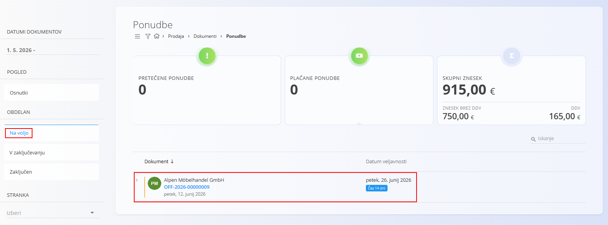

> [!NOTE]
> S klikom na **Objavi** se dokument potrdi in preide iz statusa **Osnutek** v skupino statusov **Obdelan**.

### Urediti ponudbe

Kliknite katero koli ponudbo v seznamu, da jo odprete. Osnutke je mogoče prosto urejati. Dokument je razdeljen na več razširljivih razdelkov.

Objavljene ponudbe omogočajo omejene spremembe, odvisno od sistemske konfiguracije.

#### Priponke

Razdelek **Priponke** uporabite za nalaganje in upravljanje datotek, povezanih z dokumentom, kot so fotografije, PDF datoteke, certifikati ali podporni dokumenti.

Za podrobna navodila glejte [**Priponke**](../../../Skupno/Koncepti/Priponke.md).

#### Povezani dokumenti

Ponudbe omogočajo ustvarjanje več povezanih dokumentov, kar podpira celoten poslovni proces.

Za podrobnosti o povezavah med dokumenti, sledljivosti in ustvarjanju povezanih dokumentov glejte [**Povezani dokumenti**](../../../Skupno/Koncepti/PovezaniDokumenti.md).

> [!NOTE]
> Razpoložljiva dejanja v razdelku **Povezani dokumenti** so odvisna od tipa in statusa dokumenta.

Pogosta dejanja vključujejo:

- **Projekt** – povezava ponudbe s projektom  
- **Kopiraj ponudbo** – podvojitev ponudbe  
- [**+ Predračun**](Predracuni.md) – ustvarjanje predračuna  
- **+ Prodajni nalog** – neposredno ustvarjanje [prodajnega naloga](NarocilaStrank.md) iz ponudbe

#### Alternativna valuta

Razdelek Alternativna valuta omogoča izražanje cen v dokumentu v valuti, ki je različna od privzete sistemske valute. To se običajno uporablja pri mednarodni prodaji. Tečaji se povzemajo iz šifranta [Devizni tečaji](../Upravljanje/MenjalniTecaji.md).

Ko je izbrana alternativna valuta, se cene v dokumentu samodejno preračunajo z uporabo navedenega deviznega tečaja.

#### Razdelka Transport in Intrastat

Ko je **Intrastat** nastavljen na **Obvezno** v **Sistem / Konfiguracija / Intrastat**, se v obrazcu dokumenta prikažeta dodatna razdelka.

- **Transport** – Uporablja se za zajem logističnih informacij o načinu dostave blaga.
- **Intrastat** – Uporablja se za zbiranje podatkov, potrebnih za Intrastat poročanje. Ta polja so prikazana samo, kadar je Intrastat poročanje omogočeno v sistemu.

> [!NOTE]  
> Več vrednosti, povezanih z Intrastat, je prevzetih iz **šifrantov materialov** (Intrastat konfiguracija), kot sta država in vrsta posla. Ta polja niso prosto nastavljiva na ravni dokumenta in so odvisna od predhodno definiranih matičnih podatkov.

#### Dobava

Razdelek Dobava določa, kam se blago pošlje. Privzeto se izpolni iz podatkov stranke, vendar ga je mogoče prilagoditi za posamezen dokument.

Ti podatki vplivajo na izpis dokumenta in nadaljnje logistične dokumente, ne spreminjajo pa osnovnih podatkov.

#### Postavke

Postavke določajo naročene izdelke ter njihove količine, cene, davke in popuste. Vsaka postavka predstavlja določen izdelek, storitev ali sredstvo.

Dodaj novo postavko:

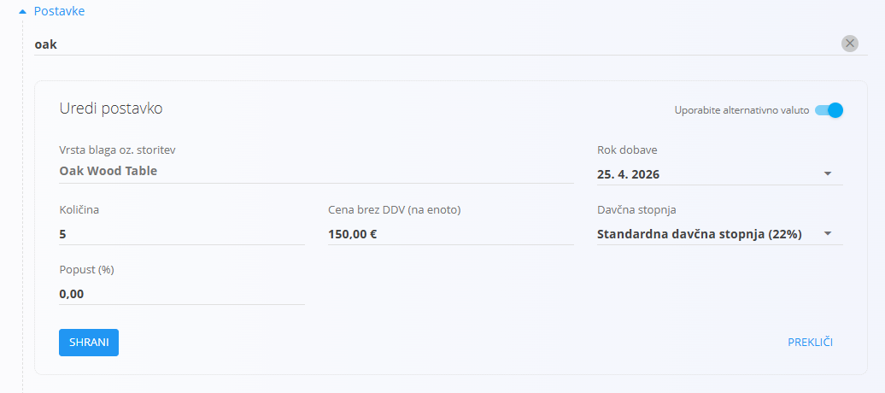

Shranjena postavka:

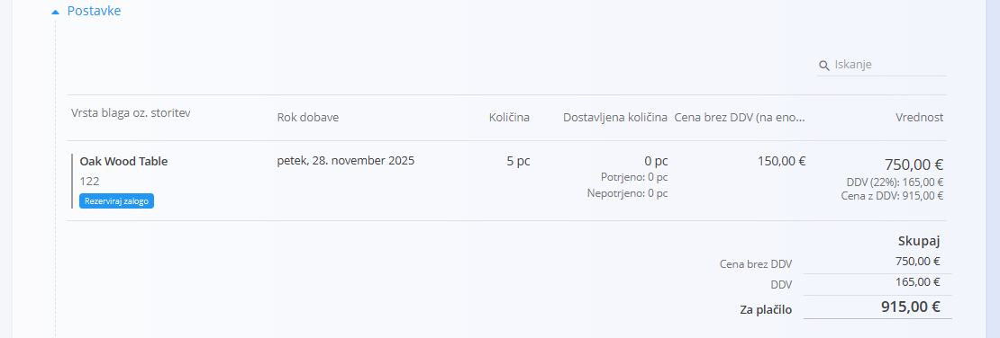

Za informacije o delu s postavkami dokumenta glejte [**Postavke dokumenta**](../../../Skupno/Koncepti/PostavkeDokumenta.md).

> [!NOTE]
> Ko je omogočen Intrastat, se v razdelku Postavke prikažejo dodatna polja, kot so **Tarifa**, **Država porekla**, **Neto teža (kg)** in **Statistična vrednost**. Ta polja so potrebna za Intrastat poročanje, vendar ne vplivajo na obdelavo prodajnega naloga.

### Zaključiti ponudbe

Ko je ponudba v statusu **Na voljo**, kliknite **Zaključi**.

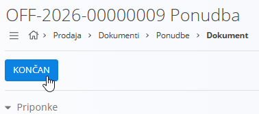

> [!NOTE]
> Ponudba se samodejno premakne v status **Zaključeno**, ko se iz nje neposredno ustvari nov [**Prodajni nalog**](NarocilaStrank.md) preko dejanja **Povezani dokumenti**.

## Izbrisati ponudbe

Osnutke je mogoče izbrisati na zaslonu za urejanje, vendar le, če **ne vsebujejo postavk**.

Če osnutek še vsebuje postavke:

1. Kliknite serijsko številko postavke, da odprete zaslon **Uredi postavko**.  
2. Kliknite **Izbriši** v oknu urejanja postavke.  
3. Postopek ponovite za vse preostale postavke.

Ko dokument ne vsebuje več postavk, lahko kliknete **Izbriši**, da odstranite osnutek.

Potrjenih dokumentov **ni mogoče** izbrisati.

> [!NOTE]
> Ponudbo je mogoče izbrisati le, če ni povezana z drugim odvisnim dokumentom (npr. prodajnim nalogom).

## Meni

Meni omogoča dodatna dejanja, ki so na voljo na tej strani.

Na voljo so naslednja dejanja:

- **Tiskanje**
- **Izvoz (v PDF)**
- **Pošiljanje dokumenta po e-pošti** (samo za potrjene dokumente)
- **Povrni v osnutek** (samo za potrjene dokumente)

Za podrobnosti o dejanjih menija glejte [**Dejanja menija**](../../../Skupno/Koncepti/MeniDejanja.md).
